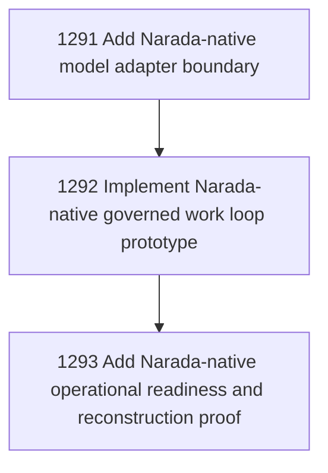

# Narada-Native Agent Carrier Stage 3

## Goal

Commissioned chapter narada-native-carrier-stage-3 for tasks 1291-1293.

## DAG

## Active Tasks

| # | Task | Name | Status |
|---|------|------|--------|
| 1 | 1291 | Add Narada-native model adapter boundary | opened |
| 2 | 1292 | Implement Narada-native governed work loop prototype | opened |
| 3 | 1293 | Add Narada-native operational readiness and reconstruction proof | opened |

## Closure Criteria

- [ ] All commissioned tasks are closed or confirmed.
- [ ] Chapter evidence is complete.
