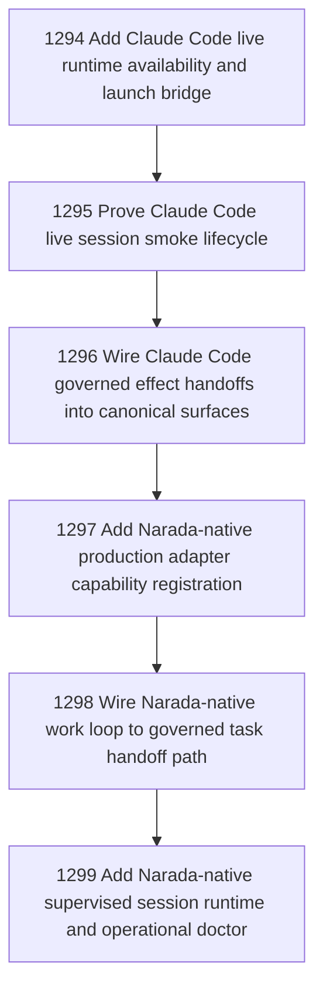

# Agent Carriers Stage 4 Operationalization

## Goal

Commissioned chapter agent-carriers-stage-4-operationalization for tasks 1294-1299.

## DAG

## Active Tasks

| # | Task | Name | Status |
|---|------|------|--------|
| 1 | 1294 | Add Claude Code live runtime availability and launch bridge | opened |
| 2 | 1295 | Prove Claude Code live session smoke lifecycle | opened |
| 3 | 1296 | Wire Claude Code governed effect handoffs into canonical surfaces | opened |
| 4 | 1297 | Add Narada-native production adapter capability registration | opened |
| 5 | 1298 | Wire Narada-native work loop to governed task handoff path | opened |
| 6 | 1299 | Add Narada-native supervised session runtime and operational doctor | opened |

## Closure Criteria

- [ ] All commissioned tasks are closed or confirmed.
- [ ] Chapter evidence is complete.
