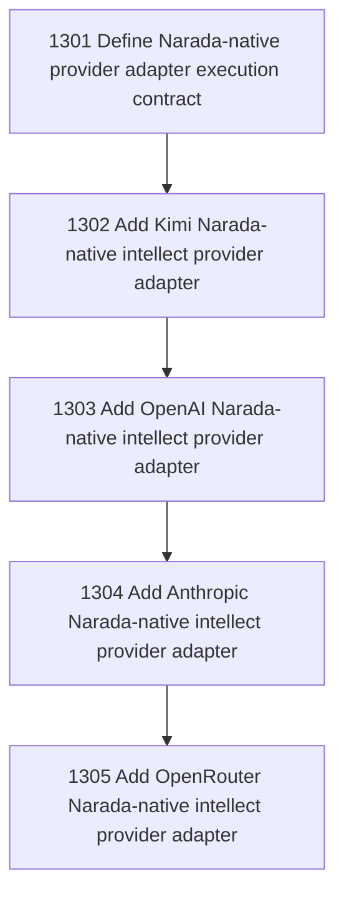

# Narada-native Intellect Provider Adapters

## Goal

Commissioned chapter narada-native-intellect-provider-adapters for tasks 1301-1305.

## DAG

## Active Tasks

| # | Task | Name | Status |
|---|------|------|--------|
| 1 | 1301 | Define Narada-native provider adapter execution contract | opened |
| 2 | 1302 | Add Kimi Narada-native intellect provider adapter | opened |
| 3 | 1303 | Add OpenAI Narada-native intellect provider adapter | opened |
| 4 | 1304 | Add Anthropic Narada-native intellect provider adapter | opened |
| 5 | 1305 | Add OpenRouter Narada-native intellect provider adapter | opened |

## Closure Criteria

- [ ] All commissioned tasks are closed or confirmed.
- [ ] Chapter evidence is complete.
