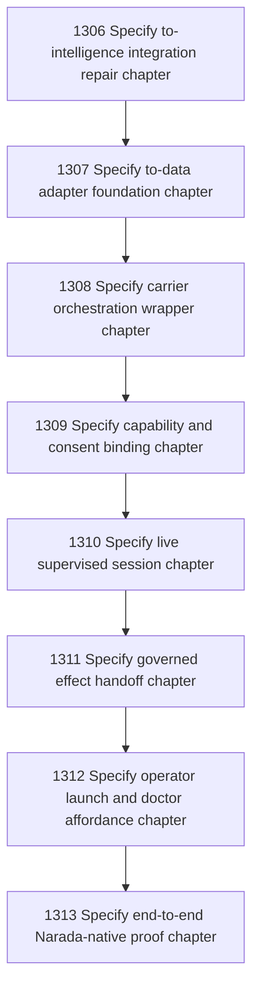

# Narada-native Carrier Future Chapter Commissioning

## Goal

Commissioned chapter narada-native-carrier-future-chapter-commissioning for tasks 1306-1313.

## DAG

## Active Tasks

| # | Task | Name | Status |
|---|------|------|--------|
| 1 | 1306 | Specify to-intelligence integration repair chapter | opened |
| 2 | 1307 | Specify to-data adapter foundation chapter | opened |
| 3 | 1308 | Specify carrier orchestration wrapper chapter | opened |
| 4 | 1309 | Specify capability and consent binding chapter | opened |
| 5 | 1310 | Specify live supervised session chapter | opened |
| 6 | 1311 | Specify governed effect handoff chapter | opened |
| 7 | 1312 | Specify operator launch and doctor affordance chapter | opened |
| 8 | 1313 | Specify end-to-end Narada-native proof chapter | opened |

## Closure Criteria

- [ ] All commissioned tasks are closed or confirmed.
- [ ] Chapter evidence is complete.
