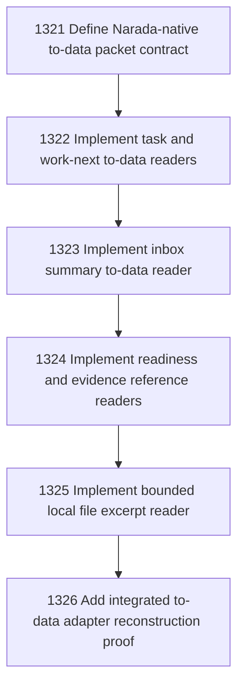

# Narada-native To-data Adapter Foundation

## Goal

Commissioned chapter narada-native-to-data-adapter-foundation for tasks 1321-1326.

## DAG

## Active Tasks

| # | Task | Name | Status |
|---|------|------|--------|
| 1 | 1321 | Define Narada-native to-data packet contract | opened |
| 2 | 1322 | Implement task and work-next to-data readers | opened |
| 3 | 1323 | Implement inbox summary to-data reader | opened |
| 4 | 1324 | Implement readiness and evidence reference readers | opened |
| 5 | 1325 | Implement bounded local file excerpt reader | opened |
| 6 | 1326 | Add integrated to-data adapter reconstruction proof | opened |

## Closure Criteria

- [ ] All commissioned tasks are closed or confirmed.
- [ ] Chapter evidence is complete.
