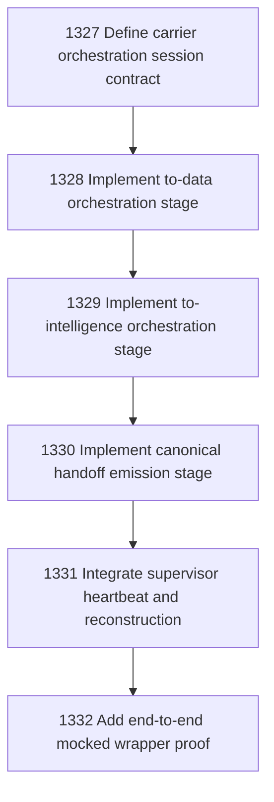

# Narada-native Carrier Orchestration Wrapper

## Goal

Commissioned chapter narada-native-carrier-orchestration-wrapper for tasks 1327-1332.

## DAG

## Active Tasks

| # | Task | Name | Status |
|---|------|------|--------|
| 1 | 1327 | Define carrier orchestration session contract | opened |
| 2 | 1328 | Implement to-data orchestration stage | opened |
| 3 | 1329 | Implement to-intelligence orchestration stage | opened |
| 4 | 1330 | Implement canonical handoff emission stage | opened |
| 5 | 1331 | Integrate supervisor heartbeat and reconstruction | opened |
| 6 | 1332 | Add end-to-end mocked wrapper proof | opened |

## Closure Criteria

- [ ] All commissioned tasks are closed or confirmed.
- [ ] Chapter evidence is complete.
