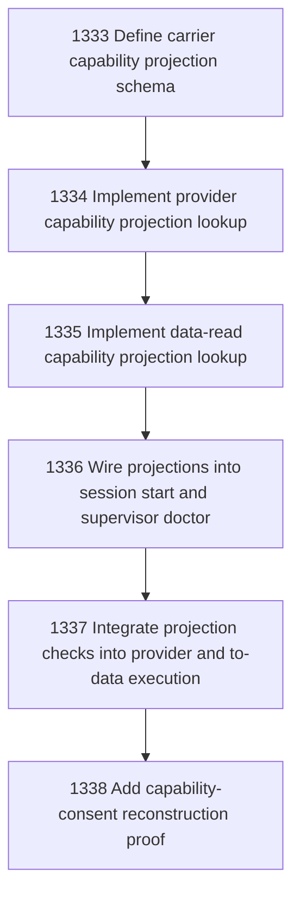

# Narada-native Capability Consent Binding

## Goal

Commissioned chapter narada-native-capability-consent-binding for tasks 1333-1338.

## DAG

## Active Tasks

| # | Task | Name | Status |
|---|------|------|--------|
| 1 | 1333 | Define carrier capability projection schema | opened |
| 2 | 1334 | Implement provider capability projection lookup | opened |
| 3 | 1335 | Implement data-read capability projection lookup | opened |
| 4 | 1336 | Wire projections into session start and supervisor doctor | opened |
| 5 | 1337 | Integrate projection checks into provider and to-data execution | opened |
| 6 | 1338 | Add capability-consent reconstruction proof | opened |

## Closure Criteria

- [ ] All commissioned tasks are closed or confirmed.
- [ ] Chapter evidence is complete.
