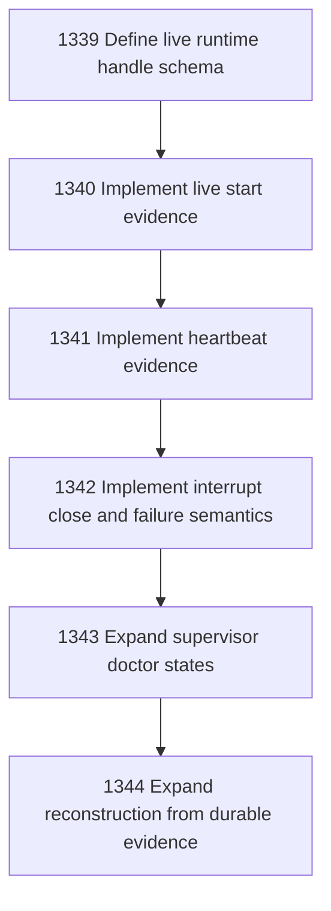

# Narada-native Live Supervised Session

## Goal

Commissioned chapter narada-native-live-supervised-session for tasks 1339-1344.

## DAG

## Active Tasks

| # | Task | Name | Status |
|---|------|------|--------|
| 1 | 1339 | Define live runtime handle schema | opened |
| 2 | 1340 | Implement live start evidence | opened |
| 3 | 1341 | Implement heartbeat evidence | opened |
| 4 | 1342 | Implement interrupt close and failure semantics | opened |
| 5 | 1343 | Expand supervisor doctor states | opened |
| 6 | 1344 | Expand reconstruction from durable evidence | opened |

## Closure Criteria

- [ ] All commissioned tasks are closed or confirmed.
- [ ] Chapter evidence is complete.
