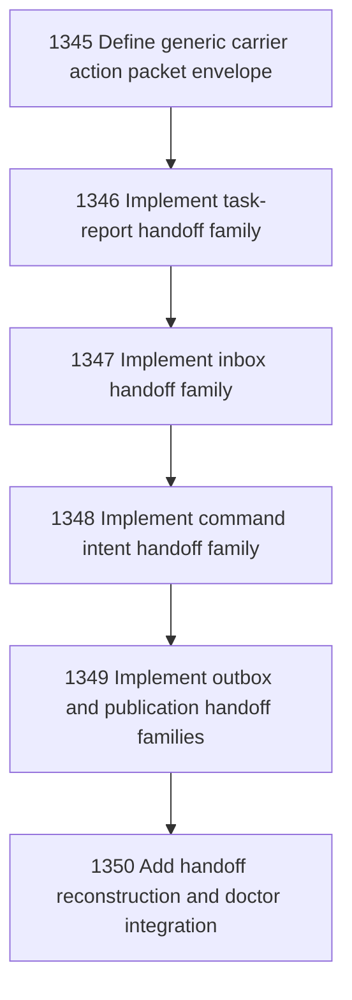

# Narada-native Governed Effect Handoff

## Goal

Commissioned chapter narada-native-governed-effect-handoff for tasks 1345-1350.

## DAG

## Active Tasks

| # | Task | Name | Status |
|---|------|------|--------|
| 1 | 1345 | Define generic carrier action packet envelope | opened |
| 2 | 1346 | Implement task-report handoff family | opened |
| 3 | 1347 | Implement inbox handoff family | opened |
| 4 | 1348 | Implement command intent handoff family | opened |
| 5 | 1349 | Implement outbox and publication handoff families | opened |
| 6 | 1350 | Add handoff reconstruction and doctor integration | opened |

## Closure Criteria

- [ ] All commissioned tasks are closed or confirmed.
- [ ] Chapter evidence is complete.
