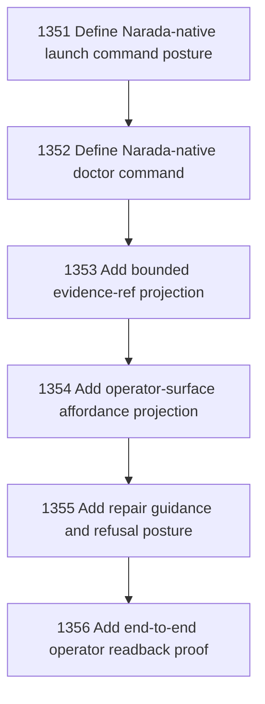

# Narada-native Operator Launch Doctor Affordances

## Goal

Commissioned chapter narada-native-operator-launch-doctor-affordances for tasks 1351-1356.

## DAG

## Active Tasks

| # | Task | Name | Status |
|---|------|------|--------|
| 1 | 1351 | Define Narada-native launch command posture | opened |
| 2 | 1352 | Define Narada-native doctor command | opened |
| 3 | 1353 | Add bounded evidence-ref projection | opened |
| 4 | 1354 | Add operator-surface affordance projection | opened |
| 5 | 1355 | Add repair guidance and refusal posture | opened |
| 6 | 1356 | Add end-to-end operator readback proof | opened |

## Closure Criteria

- [ ] All commissioned tasks are closed or confirmed.
- [ ] Chapter evidence is complete.
