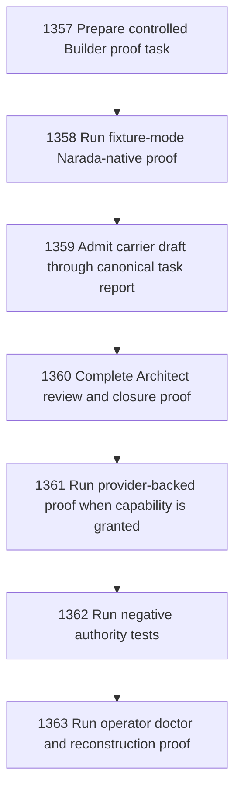

# Narada-native End-to-End Builder Proof

## Goal

Commissioned chapter narada-native-end-to-end-builder-proof for tasks 1357-1363.

## DAG

## Active Tasks

| # | Task | Name | Status |
|---|------|------|--------|
| 1 | 1357 | Prepare controlled Builder proof task | opened |
| 2 | 1358 | Run fixture-mode Narada-native proof | opened |
| 3 | 1359 | Admit carrier draft through canonical task report | opened |
| 4 | 1360 | Complete Architect review and closure proof | opened |
| 5 | 1361 | Run provider-backed proof when capability is granted | opened |
| 6 | 1362 | Run negative authority tests | opened |
| 7 | 1363 | Run operator doctor and reconstruction proof | opened |

## Closure Criteria

- [ ] All commissioned tasks are closed or confirmed.
- [ ] Chapter evidence is complete.
