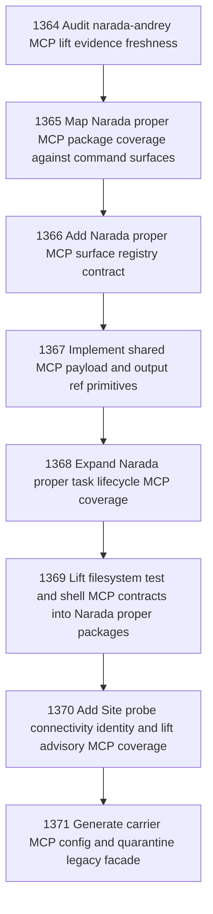

# Narada Proper MCP Facade Full Surface Coverage

## Goal

Commissioned chapter narada-proper-mcp-facade-full-surface-coverage for tasks 1364-1371.

## DAG

## Active Tasks

| # | Task | Name | Status |
|---|------|------|--------|
| 1 | 1364 | Audit narada-andrey MCP lift evidence freshness | opened |
| 2 | 1365 | Map Narada proper MCP package coverage against command surfaces | opened |
| 3 | 1366 | Add Narada proper MCP surface registry contract | opened |
| 4 | 1367 | Implement shared MCP payload and output ref primitives | opened |
| 5 | 1368 | Expand Narada proper task lifecycle MCP coverage | opened |
| 6 | 1369 | Lift filesystem test and shell MCP contracts into Narada proper packages | opened |
| 7 | 1370 | Add Site probe connectivity identity and lift advisory MCP coverage | opened |
| 8 | 1371 | Generate carrier MCP config and quarantine legacy facade | opened |

## Closure Criteria

- [ ] All commissioned tasks are closed or confirmed.
- [ ] Chapter evidence is complete.
