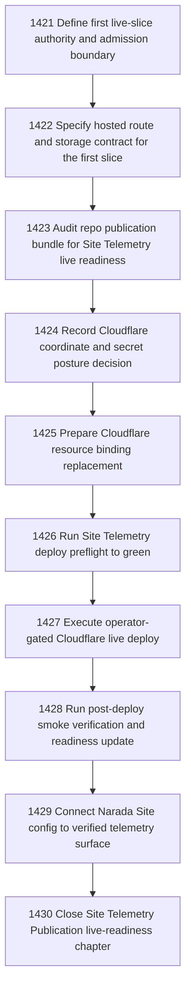

# Site Telemetry Publication Live Readiness Follow-on

## Goal

Commissioned chapter site-telemetry-publication-live-readiness-followon for tasks 1421-1430.

## DAG

## Active Tasks

| # | Task | Name | Status |
|---|------|------|--------|
| 1 | 1421 | Define first live-slice authority and admission boundary | opened |
| 2 | 1422 | Specify hosted route and storage contract for the first slice | opened |
| 3 | 1423 | Audit repo publication bundle for Site Telemetry live readiness | opened |
| 4 | 1424 | Record Cloudflare coordinate and secret posture decision | opened |
| 5 | 1425 | Prepare Cloudflare resource binding replacement | opened |
| 6 | 1426 | Run Site Telemetry deploy preflight to green | opened |
| 7 | 1427 | Execute operator-gated Cloudflare live deploy | opened |
| 8 | 1428 | Run post-deploy smoke verification and readiness update | opened |
| 9 | 1429 | Connect Narada Site config to verified telemetry surface | opened |
| 10 | 1430 | Close Site Telemetry Publication live-readiness chapter | opened |

## Closure Criteria

- [ ] All commissioned tasks are closed or confirmed.
- [ ] Chapter evidence is complete.
