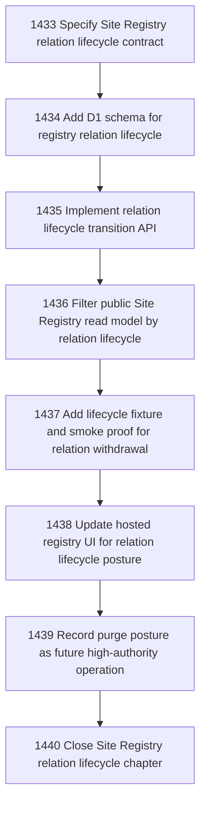

# Site Registry Relation Lifecycle

## Goal

Commissioned chapter site-registry-relation-lifecycle for tasks 1433-1440.

## DAG

## Active Tasks

| # | Task | Name | Status |
|---|------|------|--------|
| 1 | 1433 | Specify Site Registry relation lifecycle contract | closed |
| 2 | 1434 | Add D1 schema for registry relation lifecycle | closed |
| 3 | 1435 | Implement relation lifecycle transition API | closed |
| 4 | 1436 | Filter public Site Registry read model by relation lifecycle | closed |
| 5 | 1437 | Add lifecycle fixture and smoke proof for relation withdrawal | closed |
| 6 | 1438 | Update hosted registry UI for relation lifecycle posture | closed |
| 7 | 1439 | Record purge posture as future high-authority operation | closed |
| 8 | 1440 | Close Site Registry relation lifecycle chapter | claimed |

## Closure Criteria

- [x] All implementation tasks are closed.
- [x] Chapter evidence is complete through local package tests, build, and smoke fixture.
- [x] Closure artifact exists at `.ai/decisions/2026-05-16-1433-1440-site-registry-relation-lifecycle-closure.md`.
- [x] Live deploy/migration remains explicit residual rather than overclaimed.
