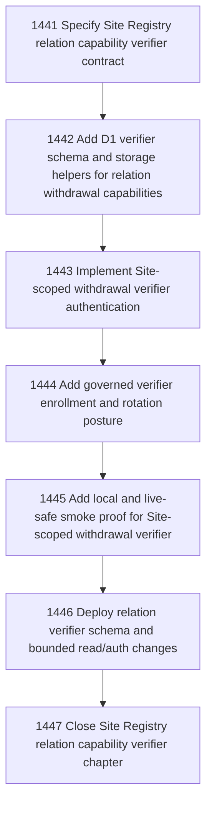

# Site Registry Relation Capability Verifiers

## Goal

Commissioned chapter site-registry-relation-capability-verifiers for tasks 1441-1447.

## DAG

## Active Tasks

| # | Task | Name | Status |
|---|------|------|--------|
| 1 | 1441 | Specify Site Registry relation capability verifier contract | opened |
| 2 | 1442 | Add D1 verifier schema and storage helpers for relation withdrawal capabilities | opened |
| 3 | 1443 | Implement Site-scoped withdrawal verifier authentication | opened |
| 4 | 1444 | Add governed verifier enrollment and rotation posture | opened |
| 5 | 1445 | Add local and live-safe smoke proof for Site-scoped withdrawal verifier | opened |
| 6 | 1446 | Deploy relation verifier schema and bounded read/auth changes | opened |
| 7 | 1447 | Close Site Registry relation capability verifier chapter | opened |

## Closure Criteria

- [ ] All commissioned tasks are closed or confirmed.
- [ ] Chapter evidence is complete.
