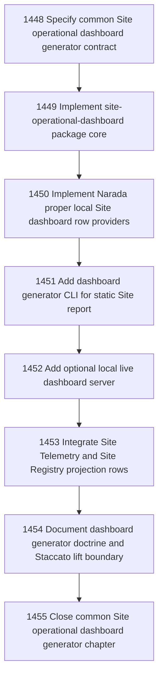

# Common Site Operational Dashboard Generator

## Goal

Commissioned chapter common-site-operational-dashboard-generator for tasks 1448-1455.

## DAG

## Active Tasks

| # | Task | Name | Status |
|---|------|------|--------|
| 1 | 1448 | Specify common Site operational dashboard generator contract | opened |
| 2 | 1449 | Implement site-operational-dashboard package core | opened |
| 3 | 1450 | Implement Narada proper local Site dashboard row providers | opened |
| 4 | 1451 | Add dashboard generator CLI for static Site report | opened |
| 5 | 1452 | Add optional local live dashboard server | opened |
| 6 | 1453 | Integrate Site Telemetry and Site Registry projection rows | opened |
| 7 | 1454 | Document dashboard generator doctrine and Staccato lift boundary | opened |
| 8 | 1455 | Close common Site operational dashboard generator chapter | opened |

## Closure Criteria

- [ ] All commissioned tasks are closed or confirmed.
- [ ] Chapter evidence is complete.
