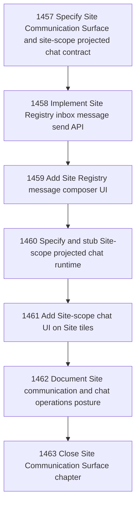

# Site Communication Surface

## Goal

Commissioned chapter site-communication-surface for tasks 1457-1463.

## DAG

## Active Tasks

| # | Task | Name | Status |
|---|------|------|--------|
| 1 | 1457 | Specify Site Communication Surface and site-scope projected chat contract | closed |
| 2 | 1458 | Implement Site Registry inbox message send API | closed |
| 3 | 1459 | Add Site Registry message composer UI | closed |
| 4 | 1460 | Specify and stub Site-scope projected chat runtime | closed |
| 5 | 1461 | Add Site-scope chat UI on Site tiles | closed |
| 6 | 1462 | Document Site communication and chat operations posture | closed |
| 7 | 1463 | Close Site Communication Surface chapter | claimed |

## Closure Criteria

- [x] All commissioned implementation/spec/doc tasks are closed or confirmed.
- [x] Chapter evidence is complete.

## Closure Artifact

Closed by task 1463.

### Final Posture

- Contract: `docs/product/site-communication-surface.v0.md` defines the
  versioned Site Communication Surface, Site-scope projected chat, allowed and
  forbidden context, shared inbox-message send path, receipts, capability
  posture, UI rules, and operator operations posture.
- Fixtures:
  `docs/product/fixtures/site-communication-surface/message-candidate.valid.json`,
  `chat-request.valid.json`, `chat-response-refusal.expected.json`, and
  `receipt.remote-preserved.expected.json` prove the contract shape.
- Send API:
  `packages/site-registry-cloudflare` exposes guarded
  `POST /api/site-communications/send` plus read-only communication status and
  receipt routes. The route records outbound communication state, validates
  target relation and HTTPS endpoint posture, preserves idempotency, and keeps
  delivery receipt distinct from target Site admission receipt.
- Message UI: eligible active/public Site tiles expose a scoped `Message`
  composer. The composer labels target Site, relation posture, delivery versus
  admission, and submits only through the shared send API.
- Chat runtime: `packages/site-registry-cloudflare/src/site-scope-chat.ts`
  defines a provider-free deterministic Site-scope projected chat boundary. It
  requires selected `site_id` and `projection_ref`, answers only from explicit
  projection context, refuses private/cross-Site/secret/direct-mutation
  requests, and exposes only compose or shared-API send plans.
- Chat UI: eligible Site tiles expose scoped `Chat` panels with selected Site,
  freshness, projection basis, answer display, draft message generation, and
  explicit send confirmation through `/api/site-communications/send`.
- Operator docs: `packages/site-registry-cloudflare/README.md` and the product
  contract document direct message behavior, token/capability posture,
  delivery/admission receipts, Site-scope chat posture, no-authority/no-secret
  boundaries, and residuals.

### Invariants Preserved

- Cloud delivery or remote preservation is not target Site local admission.
- The hosted registry does not mutate target Site Canonical Inbox, task
  lifecycle, Site config, capability grants, secrets, or relation authority.
- Chat is projection-scoped intelligence, not task execution authority.
- Chat does not default to registry-wide or cross-Site context.
- Raw bearer token values remain transport-time inputs and are not stored or
  echoed by docs, fixtures, tests, D1 rows, HTML shell, or JSON responses.

### Verification Snapshot

- `pnpm --filter @narada2/site-registry-cloudflare test` passed: 6 files, 64
  tests.
- `pnpm --filter @narada2/site-registry-cloudflare typecheck` passed.
- `pnpm --filter @narada2/site-registry-cloudflare build` passed.
- `git diff --check -- <chapter files>` passed.
- `pnpm verify` remains blocked by the pre-existing unrelated CLI output
  admission guard in `sites-register.ts:69`, `sites-register.ts:85`, and
  `sites-register.ts:141`; task file guard passes.

### Residuals

- No production LLM provider is wired. The chat runtime is deterministic and
  provider-free.
- No autonomous delegated send exists. Chat-authored messages remain drafts
  unless explicitly sent through the shared API.
- No registry-wide or cross-Site comparison chat exists.
- Live transport delivery is not implemented or claimed by unit tests; v0
  delivery records are `recorded_not_delivered`.
- Target Site admission remains local and requires target Site finalization
  evidence.
