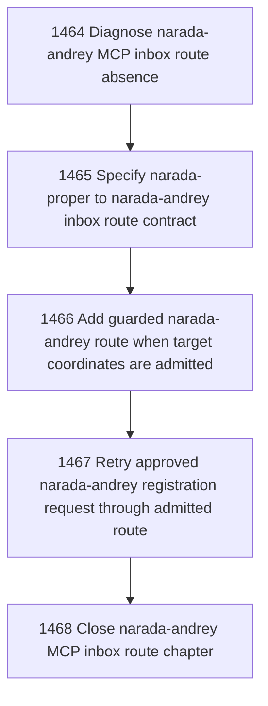

# Cross-Site MCP Inbox Route to narada-andrey

## Goal

Commissioned chapter cross-site-mcp-inbox-route-narada-andrey for tasks 1464-1468.

## DAG

## Active Tasks

| # | Task | Name | Status |
|---|------|------|--------|
| 1 | 1464 | Diagnose narada-andrey MCP inbox route absence | opened |
| 2 | 1465 | Specify narada-proper to narada-andrey inbox route contract | opened |
| 3 | 1466 | Add guarded narada-andrey route when target coordinates are admitted | opened |
| 4 | 1467 | Retry approved narada-andrey registration request through admitted route | opened |
| 5 | 1468 | Close narada-andrey MCP inbox route chapter | opened |

## Closure Criteria

- [ ] All commissioned tasks are closed or confirmed.
- [ ] Chapter evidence is complete.
