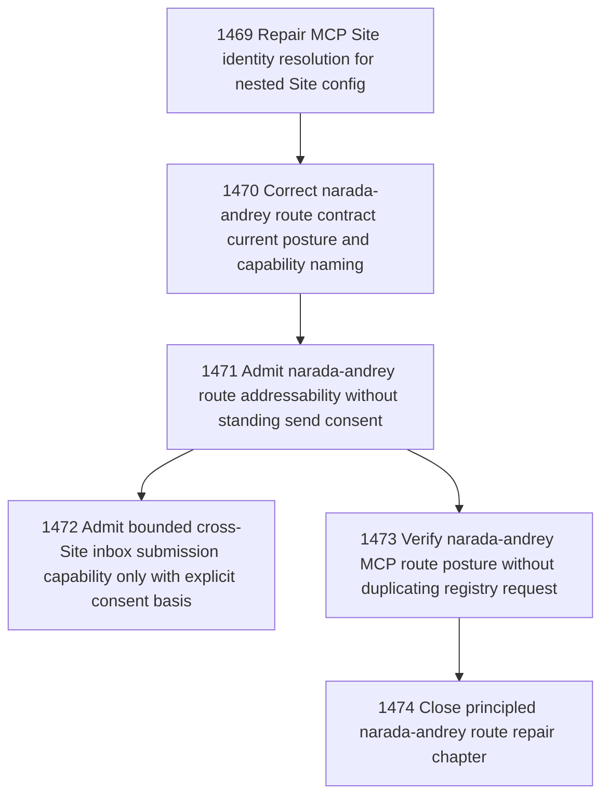

# Principled narada-andrey Cross-Site Inbox Route

## Goal

Commissioned chapter principled-narada-andrey-cross-site-inbox-route for tasks 1469-1474.

## DAG

## Final Task Posture

| # | Task | Name | Status |
|---|------|------|--------|
| 1 | 1469 | Repair MCP Site identity resolution for nested Site config | closed |
| 2 | 1470 | Correct narada-andrey route contract current posture and capability naming | closed |
| 3 | 1471 | Admit narada-andrey route addressability without standing send consent | closed |
| 4 | 1472 | Admit bounded cross-Site inbox submission capability only with explicit consent basis | deferred |
| 5 | 1473 | Verify narada-andrey MCP route posture without duplicating registry request | closed |
| 6 | 1474 | Close principled narada-andrey route repair chapter | claimed |

## Final Posture

- Identity resolver: repaired in both MCP facade resolvers to read nested `static_config` Site identity fallback.
- Route contract: corrected to use canonical capability kind `canonical_inbox_cross_site_submission` and to distinguish direct delivery from route/capability readiness.
- Addressability: source-local route `route_1c33db5b-d527-4b45-aa6b-f917ddb7c45c` resolves `site:narada-andrey` to `C:\Users\Andrey\Narada` through filesystem transport.
- Standing capability: deferred in task 1472. No reusable `canonical_inbox_cross_site_submission` grant exists because no explicit reusable consent artifact exists.
- Verification: read-only route resolution passes; staged MCP preview is dry-run/no mutation; no live probe was sent.
- Original registry request: direct target inbox delivery remains `env_37e5cd13-d005-4ba9-b0a2-e982139f246b`, with response envelope `env_be44e421-caa6-4a76-99b7-fa481e19b3c6`.
- Target local admission: narada-andrey reported local relation admission in principle. Hosted registry publication is not claimed complete.
- Live MCP carrier residual: current carrier still reports stale explicit target Site identity until refreshed after resolver repair; route resolution by target ref works.

## Closure Criteria

- [x] All non-residual commissioned tasks are closed or confirmed.
- [x] Residual capability task is deferred with explicit unblock condition.
- [x] Chapter evidence is complete and bounded.
