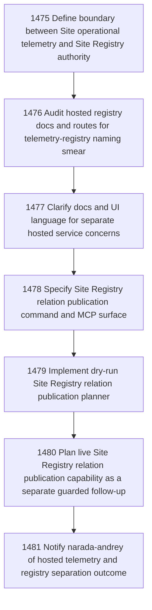

# Separate Site Telemetry From Site Registry

## Goal

Commissioned chapter separate-site-telemetry-from-site-registry for tasks 1475-1481.

## DAG

## Active Tasks

| # | Task | Name | Status |
|---|------|------|--------|
| 1 | 1475 | Define boundary between Site operational telemetry and Site Registry authority | opened |
| 2 | 1476 | Audit hosted registry docs and routes for telemetry-registry naming smear | opened |
| 3 | 1477 | Clarify docs and UI language for separate hosted service concerns | opened |
| 4 | 1478 | Specify Site Registry relation publication command and MCP surface | opened |
| 5 | 1479 | Implement dry-run Site Registry relation publication planner | opened |
| 6 | 1480 | Plan live Site Registry relation publication capability as a separate guarded follow-up | opened |
| 7 | 1481 | Notify narada-andrey of hosted telemetry and registry separation outcome | opened |

## Closure Criteria

- [ ] All commissioned tasks are closed or confirmed.
- [ ] Chapter evidence is complete.
