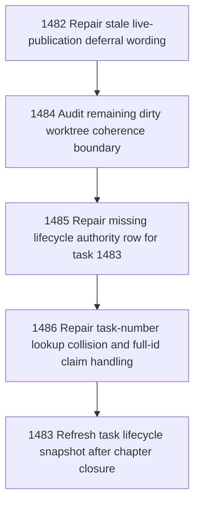

# Remaining Coherence Cleanup After Site Registry Split

## Goal

Commissioned chapter remaining-coherence-cleanup-after-site-registry-split for tasks 1482-1484. Task 1485 and task 1486 were added as governed repair tasks after task 1483 was found readable but not lifecycle-claimable.

## DAG

## Active Tasks

| # | Task | Name | Status |
|---|------|------|--------|
| 1 | 1482 | Repair stale live-publication deferral wording | closed |
| 2 | 1483 | Refresh task lifecycle snapshot after chapter closure | closed |
| 3 | 1484 | Audit remaining dirty worktree coherence boundary | closed |
| 4 | 1485 | Repair missing lifecycle authority row for task 1483 | closed |
| 5 | 1486 | Repair task-number lookup collision and full-id claim handling | closed |

## Closure Criteria

- [x] All commissioned tasks are closed or confirmed.
- [x] Chapter evidence is complete.
