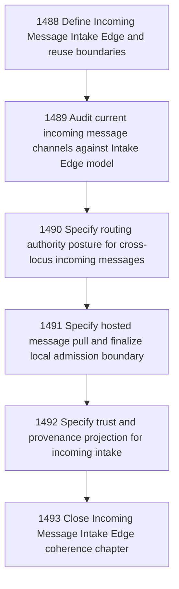

# Incoming Message Intake Edge Coherence

## Goal

Commissioned chapter incoming-message-intake-edge-coherence for tasks 1488-1493.

## DAG

## Active Tasks

| # | Task | Name | Status |
|---|------|------|--------|
| 1 | 1488 | Define Incoming Message Intake Edge and reuse boundaries | opened |
| 2 | 1489 | Audit current incoming message channels against Intake Edge model | opened |
| 3 | 1490 | Specify routing authority posture for cross-locus incoming messages | opened |
| 4 | 1491 | Specify hosted message pull and finalize local admission boundary | opened |
| 5 | 1492 | Specify trust and provenance projection for incoming intake | opened |
| 6 | 1493 | Close Incoming Message Intake Edge coherence chapter | opened |

## Closure Criteria

- [ ] All commissioned tasks are closed or confirmed.
- [ ] Chapter evidence is complete.
