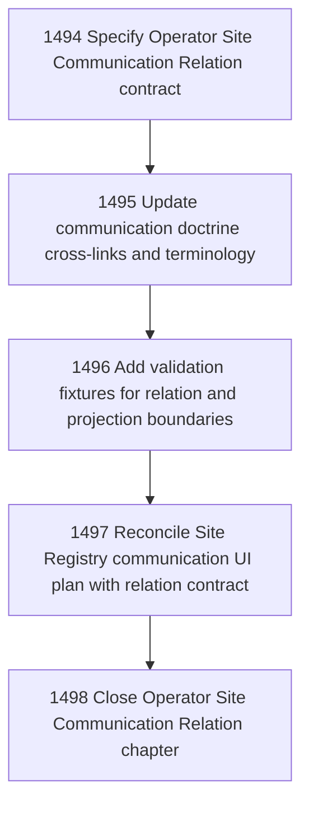

# Operator Site Communication Relation

## Goal

Commissioned chapter operator-site-communication-relation for tasks 1494-1498.

## DAG

## Active Tasks

| # | Task | Name | Status |
|---|------|------|--------|
| 1 | 1494 | Specify Operator Site Communication Relation contract | confirmed |
| 2 | 1495 | Update communication doctrine cross-links and terminology | confirmed |
| 3 | 1496 | Add validation fixtures for relation and projection boundaries | confirmed |
| 4 | 1497 | Reconcile Site Registry communication UI plan with relation contract | confirmed |
| 5 | 1498 | Close Operator Site Communication Relation chapter | closed |

## Closure Criteria

- [x] All commissioned tasks are closed or confirmed.
- [x] Chapter evidence is complete.
