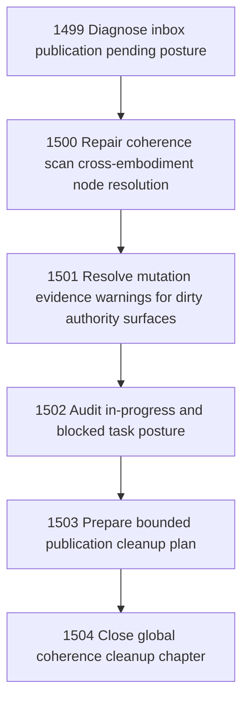

# Global Coherence Cleanup After Operator Site Communication Relation

## Goal

Commissioned chapter global-coherence-cleanup-after-operator-site-communication-relation for tasks 1499-1504.

## DAG

## Active Tasks

| # | Task | Name | Status |
|---|------|------|--------|
| 1 | 1499 | Diagnose inbox publication pending posture | confirmed |
| 2 | 1500 | Repair coherence scan cross-embodiment node resolution | confirmed |
| 3 | 1501 | Resolve mutation evidence warnings for dirty authority surfaces | confirmed |
| 4 | 1502 | Audit in-progress and blocked task posture | confirmed |
| 5 | 1503 | Prepare bounded publication cleanup plan | confirmed |
| 6 | 1504 | Close global coherence cleanup chapter | confirmed |

## Closure Criteria

- [x] All commissioned tasks are closed or confirmed.
- [x] Chapter evidence is complete.

## Closure Posture

Governed chapter close completed for range 1499-1504. Operational and mutation-evidence coherence scans are clean after lifecycle snapshot export. The chapter does not claim global cleanliness: inbox publication, authority-inversion findings, publication prepare `ENOBUFS`, parked tasks, and broad unrelated dirty work remain explicit residuals.
