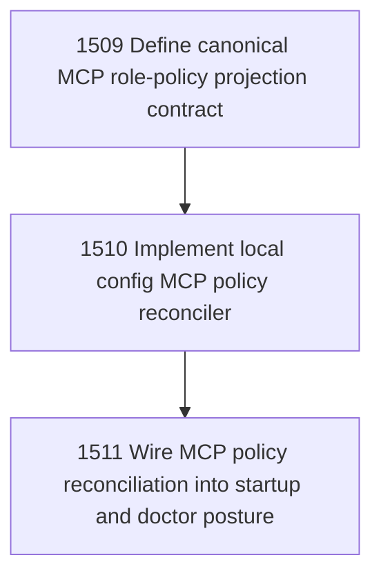

# MCP Policy Reconciliation

## Goal

Commissioned chapter mcp-policy-reconciliation for tasks 1509-1511.

## DAG

## Active Tasks

| # | Task | Name | Status |
|---|------|------|--------|
| 1 | 1509 | Define canonical MCP role-policy projection contract | opened |
| 2 | 1510 | Implement local config MCP policy reconciler | opened |
| 3 | 1511 | Wire MCP policy reconciliation into startup and doctor posture | opened |

## Closure Criteria

- [ ] All commissioned tasks are closed or confirmed.
- [ ] Chapter evidence is complete.
