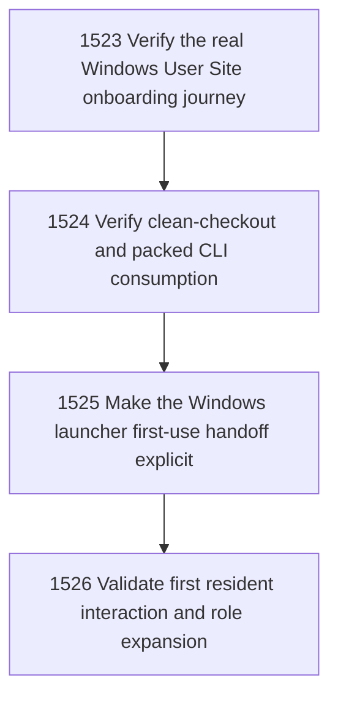

# First-Use Operator Success Validation

## Goal

Commissioned chapter first-use-operator-success-validation for tasks 1523-1526.

## DAG

## Active Tasks

| # | Task | Name | Status |
|---|------|------|--------|
| 1 | 1523 | Verify the real Windows User Site onboarding journey | opened |
| 2 | 1524 | Verify clean-checkout and packed CLI consumption | opened |
| 3 | 1525 | Make the Windows launcher first-use handoff explicit | opened |
| 4 | 1526 | Validate first resident interaction and role expansion | opened |

## Closure Criteria

- [ ] All commissioned tasks are closed or confirmed.
- [ ] Chapter evidence is complete.
