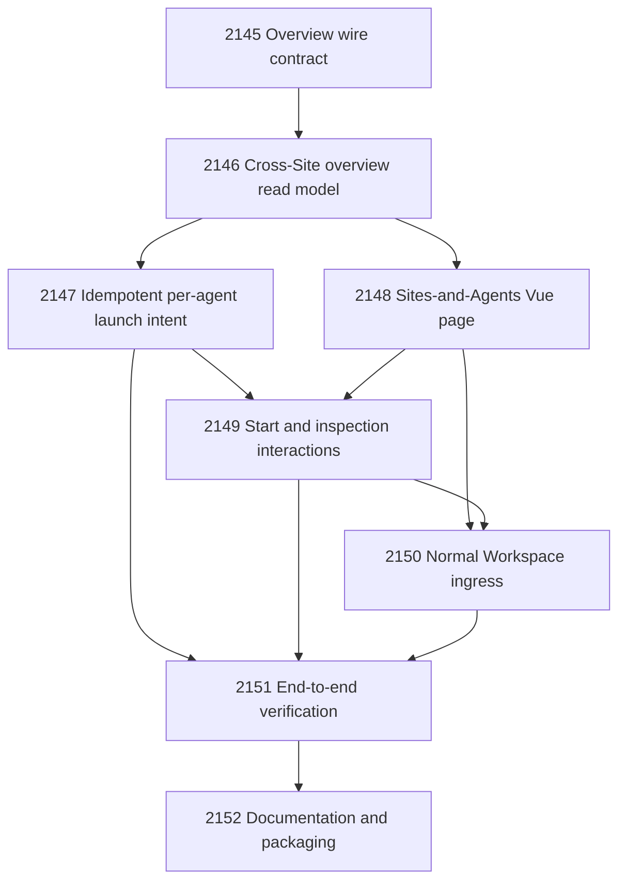

# Site-and-Agent Operator Workspace

## Goal

Implement the normal Operator Workspace overview that groups the User Site and
Host/PC Site separately from ordinary Sites, shows admitted agents and their
orthogonal admission/runtime/work/session state, starts agents idempotently,
and opens canonical session-scoped Agent Web UI projections.

## Authority Shape

- Site identity and classification remain owned by canonical Site/User Site configuration.
- Agent admission remains owned by each Site roster or launch declaration.
- Work state remains owned by Site Operations and task/principal runtime authority.
- Runtime and session state remain owned by the NARS session index.
- Browser navigation remains owned by the Operator Workspace route directory.
- The Operator Console composes these projections and requests governed actions; it does not become authority for them.

## DAG

## Tasks

| # | Task | Name | Status |
|---|---:|---|---|
| 1 | 2145 | Define the Site-and-Agent overview wire contract | closed |
| 2 | 2146 | Compose the cross-Site Site-and-Agent overview read model | closed |
| 3 | 2147 | Add governed idempotent per-agent launch intent | closed |
| 4 | 2148 | Build the Operator Workspace Sites-and-Agents page | closed |
| 5 | 2149 | Implement agent start and inspection interactions | closed |
| 6 | 2150 | Promote Sites and Agents to normal Operator Workspace ingress | closed |
| 7 | 2151 | Verify the Sites-and-Agents operator journey end to end | closed |
| 8 | 2152 | Document and package the Sites-and-Agents Operator Workspace | in review; SQLite review transition retry pending |

## Closure Criteria

- [ ] Tasks 2145-2152 are closed or confirmed through lifecycle authority.
- [x] Focused contract, CLI, UI, browser, and Windows launch tests pass.
- [x] The normal Operator Workspace ingress reaches the overview.
- [x] Unrelated provider/Cloudflare worktree changes remain untouched.
