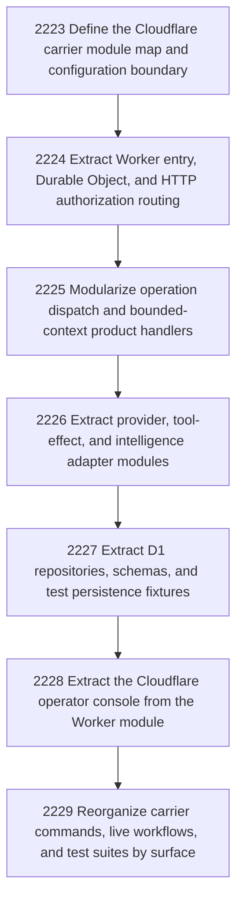

# Refactor Cloudflare carrier into explicit module boundaries

## Goal

Commissioned chapter cloudflare-carrier-organization for tasks 2223-2229.

## DAG

## Active Tasks

| # | Task | Name | Status |
|---|------|------|--------|
| 1 | 2223 | Define the Cloudflare carrier module map and configuration boundary | closed |
| 2 | 2224 | Extract Worker entry, Durable Object, and HTTP authorization routing | closed |
| 3 | 2225 | Modularize operation dispatch and bounded-context product handlers | closed |
| 4 | 2226 | Extract provider, tool-effect, and intelligence adapter modules | closed |
| 5 | 2227 | Extract D1 repositories, schemas, and test persistence fixtures | closed |
| 6 | 2228 | Extract the Cloudflare operator console from the Worker module | closed |
| 7 | 2229 | Reorganize carrier commands, live workflows, and test suites by surface | closed |

## Closure Criteria

- [x] All commissioned tasks are closed or confirmed.
- [x] Chapter evidence is complete.

## Evidence

Tasks 2223–2228 have repository-local lifecycle records with status closed and
peer-reviewed closure metadata. Task 2229 was re-claimed and its repaired replacement
report was submitted through the structured-command MCP operator surface:

* report: wrr_23c287a7_20260720-2229-reorganize-carrier-commands-live-workflows-and-test-suites-b_operator
* status: closed
* review: accepted by Poincare with no findings
* review ID: review-20260720-2229-reorganize-carrier-commands-live-workflows-and-test-suites-b-1784601635782
* stale replacement-report obligation: completed by a targeted transition after
  dry-run identified 119 stale obligations repository-wide; the broad migration was
  not run.
* verification: package pnpm test passed through structured-command MCP with exit code 0;
  unit 43, contract 651, and live 336 tests passed.

The chapter is closed after the final lifecycle readback confirmed all seven
commissioned tasks are closed or confirmed and no task-specific review obligation
remains open.
