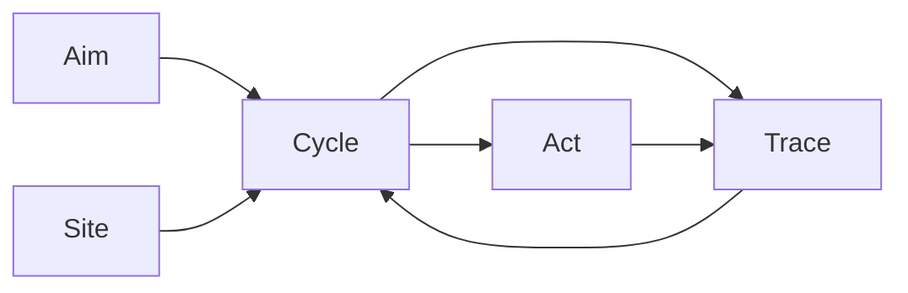

# Task 307 — Semantic Crystallization: Aim / Site / Cycle / Act / Trace

## Context

Recent deployment discussion exposed a semantic smear around the word `operation`.

`operation` currently carries multiple meanings:

- the user-level thing being pursued
- the internal runtime unit Narada manages
- the deployment/process of running Narada
- generic software action/method language

This becomes especially confusing when Narada is used to govern USC-like constructors, because then Narada may help create and deploy systems that themselves create and deploy systems. Phrases like "operation deploys operation" or "Cloudflare operation" lose precision quickly.

The crystallized projection proposed in discussion is:

```text
Aim
Site
Cycle
Act
Trace
```

This task incorporates that projection into Narada's semantic documentation before any deployment-layer or Cloudflare-specific work is designed.

## Goal

Introduce `Aim / Site / Cycle / Act / Trace` as a higher-order semantic lens for Narada without forcing immediate code, database, or CLI renames.

Narada should be explainable as:

```text
Narada advances Aims at Sites through bounded Cycles that produce governed Acts and durable Traces.
```

## Required Work

### 1. Update `SEMANTICS.md`

Add a canonical section defining:

- `Aim`: the pursued telos or user-level objective.
- `Site`: the anchored place where state, substrate bindings, and runtime context live.
- `Cycle`: one bounded attempt to advance an Aim at a Site.
- `Act`: a governed side effect candidate or committed side effect.
- `Trace`: durable explanation/history of what happened and why.

The section must explain that these are higher-order terms. They do not immediately replace all existing implementation terms.

### 2. Add Current-Term Mapping

Add a table mapping existing Narada vocabulary to the crystallized projection.

At minimum include:

| Existing Term | Crystallized Reading |
| --- | --- |
| `operation` | Aim-at-Site binding / current user-facing convenience word |
| `scope` | internal partition for an Aim-at-Site binding |
| `daemon` | one possible Cycle scheduler |
| `run once` / sync cycle / dispatch cycle | Cycle |
| `work_item` | schedulable unit inside Cycle advancement |
| `intent` / `outbound_command` | Act candidate |
| `execution_attempt` | bounded attempt to perform charter work or execute an Act |
| `evaluation` / `foreman_decision` / logs | Trace |
| deployment target | Site materialization |
| Cloudflare Worker / Cron / Sandbox | Site substrate and Cycle machinery |
| Durable Object / R2 / SQLite | Site state and Trace storage |

### 3. Add Forbidden-Smear Examples

Document phrases agents should avoid and their replacement language.

Examples:

- Avoid: `Cloudflare operation`
- Prefer: `Cloudflare Site substrate` or `Cloudflare-backed Site`

- Avoid: `operation deploys operation`
- Prefer: `an Aim creates or materializes another Aim-at-Site binding`

- Avoid: `daemon operation`
- Prefer: `Cycle scheduler` or `continuous Cycle runner`

- Avoid: `deployment operation`
- Prefer: `Site materialization`

### 4. Update `docs/runtime-usc-boundary.md`

Add a short section explaining how the crystallized vocabulary prevents USC recursion confusion.

Required examples:

- `narada.usc` as static/pure constructor knowledge is not itself an active operator.
- A concrete "build ERP" request is an `Aim`.
- A USC app repo or Cloudflare-backed runtime is a `Site`.
- Each refinement/planning/execution pass is a `Cycle`.
- File edits, commits, PRs, deployments are `Acts`.
- Task graph, reviews, logs, decisions are `Traces`.

### 5. Update Root `AGENTS.md`

Add a concise guidance note near Terminology or Documentation Index:

- `operation` remains current user-facing CLI language for now.
- Do not invent new meanings of `operation`.
- For higher-order architecture/design, prefer `Aim / Site / Cycle / Act / Trace`.
- Do not rename CLI flags, DB columns, or package APIs as part of this task.

### 6. Optional Supporting Diagram

If helpful, add a small Mermaid diagram to `SEMANTICS.md`.

It should be simple and must not use Mermaid classes.

Suggested shape:



## Non-Goals

- Do not implement Cloudflare deployment.
- Do not create deployment tasks.
- Do not rename `operation` CLI flags.
- Do not rename `scope` database fields.
- Do not rewrite existing docs wholesale.
- Do not introduce a new runtime object or table.
- Do not create derivative `*-EXECUTED`, `*-DONE`, `*-RESULT`, `*-FINAL`, or `*-SUPERSEDED` files.

## Acceptance Criteria

- [x] `SEMANTICS.md` defines `Aim`, `Site`, `Cycle`, `Act`, and `Trace`.
- [x] `SEMANTICS.md` includes a current-term mapping table.
- [x] `SEMANTICS.md` includes forbidden-smear examples and preferred replacements.
- [x] `docs/runtime-usc-boundary.md` explains the USC recursion case using the new vocabulary.
- [x] Root `AGENTS.md` tells agents when to use the new vocabulary and explicitly bans new ad hoc meanings of `operation`.
- [x] No CLI flags, database fields, or runtime APIs are renamed.
- [x] No Cloudflare-specific implementation work is added.
- [x] No derivative task-status files are created.

## Execution Notes

- **SEMANTICS.md §2.14** added with definitions, current-term mapping table, forbidden-smear examples, and Mermaid diagram.
- **docs/runtime-usc-boundary.md** appended with "USC Recursion and the Crystallized Vocabulary" section containing required layered examples and key distinctions.
- **Root AGENTS.md** updated with "Semantic Crystallization Guidance" subsection under Project Overview.
- No code, CLI flags, DB columns, or package APIs were renamed.
- No Cloudflare-specific implementation was added.
- No derivative status files created.

## Suggested Verification

Run only documentation-focused checks unless code is unexpectedly touched:

```bash
pnpm verify
```

If only Markdown files are modified and `pnpm verify` is already known clean, a task-file guard plus manual doc inspection is acceptable.
