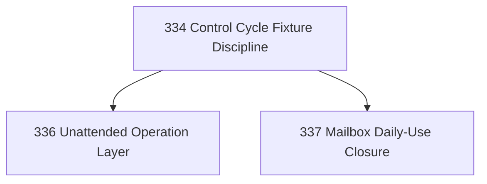

# Post-Cloudflare Coherence Chapter

## Goal

Stabilize Narada's governed-control grammar after the Cloudflare Site prototype: establish fixture discipline, make operations unattended-safe, and close the mailbox vertical as a daily-use product.

## DAG

## Active Chapters

| # | Task | Name | Purpose |
|---|------|------|---------|
| 1 | 334 | Control Cycle Fixture Discipline | Define canonical fixture shapes so integration semantics are tested before components drift |
| 2 | 336 | Unattended Operation Layer | Health contracts, stuck-cycle detection, alerting, self-healing boundaries |
| 3 | 337 | Mailbox Daily-Use Closure | Knowledge, review queue, terminal failure hygiene, draft/send posture |

## Deferred Chapters

| # | Task | Name | Reason |
|---|------|------|--------|
| — | 333 | Canonical Vocabulary Hardening | Task 330 already performed this function. Vocabulary is coherent. |
| — | 335 | Runtime Locus Abstraction | Task 330 deferred generic `Site` abstraction until a second substrate is proven. |

## Chapter Rules

- Use the hardened vocabulary from Task 330. No `operation` smear.
- Each chapter must strengthen Narada as a portable governed-control grammar.
- Fixture discipline applies to every implementation-heavy chapter.
- No generic deployment framework before a second substrate is proven.
- Live credentials or secrets must never be committed.

## Task Files

| # | Task | File | Status |
|---|------|------|--------|
| 333 | Canonical Vocabulary Hardening | [`20260421-333-canonical-vocabulary-hardening.md`](20260421-333-canonical-vocabulary-hardening.md) | Deferred |
| 334 | Control Cycle Fixture Discipline | [`20260421-334-control-cycle-fixture-discipline.md`](20260421-334-control-cycle-fixture-discipline.md) | Closed |
| 335 | Runtime Locus Abstraction | [`20260421-335-runtime-locus-abstraction.md`](20260421-335-runtime-locus-abstraction.md) | Deferred |
| 336 | Unattended Operation Layer | [`20260421-336-unattended-operation-layer.md`](20260421-336-unattended-operation-layer.md) | Closed |
| 337 | Mailbox Daily-Use Closure | [`20260421-337-mailbox-daily-use-closure.md`](20260421-337-mailbox-daily-use-closure.md) | Closed |

## Closure Criteria

- [x] Task 334 closed: fixture discipline documented, 4 canonical fixture shapes defined, backfilled integration tests prove handler boundaries.
- [x] Task 336 closed: unattended operation design documented at `docs/product/unattended-operation-layer.md`.
- [x] Task 337 closed: knowledge model, draft/send posture, terminal failure catalog, and day-2 runbook documented.
- [x] Tasks 333 and 335 remain deferred with documented rationale.
