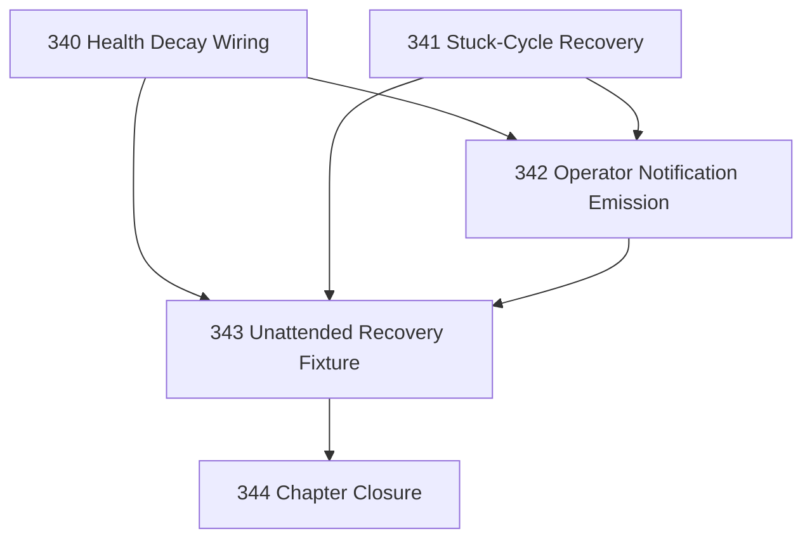

# Unattended Operation Implementation Chapter

## Goal

Move the unattended operation layer from design to executable behavior without changing Narada's authority boundaries.

The chapter applies current CCC pressure:

```text
constructive_executability = -1
authority_reviewability    = +1
```

So the work should implement bounded behavior, not add more meta-process.

## CCC Posture

| Coordinate | Evidenced State | Projected State If Chapter Verifies | Pressure Path | Evidence Required |
|------------|-----------------|-------------------------------------|---------------|-------------------|
| semantic_resolution | `0` | `0` | Maintain 336 semantics | 344 confirms implementation matches documented boundaries |
| invariant_preservation | `0` | `0` | 340–343 authority checks | 343 fixture and 344 review show health/notification/recovery remain advisory/mechanical |
| constructive_executability | `-1` | `0` | 340–343 | Executable health decay, stuck recovery, notification emission, and recovery fixture |
| grounded_universalization | `0` | `0` | Keep Runtime Locus abstraction deferred | 344 confirms no generic deployment framework was introduced |
| authority_reviewability | `+1` | `0` | 343–344 | Review becomes load-bearing over fixture evidence rather than more closure process |
| teleological_pressure | `0` | `0` | This chapter | 344 confirms pressure moved from design to executable behavior |

## DAG



## Tasks

| # | Task | Purpose |
|---|------|---------|
| 340 | Health Decay Wiring | Persist and expose health status transitions from repeated cycle failures/successes |
| 341 | Stuck-Cycle Recovery | Detect stale cycle locks, recover safely, and record recovery traces |
| 342 | Operator Notification Emission | Emit non-blocking, rate-limited operator notifications for critical/auth/stuck events |
| 343 | Unattended Recovery Fixture | Prove failure → recovery → notification path through an executable fixture |
| 344 | Chapter Closure | Review behavior, residuals, docs, and changelog |

## Chapter Rules

- Health, notification, and traces are advisory signals. They must not own work opening, evaluation resolution, lease authority, outbound mutation, or confirmation.
- Stuck-cycle recovery may release or steal only the cycle/site lock it owns. It must not classify work-item failure; Foreman/Scheduler boundaries remain intact.
- Notification failure must never fail a cycle.
- Prefer focused tests through existing fixtures. Do not run broad test suites unless a focused command cannot cover the change.
- Do not create a generic Runtime Locus abstraction in this chapter.
- Do not create derivative task-status files.

## Closure Criteria

- [x] Repeated failures decay health to degraded/critical.
- [x] Successful cycle resets health to healthy.
- [x] Stale cycle lock recovery is implemented and traceable.
- [x] Critical/auth/stuck transitions emit rate-limited notifications.
- [x] A focused fixture proves unattended recovery behavior end-to-end.
- [x] Authority boundaries remain unchanged.
