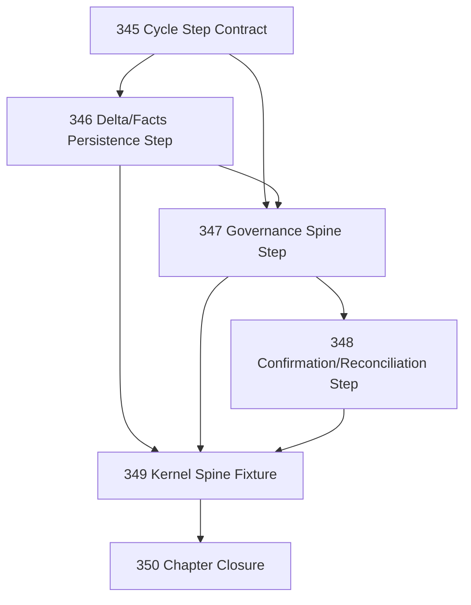

# Cloudflare Kernel Spine Port Chapter

## Goal

Replace the Cloudflare Cycle runner's placeholder steps 2–6 with a bounded, fixture-backed Narada kernel spine.

This chapter must prove that a Cloudflare Runtime Locus can execute the shape of Narada's governed-control grammar, not merely count steps.

## CCC Posture

| Coordinate | Evidenced State | Projected State If Chapter Verifies | Pressure Path | Evidence Required |
|------------|-----------------|-------------------------------------|---------------|-------------------|
| semantic_resolution | `0` | `0` | Keep Task 330 Cloudflare ontology | Closure confirms no Operation/Site/Runtime-Locus smear |
| invariant_preservation | `0` | `0` | 345–349 authority checks | Fixture proves evaluation/decision/intent/execution/confirmation boundaries are not bypassed |
| constructive_executability | `-1` | `0` | 345–349 | Steps 2–6 perform real fixture-backed kernel work instead of no-op step counting |
| grounded_universalization | `0` | `0` | Fixture-backed originating case | Mailbox-like synthetic case runs through the Cloudflare spine without claiming live Graph completeness |
| authority_reviewability | `0` | `0` | 349–350 | Review remains load-bearing over kernel-spine fixture evidence |
| teleological_pressure | `0` | `0` | This chapter | Pressure stays on executable kernel behavior, not deployment abstraction |

## DAG

## Tasks

| # | Task | Purpose |
|---|------|---------|
| 345 | Cycle Step Contract | Replace bare step-number pushes with typed step handlers/results |
| 346 | Delta/Facts Persistence Step | Implement fixture-backed source delta admission into DO durable tables |
| 347 | Governance Spine Step | Implement context/work/evaluation/decision/intent handoff over synthetic facts |
| 348 | Confirmation/Reconciliation Step | Implement fixture-backed confirmation/reconciliation without re-performing effects |
| 349 | Kernel Spine Fixture | Prove steps 2–6 execute real bounded kernel-spine behavior end-to-end |
| 350 | Chapter Closure | Review authority boundaries, residuals, docs, and CCC posture |

## Chapter Rules

- Do not add live Microsoft Graph access in this chapter.
- Do not add real email send.
- Do not claim Cloudflare production readiness.
- Do not create generic Runtime Locus abstraction.
- Do not bypass IAS: evaluation, decision, intent, execution, and confirmation must remain distinct records or fixture-visible boundaries.
- Fixture-backed behavior is acceptable only when explicitly named as fixture-backed.
- No derivative task-status files.

## Closure Criteria

- [x] Steps 2–6 no longer consist only of no-op step-number increments.
- [x] A fixture source can admit durable facts and cursor/apply-log state.
- [x] Synthetic facts can produce governed work/evaluation/decision/intent records.
- [x] Confirmation/reconciliation is represented without self-confirmation or re-performing effects.
- [x] An end-to-end fixture proves the Cloudflare kernel spine.
- [x] Closure records live residuals: live Graph, real Sandbox charter runtime, tool execution, and production send remain out of scope unless actually implemented.

## Closure Decision

`.ai/decisions/20260421-350-cloudflare-kernel-spine-closure.md` — Verdict: **Closed — accepted.**

- `constructive_executability` for the Cloudflare fixture-backed kernel spine moved from `-1` to `0`.
- No overclaim: live Graph sync, production readiness, real charter runtime, real email send, and generic Runtime Locus abstraction are all explicitly deferred.
- IAS boundaries preserved: facts ≠ context/work, evaluation ≠ decision, decision ≠ intent/handoff, confirmation requires observation.

