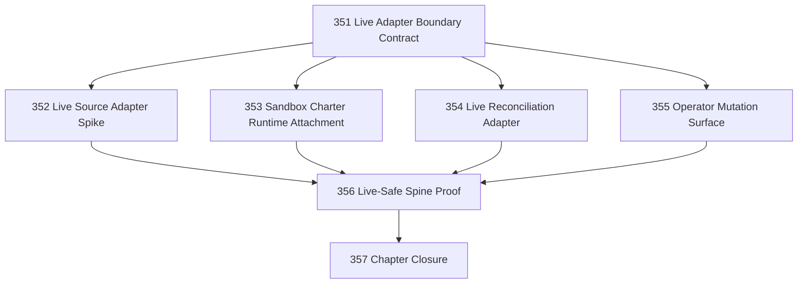

# Cloudflare Live Adapter Spine Chapter

## Goal

Define and implement a bounded Cloudflare Site v1 live-adapter spine.

This chapter moves beyond fixture-only kernel execution by replacing selected fixture seams with live adapters while preserving the Cloudflare-as-Site ontology and IAS boundaries.

## CCC Posture

| Coordinate | Evidenced State | Projected State If Chapter Verifies | Pressure Path | Evidence Required |
|------------|-----------------|-------------------------------------|---------------|-------------------|
| semantic_resolution | `0` | `0` | Keep Task 330 ontology | Closure confirms Site/Operation/Cycle/Act/Trace remain distinct |
| invariant_preservation | `0` | `0` | Live seams must preserve IAS | Live adapters cannot self-authorize, self-execute, or self-confirm |
| constructive_executability | `0` | `+1` scoped | 351–356 | A bounded Cloudflare Site cycle uses at least one live adapter safely |
| grounded_universalization | `0` | `0` | Start from proven fixture spine | Live behavior is attached to existing kernel spine, not new abstraction |
| authority_reviewability | `0` | `0` | 355–357 | Operator mutation and review paths remain audited and explicit |
| teleological_pressure | `0` | `0` | This chapter | Pressure stays on useful live operation, not production overclaim |

## Scope

This chapter is not full production deployment.

Allowed live seams:

- live source read/admission
- real charter runtime spike or explicit blocker proof
- live reconciliation read
- audited operator mutation

Disallowed unless explicitly proven and reviewed:

- autonomous send
- unreviewed effect execution
- generic Runtime Locus abstraction
- multi-Site orchestration
- production readiness claims

## DAG

## Tasks

| # | Task | Purpose |
|---|------|---------|
| 351 | Live Adapter Boundary Contract | Define which fixture seams may become live and how authority is preserved |
| 352 | Live Source Adapter Spike | Attach one bounded live source-read path to fact admission |
| 353 | Sandbox Charter Runtime Attachment | Prove or block real charter evaluation in Cloudflare Sandbox |
| 354 | Live Reconciliation Adapter | Attach live read-only confirmation without re-performing effects |
| 355 | Operator Mutation Surface | Add audited approve/reject/retry control surface |
| 356 | Live-Safe Spine Proof | Prove a bounded live Cloudflare Site path through the spine |
| 357 | Chapter Closure | Review scope, residuals, CCC movement, and overclaim risk |

## Chapter Rules

- Do not create a second Narada runtime.
- Do not treat a live adapter as authority.
- Do not let evaluator output create effects directly.
- Do not let execution or API success self-confirm.
- Do not claim production readiness from a bounded live proof.
- Do not create derivative task-status files.

## Closure Criteria

- [x] Live adapter boundary contract exists and is referenced by implementation tasks.
- [x] At least one live read seam is attached to the Cloudflare kernel spine.
- [x] Charter runtime attachment is either proven or blocked with concrete evidence.
- [x] Reconciliation remains separate from evaluation, decision, and execution.
- [x] Operator mutations are audited if implemented.
- [x] Live-safe proof distinguishes bounded live operation from production readiness.
- [x] Closure records CCC posture honestly.
