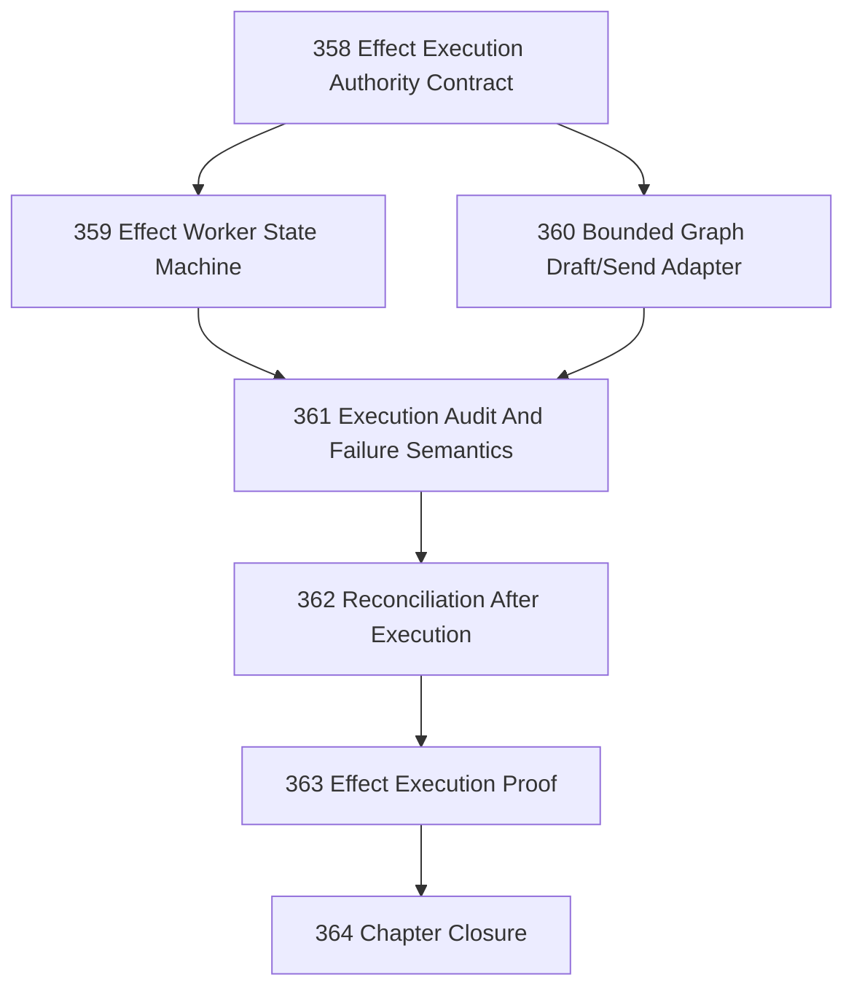

# Cloudflare Effect Execution Boundary Chapter

## Goal

Shape and implement the next bounded Cloudflare chapter: effect execution under explicit authority.

The chapter must cross from live-safe read/control adapters into one real effect-execution path without collapsing intelligence, authority, execution, and confirmation.

## CCC Posture

| Coordinate | Evidenced State | Projected State If Chapter Verifies | Pressure Path | Evidence Required |
|------------|-----------------|-------------------------------------|---------------|-------------------|
| semantic_resolution | `0` | `0` | Keep Site/Operation/Cycle/Act/Trace stable | Effect execution does not introduce new smeared nouns |
| invariant_preservation | `0` | `0` | 358–363 authority contract and tests | Execution requires prior authority and later confirmation |
| constructive_executability | `+1 scoped` | `+1 wider scoped` | 359–363 | One bounded external effect is attempted through a worker boundary |
| grounded_universalization | `0` | `0` | Start from Cloudflare originating case | No generic effect substrate until one concrete path is proven |
| authority_reviewability | `0` | `0` | 358, 361, 364 | Operator approval and execution audit remain inspectable |
| teleological_pressure | `0` | `0` | This chapter | Pressure stays on useful governed action, not production readiness |

## Chapter Boundary

This chapter is about one bounded effect-execution path.

Allowed:

- one effect-execution adapter
- approved-command-only execution
- submitted/attempted state recording
- live or mocked external mutating API boundary
- reconciliation remains separate from execution

Disallowed unless explicitly reviewed:

- autonomous send without prior approval
- production readiness claims
- generic effect-execution abstraction
- multi-provider execution substrate
- confirmation from API success alone

## DAG

## Tasks

| # | Task | Purpose |
|---|------|---------|
| 358 | Effect Execution Authority Contract | Define exact authority, state, and no-overclaim boundary for effect execution |
| 359 | Effect Worker State Machine | Add approved-only execution worker state transitions without external API dependency |
| 360 | Bounded Graph Draft/Send Adapter | Implement or spike one bounded Graph mutating adapter behind a worker boundary |
| 361 | Execution Audit And Failure Semantics | Persist attempts, failures, retries, and terminal states honestly |
| 362 | Reconciliation After Execution | Ensure submitted/attempted effects confirm only through reconciliation |
| 363 | Effect Execution Proof | Prove approved command -> execution attempt -> submitted -> observed confirmation |
| 364 | Chapter Closure | Review scope, residuals, CCC posture, and overclaim risk |

## Chapter Rules

- No evaluator output may execute an effect directly.
- No command may execute unless it is explicitly approved under the chapter contract.
- Execution success does not equal confirmation.
- Reconciliation must remain a separate read/observation path.
- External API calls may be mocked for tests, but the adapter boundary must be real.
- Do not claim production readiness.
- Do not create derivative task-status files.

## Closure Criteria

- [x] Effect execution authority contract exists.
- [ ] Worker state machine rejects unapproved commands.
- [ ] One bounded effect-execution adapter exists or blocker proof exists.
- [ ] Execution attempts are audited with honest failure semantics.
- [ ] Confirmation remains separate from execution.
- [ ] Proof covers approved effect attempt through reconciliation.
- [ ] Closure records CCC posture honestly.
