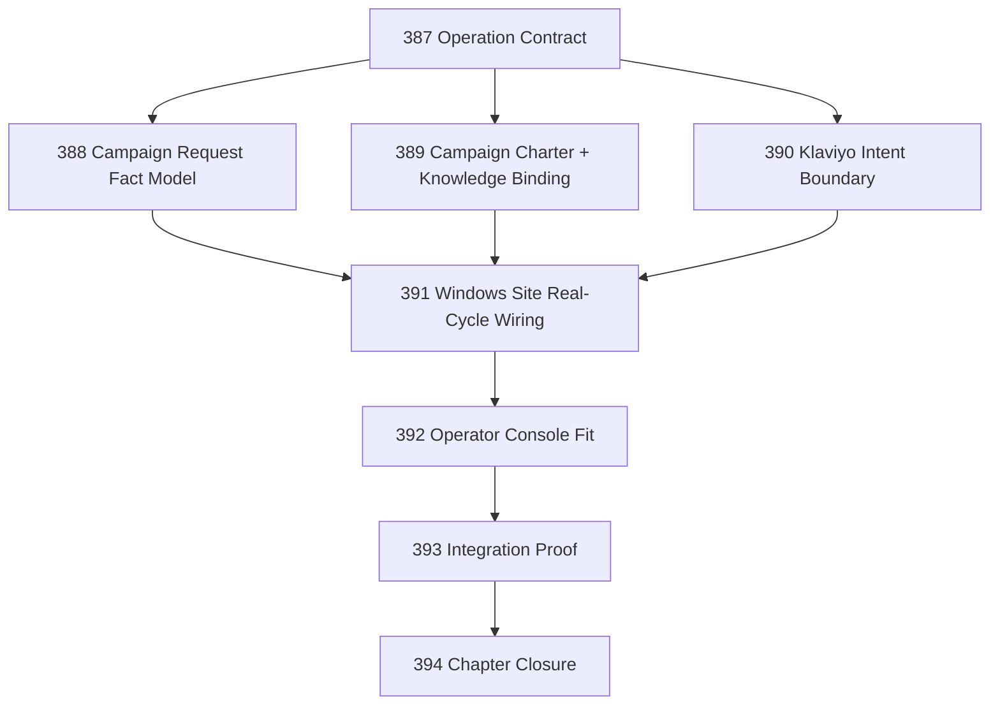

# Email Marketing Operation Chapter

## Goal

Implement Narada's first non-helpdesk Operation: an email-marketing Operation that turns inbound colleague/customer requests into governed Klaviyo campaign work.

This chapter proves the kernel can support a second vertical (campaign management) without collapsing into the mailbox helpdesk vertical or extracting premature generic abstractions.

## First Executable Skeleton

The chapter's success criterion is proving this pipeline end-to-end:

> `inbound request fact` → `campaign work item` → `charter evaluation` → `durable draft campaign intent` → `operator attention / approval`

This is the canonical constructive proof for Narada's second vertical. Tasks 387–390 set the boundaries. Task 393 is the keystone runnable fixture that demonstrates the skeleton works. Tasks 391–392 fill substrate gaps and console fit but must not block the integration proof.

## DAG

## Active Tasks

| # | Task | Name | Purpose |
|---|------|------|---------|
| 1 | 387 | Email Marketing Operation Contract | Boundary, posture, non-goals, authority table |
| 2 | 388 | Campaign Request Fact Model | Canonical facts, source schema, extraction rules |
| 3 | 389 | Campaign Charter + Knowledge Binding | Charter behavior, knowledge sources, missing-info escalation |
| 4 | 390 | Klaviyo Intent Boundary | Durable intents, forbidden actions, credential handling |
| 5 | 391 | Windows Site Real-Cycle Wiring | What must exist for Windows to run the operation end-to-end |
| 6 | 392 | Operator Console Fit | Pending drafts, missing credentials, missing info surface correctly |
| 7 | 393 | Email Marketing Operation Integration Proof | End-to-end fixture proving the pipeline |
| 8 | 394 | Chapter Closure | Review, residuals, CCC posture, next-work recommendations |

## Chapter Rules

- Use SEMANTICS.md §2.14 vocabulary: Aim / Site / Cycle / Act / Trace.
- No `operation` smear. No "marketing automation framework" abstraction.
- Campaign publish/send is explicitly out of scope for v0.
- Private brand/customer data belongs in ops repos, not public Narada packages.
- All Klaviyo mutations must be durable intents before execution.
- Missing credentials and missing campaign data become operator attention items.
- Do not create derivative task-status files.

## Deferred Work

The following capabilities are explicitly deferred and must not be introduced during this chapter:

| Deferred Capability | Rationale |
|---------------------|-----------|
| **Generic SaaS connector framework** | Premature abstraction. No second SaaS vertical exists to validate generality. |
| **Generic marketing automation framework** | First marketing Operation. Framework extraction requires evidence from at least one live vertical. |
| **Generic Site core extraction** | Cloudflare and Windows Sites are substrate-specific. A common core is deferred until a third substrate appears. |
| **Additional governance dashboards** | Authority reviewability is already strong. No new observation surfaces are needed. |
| **Autonomous campaign publish/send** | All campaign drafts require explicit operator review in v0. Send/publish is forbidden without operator policy. |
| **Real Klaviyo API calls** | v0 uses manual operator entry. Adapter is specified (Task 390) but not implemented until v1. |
| **Real-time Klaviyo webhooks** | Polling-only for v0. Webhook push is deferred. |
| **NLP/ML extraction model** | v0 uses simple keyword matching. NLP is deferred to v1. |

## Closure Criteria

- [ ] Task 387 closed: operation contract exists, authority boundaries explicit, Klaviyo send/publish forbidden in v0.
- [ ] Task 388 closed: campaign request fact model is defined and distinguishable from helpdesk mail facts.
- [ ] Task 389 closed: campaign charter behavior is specified, knowledge binding is documented, missing-info escalation path exists.
- [ ] Task 390 closed: Klaviyo intent boundary defines allowed/forbidden actions, credential seam is documented.
- [ ] Task 391 closed: Windows Site can run the marketing Operation Cycle end-to-end.
- [ ] Task 392 closed: operator console surfaces campaign drafts, missing credentials, and missing info correctly.
- [ ] Task 393 closed: integration proof fixture demonstrates full pipeline.
- [ ] Task 394 closed: semantic drift check passes, gap table produced, CCC posture recorded.
