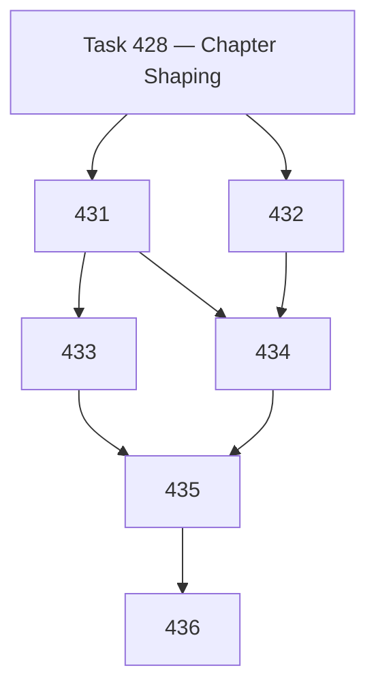

# Chapter DAG — macOS Site Materialization (Tasks 431–436)

> Self-standing chapter for macOS-backed Narada Site materializations.
> Sibling to the Windows Site materialization chapter (Tasks 371–377) and the Cloudflare Site materialization chapter.
>
> Uses canonical vocabulary per [`SEMANTICS.md §2.14`](../../SEMANTICS.md) and Task 424 two-level mapping.

---

## Chapter Goal

Make macOS a first-class Site substrate with a disciplined materialization chapter that defines design, implementation, and closure tasks.

---

## Task DAG

| Task | Title | Purpose |
|------|-------|---------|
| **431** | macOS Site Boundary / Design Contract | Actionable boundary contract that Tasks 432–435 implement against |
| **432** | launchd Runner / Supervision Spike | Implement bounded Cycle runner and LaunchAgent supervision |
| **433** | macOS Credential and Path Binding Contract | Resolve Site root, Keychain secrets, and path-with-spaces handling |
| **434** | Health / Trace / Operator-Loop Integration | Site-local health, trace storage, and operator CLI surface |
| **435** | Sleep/Wake and Missed-Cycle Recovery Fixture | Prove the Cycle behaves correctly across sleep/wake boundaries |
| **436** | macOS Site Materialization Closure | Chapter-level closure review, gap table, generic abstraction decision |

---

## Authority Boundaries (Preserved Across All Tasks)

| Concern | Owner | What macOS runner may do | What macOS runner must NOT do |
|---------|-------|-------------------------|------------------------------|
| **Lock** | `FileLock` (kernel) | Call `acquire()` before Cycle; call release after Cycle | Invent a new lock mechanism; bypass TTL expiry |
| **Health** | `computeHealthTransition` (kernel) | Call with cycle outcome; write result to SQLite | Invent new health states; override transition rules |
| **Trace** | Cycle runner (ephemeral) | Append trace records to SQLite and filesystem | Delete or mutate historical traces |
| **Work opening** | Foreman (`DefaultForemanFacade`) | Call `onContextsAdmitted()` or `recoverFromStoredFacts()` | Open work items directly via SQL |
| **Leases** | Scheduler (`SqliteScheduler`) | N/A — macOS v0 does not run a continuous scheduler | Claim or release leases |
| **Decisions** | Foreman (`DefaultForemanFacade`) | Call foreman governance methods | Create `foreman_decision` rows via SQL |
| **Outbound commands** | `OutboundHandoff` | Call `createCommandFromDecision()` | Insert `outbound_handoff` rows directly |
| **Effect execution** | Outbound workers (`SendReplyWorker`, `NonSendWorker`) | N/A — v0 uses fixture stubs | Send email or mutate Graph API directly |
| **Secret resolution** | Credential resolver (Task 433) | Call `resolveSecret(siteId, name)` | Hard-code credentials or read from undocumented locations |

---

## Task Files

| File | Task |
|------|------|
| `.ai/tasks/20260422-431-macos-site-boundary-contract.md` | 431 |
| `.ai/tasks/20260422-432-launchd-runner-supervision-spike.md` | 432 |
| `.ai/tasks/20260422-433-macos-credential-path-binding-contract.md` | 433 |
| `.ai/tasks/20260422-434-macos-health-trace-operator-integration.md` | 434 |
| `.ai/tasks/20260422-435-macos-sleep-wake-recovery-fixture.md` | 435 |
| `.ai/tasks/20260422-436-macos-site-materialization-closure.md` | 436 |
