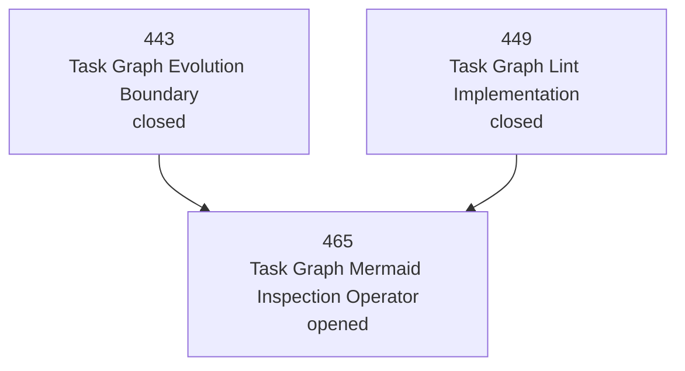

# Task 465 — Task Graph Mermaid Inspection Operator

## Context

Narada now treats `.ai/tasks` as a governed task graph substrate. The graph has task files, front-matter lifecycle state, `depends_on`, `blocked_by`, chapter DAG files, assignment/roster state, WorkResultReports, and review artifacts.

Humans can inspect pieces of this through:

- `narada task list`
- `narada task lint`
- `narada task roster show`
- chapter DAG markdown files with hand-written Mermaid blocks

But there is no canonical read-only operator that renders the **current task graph** as Mermaid for human observability. This creates avoidable operator load: the architect/operator must mentally reconstruct dependency structure, blocked work, and active assignments from scattered files.

This task implements a read-only inspection operator:

```bash
narada task graph --format mermaid
```

It must not mutate task files, roster files, reports, reviews, or registry state.

## Goal

Provide a canonical human-observable task graph rendering surface that turns the current `.ai/tasks` graph into Mermaid.

The output should be directly pasteable into Markdown or Mermaid viewers and should make active work, blocked work, dependencies, and closure state visible without changing graph state.

## Required Work

### 1. Add task graph read model

Create a pure read model in the CLI layer, likely under:

```text
packages/layers/cli/src/lib/task-graph.ts
```

It must read:

- task files in `.ai/tasks/`
- front matter fields: `status`, `depends_on`, `blocked_by`
- task heading/title: `# Task NNN — Title`
- optional chapter DAG files and chapter ranges where existing helpers make this practical
- roster assignment state from `.ai/agents/roster.json` if available

It must produce an internal graph model:

```ts
interface TaskGraphNode {
  taskNumber: number;
  title: string;
  status: string;
  file: string;
  assignedAgentId?: string;
}

interface TaskGraphEdge {
  from: number;
  to: number;
  kind: "depends_on" | "blocked_by";
}
```

Exact shape may differ, but it must keep nodes and edges explicit.

### 2. Add Mermaid renderer

Render Mermaid as:



Requirements:

- Use safe Mermaid node IDs, e.g. `T465`.
- Escape quotes and brackets in labels.
- Include status in each node label.
- Include assigned agent in node label when present, e.g. `working: a6`.
- Use solid arrows for `depends_on`.
- Use visibly distinct edge labels or style for `blocked_by`.
- Do not use Mermaid class styling unless the implementation is simple and deterministic.
- Output must be stable across runs for the same graph.

### 3. Add CLI command

Add:

```bash
narada task graph
```

Options:

```bash
--format mermaid|json
--range <start-end>
--status <csv>
--include-closed
--cwd <path>
```

Behavior:

- Default human output should be Mermaid.
- `--format json` should emit the graph model.
- `--range 429-454` filters nodes to that range.
- `--status opened,working,blocked` filters nodes by status.
- Closed tasks should be omitted by default unless needed as dependency context or `--include-closed` is provided.
- If a visible task depends on a filtered-out task, include a compact dependency node or edge note rather than silently hiding the dependency.
- Command is read-only.

### 4. Add focused tests

Add focused tests under CLI tests covering:

- Mermaid output for a small synthetic task graph.
- JSON output shape.
- `depends_on` edge rendering.
- `blocked_by` edge rendering.
- range filter.
- status filter.
- roster assignment overlay.
- escaping of labels with quotes/brackets.
- no mutation of task files or roster files.

Do not run broad test suites as default verification. Use focused CLI tests and `pnpm verify`.

### 5. Document the surface

Update:

- `AGENTS.md` Documentation Index or task-governance section
- `docs/governance/task-graph-evolution-boundary.md`

Document that this is an **inspection operator**:

- read-only;
- non-authoritative;
- safe for humans and agents to use before assignment;
- not a replacement for `task lint`, `task claim`, `task roster`, or `chapter close`.

## Non-Goals

- Do not add a web UI.
- Do not implement graph layout beyond Mermaid text.
- Do not mutate task lifecycle state.
- Do not auto-assign agents.
- Do not auto-close or review tasks.
- Do not invent a new task storage format.
- Do not require Graphviz or browser dependencies.

## Acceptance Criteria

- [x] `narada task graph --format mermaid` renders a valid Mermaid `flowchart TD`.
- [x] `narada task graph --format json` emits explicit nodes and edges.
- [x] `depends_on` and `blocked_by` are represented distinctly.
- [x] `--range` and `--status` filters work.
- [x] Active roster assignment is shown when available.
- [x] Closed tasks are omitted by default except when needed for dependency context; `--include-closed` includes them.
- [x] Focused CLI tests cover graph rendering and filtering.
- [x] Documentation identifies this as a read-only inspection operator.
- [x] No task, roster, review, report, or registry files are mutated by the command.

## Execution Notes

### Implementation Summary

Implemented a read-only task graph inspection operator.

Delivered:

- `packages/layers/cli/src/lib/task-graph.ts`
  - Reads task files from `.ai/tasks`.
  - Parses `status`, `depends_on`, `blocked_by`, task number, title, and file path.
  - Overlays active roster assignment state from `.ai/agents/roster.json`.
  - Emits explicit node and edge model.
  - Renders Mermaid `flowchart TD`.
  - Renders JSON graph shape.
- `packages/layers/cli/src/commands/task-graph.ts`
  - Adds command implementation for `narada task graph`.
  - Supports `--format mermaid|json`, `--range`, `--status`, `--include-closed`, and `--cwd`.
- `packages/layers/cli/src/main.ts`
  - Wires `task graph` under task governance commands.
- `packages/layers/cli/test/commands/task-graph.test.ts`
  - Covers Mermaid output, JSON output, dependency edges, blocked edges, range/status filters, roster overlay, escaping, include-closed behavior, empty graph behavior, and no file mutation.
- `AGENTS.md`
  - Adds task graph rendering to navigation/quick-command guidance.
- `docs/governance/task-graph-evolution-boundary.md`
  - Documents task graph rendering as a read-only inspection operator.

### Verification

Focused task graph tests:

```bash
pnpm --filter @narada2/cli exec vitest run test/commands/task-graph.test.ts
```

Result:

```text
Test Files  1 passed (1)
Tests       14 passed (14)
```

CLI typecheck:

```bash
pnpm --filter @narada2/cli typecheck
```

Result: passed.

Derivative task-status file check:

```bash
find .ai/tasks -maxdepth 1 -type f \( -name '*-EXECUTED.md' -o -name '*-DONE.md' -o -name '*-RESULT.md' -o -name '*-FINAL.md' -o -name '*-SUPERSEDED.md' \) -print
```

Result: no files printed.
