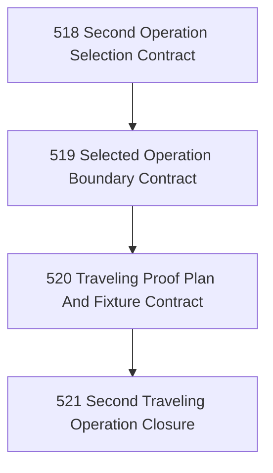

# Second Traveling Operation Selection And Proof Chapter

## Goal

Select one second real operation family beyond mailbox/email-marketing and shape the first bounded proof that Narada's topology travels.

## Why This Chapter Exists

Narada needs one more real operation, not another abstract argument, to prove that the governed zone/crossing topology is portable beyond the current mailbox-heavy line.

## DAG

## Task Table

| Task | Name | Purpose |
|------|------|---------|
| 518 | Second Operation Selection Contract | Choose the next operation family by explicit criteria, not whim |
| 519 | Selected Operation Boundary Contract | Define facts, work, intents, and forbidden shortcuts for the chosen operation |
| 520 | Traveling Proof Plan And Fixture Contract | Define the first bounded proof and its fixtures/live boundary |
| 521 | Second Traveling Operation Closure | Close the chapter shaping and state what proof comes next |

