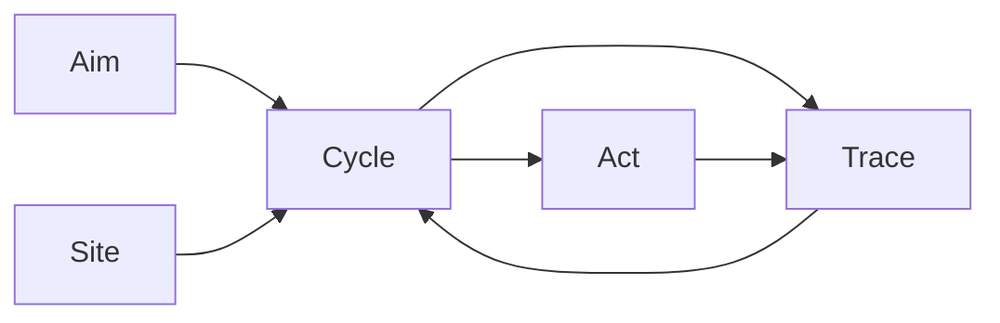

# Narada Semantics and Ontology

> **Canonical vocabulary for Narada.**  
> This document is the single source of truth for user-facing and system-facing terms.  
> Other documents may elaborate or contextualize, but they must not contradict these definitions.

---

## 1. User-Facing Vocabulary

Terms that appear in CLI output, configuration, documentation, and user communication.

<a name="operation"></a>
### 1.1 `operation` (Primary)

An **operation** is the live configured thing a user sets up and runs.

- A mailbox operation (syncing `help@company.com`)
- A workflow operation (a timer-driven health check)
- A webhook operation (an inbound HTTP-triggered automation)
- A helpdesk operation (a single mailbox with a triage charter)

Users create, configure, preflight, activate, and run **operations**.

Each operation maps to exactly one `scope`. An operation is the atomic unit of user intent; a scope is its internal representation. If Narada later needs to group or coordinate multiple operations, that will be introduced as a distinct composite concept (e.g. `suite` or `campaign`), not by redefining `operation`.

<a name="ops-repo"></a>
### 1.2 `ops repo`

An **ops repo** (or **operations repo**) is a private repository that contains one or more operations, plus their knowledge, scenarios, and local configuration.

Created with:

```bash
narada init-repo ~/src/my-ops
```

<a name="typed-variants"></a>
### 1.3 Typed Variants

When specificity matters:

| Variant | Meaning |
|---------|---------|
| `mailbox operation` | An operation whose source is a mailbox |
| `workflow operation` | An operation whose source is a timer/cron schedule |
| `webhook operation` | An operation whose source is an inbound HTTP webhook |
| `filesystem operation` | An operation whose source is a local filesystem path |

---

## 2. System Ontology

Terms used inside the kernel, control plane, and runtime.

### 2.1 The Nine-Layer Pipeline

All verticals traverse the same pipeline:

```
Source → Fact → Context → Work → Policy → Intent → Execution → Confirmation → Observation
```

| Layer | Responsibility | Durable? | Canonical Name |
|-------|----------------|----------|----------------|
| **Source** | Pulls records from a remote or local origin using an opaque checkpoint | Checkpoint only | `source_id` |
| **Fact** | Canonical, replay-stable envelope of every observed change | **Yes** | `fact_id` |
| **Context** | Groups facts into policy-relevant scopes | Metadata: **Yes**; grouping: No | `context_id`, `scope_id` |
| **Work** | Terminal schedulable unit opened for a context revision | **Yes** | `work_item_id` |
| **Policy** | Admits, supersedes, or rejects work; governs proposed effects | Decision: **Yes** | `decision_id` |
| **Intent** | Universal durable effect boundary | **Yes** | `intent_id` |
| **Execution** | Claims intent and performs the effect | **Yes** | `execution_id` |
| **Confirmation** | Binds execution outcome back to durable state | **Yes** | — |
| **Observation** | Read-only derived views over durable state | No | — |

### 2.2 Core Abstractions

#### `scope`

The internal runtime/config representation of an operation.

- `scope_id` identifies it in config files and the database
- `scope` is the correct word inside the kernel, CLI code, and config schema
- Users should not need to know the word "scope" to use Narada successfully

Narada compiles one **operation** into one **scope** and then into lower-level runtime/control-plane objects.

#### `fact`

The **first canonical durable boundary**. All external change enters as a Fact.

```typescript
interface Fact {
  fact_id: string;           // deterministic, replay-stable
  fact_type: FactType;       // e.g. "mail.message.discovered", "timer.tick"
  provenance: FactProvenance;
  payload_json: string;      // opaque, vertical-specific
  created_at: string;
}
```

Properties:
- All replay determinism derives from fact identity
- Fact store ingestion is idempotent (`fact_id` primary key)
- Re-pulling may return overlapping records; deduplication is the kernel's responsibility

#### `context`

A policy-relevant grouping of facts.

- `context_id` is domain-neutral. For mailbox it may be a conversation; for timer it may be `timer:{schedule_id}`; for webhook it may be `webhook:{endpoint_id}`.
- `context_records` is the durable table that tracks context metadata (primary charter, status, last activity times).
- `context_revisions` tracks deterministic snapshots of a context over time.
- Work items are keyed by `context_id`, but the abstract *grouping* itself is not durable; only its control-plane metadata and revision history are.
- No kernel section may assume `conversation_id`, `thread_id`, or message semantics.

#### `work_item`

The **terminal schedulable unit**.

```typescript
interface WorkItem {
  work_item_id: string;
  context_id: string;
  scope_id: string;
  status: "opened" | "leased" | "executing" | "resolved" | "failed_retryable" | "failed_terminal" | "superseded" | "cancelled";
  opened_for_revision_id: string;
}
```

Properties:
- At most one non-terminal work item per context may be `leased` or `executing`
- Supersession replaces stale work with new work when a higher revision arrives
- Work items are durable and survive crashes

#### `policy` / `foreman`

The foreman performs three authorities:

1. **Admission** — `onFactsAdmitted()` opens/supersedes work items from `PolicyContext[]`
2. **Governance** — `resolveWorkItem()` validates charter output, applies policy, and decides accept / reject / escalate / no-op
3. **Handoff** — On acceptance, atomically persists the decision and emits an `Intent`

Policy is the **sole gate to effects**. No effect may materialize without passing through foreman governance.

**Explicit replay derivation**: `deriveWorkFromStoredFacts()` re-derives work from already-stored facts without requiring a fresh source delta. It uses the same context formation + work-opening path as live admission but does not mark facts as admitted. This is the canonical path for replay, policy testing, and recovery from control-plane loss.

#### `intent`

The **universal durable effect boundary**.

```typescript
interface Intent {
  intent_id: string;
  intent_type: string;        // e.g. "mail.send_reply", "process.run"
  executor_family: string;    // e.g. "mail", "process"
  payload_json: string;
  idempotency_key: string;    // deterministic per (context, action, payload)
  status: IntentStatus;
  context_id: string;
}
```

Properties:
- All side effects (mail sends, process spawns, future automations) must be represented as an Intent before execution
- Idempotency is enforced at `idempotency_key`
- No `Intent` may be created outside the foreman's atomic handoff transaction

#### `execution`

Executors claim admitted Intents and perform effects:

- **Mail family** → `OutboundHandoff` creates `OutboundCommand`, workers mutate Graph state
- **Process family** → `ProcessExecutor` spawns a subprocess, records exit code
- Future families follow the same lifecycle algebra (`admitted → started → completed / failed`)

#### `confirmation`

Binds the external effect back to durable state:

- `submitted` — executor received external acceptance
- `confirmed` — inbound observation or reconciliation proves the effect took hold
- `failed` — external rejection or timeout

Confirmation status is **derived from durable store state**, not in-memory or log state.

#### `observation`

Read-only, reconstructible views over durable state.

- Non-authoritative: may be deleted and rebuilt without affecting correctness
- No scheduler, lease, executor, or sync path may depend on observation artifacts
- Operator visibility must not require terminal attachment

### 2.3 First-Class Runtime Terms

Terms already treated as first-class in code and docs.

#### `charter`

A named policy configuration that defines how a context should be analyzed and what actions may be proposed.

- **Layer**: Control plane / charters domain
- **User-facing**: Yes — users declare `primary_charter` and `secondary_charters` in scope config
- **Durable boundary**: Config-scoped; charter outputs persisted in `evaluations`
- **Authority owner**: Charter runtime (`@narada2/charters`)

Replaces the generic term `agent`. Each scope binds one primary charter and optional secondary charters for arbitration.

#### `posture`

A named safety preset that maps to a concrete set of allowed actions for a vertical.

- **Layer**: ops-kit / CLI
- **User-facing**: Yes — set via `want-posture` or `--posture` flags
- **Durable boundary**: Scope config (`allowed_actions` derived from posture)
- **Authority owner**: Operator

Canonical progression: `observe-only` → `draft-only` → `review-required` → `autonomous`. Postures do not invent actions; they select from the existing `AllowedAction` universe.

#### `evaluation`

The structured output envelope produced by charter execution.

- **Layer**: Control plane / foreman
- **User-facing**: No
- **Durable boundary**: `evaluations` table
- **Authority owner**: Charter runtime (produces); Foreman (governs)

Contains proposed actions, tool requests, confidence scores, and outcome classification. Evaluations are governed by the foreman before any effect is authorized.

#### `decision`

The authoritative record of the foreman's governance outcome for a work item.

- **Layer**: Control plane / foreman
- **User-facing**: No (surfaced read-only via observation)
- **Durable boundary**: `foreman_decisions` table (coordinator store)
- **Authority owner**: Foreman

Binds an approved action, its payload, and rationale. Decisions are the sole gate to intent creation; no intent may exist without a preceding decision.

#### `outbound handoff`

The durable bridge between a foreman decision and its executable command envelope.

- **Layer**: Control plane / outbound
- **User-facing**: No
- **Durable boundary**: `outbound_handoffs` table
- **Authority owner**: Foreman handoff logic

Preserves the decision-to-command lineage and tracks submission status through the outbound worker registry.

#### `outbound command`

The executable command envelope derived from a decision.

- **Layer**: Control plane / outbound
- **User-facing**: No
- **Durable boundary**: `outbound_commands` view/table (outbound store)
- **Creation authority**: `OutboundHandoff.createCommandFromDecision()` (called within the foreman's atomic decision transaction)
- **Mutation/execution authority**: outbound workers registered in `WorkerRegistry` (`send_reply`, `non_send_actions`)
- **Reconciliation authority**: `OutboundReconciler`

Contains the concrete action payload (e.g., draft content, move target) and tracks execution state from creation through confirmation.

#### `tool call`

A governed, durable record of a charter's request to invoke an external tool.

- **Layer**: Control plane / coordinator
- **User-facing**: No (operators may inspect summaries)
- **Durable boundary**: `tool_call_records` table
- **Authority owner**: Charter runtime (requests); Foreman (governs); Executor (performs)

Validated by the foreman before execution. Exit status is recorded for observability and operator categorization.

#### `trace`

A durable record of charter execution metadata.

- **Layer**: Control plane / agent observability
- **User-facing**: No (operator-facing via observation API)
- **Durable boundary**: `agent_traces` table
- **Authority owner**: Charter runtime (produces); Observation layer (reads)

Contains token usage, latency, model references, and session linkage. Non-authoritative for control but essential for debugging and audit.

#### `knowledge source`

A declared reference to external knowledge consumed by a charter during context analysis.

- **Layer**: Charters domain
- **User-facing**: Yes (declared in charter config)
- **Durable boundary**: Config-scoped; normalized items may be cached
- **Authority owner**: Charter runtime

May be a URL, local filesystem path, or SQLite database. Knowledge sources are vertical-specific and bound to charter scope.

#### `operator action`

A durable request for a human operator to perform a safe, UI-mediated mutation.

- **Layer**: Control plane / coordinator
- **User-facing**: Yes (operator initiates via UI/CLI)
- **Durable boundary**: `operator_action_requests` table
- **Authority owner**: Operator

The explicit bridge between human judgment and system state. Current safelisted actions: `retry_work_item`, `acknowledge_alert`. Future extensions (e.g., draft approval, decision override) must be added explicitly to the safelist before they become available.

---

### 2.4 Identity Lattice

| Identity | Format | Scope | Derivation |
|----------|--------|-------|------------|
| `context_id` | Domain-neutral string | Policy-relevant grouping | `conversation_id` for mailbox; `timer:{id}` for timer; etc. |
| `revision_id` | `{context_id}:rev:{ordinal}` | Snapshot of a context at a point in time | Ordinal incremented by foreman on material change |
| `work_item_id` | `wi_<uuid>` | Terminal schedulable unit | Random UUID |
| `execution_id` | `ex_<uuid>` | Bounded charter invocation | Random UUID |
| `evaluation_id` | `eval_<execution_id>` | Structured output summary | Derived from `execution_id` |
| `decision_id` | `fd_<work_item_id>_<action_type>` | Foreman proposal | Deterministic from work item + action |
| `outbound_id` | `ob_<decision_id>` | Executable command envelope | Derived from `decision_id` |
| `event_id` | `evt_<sha256>` | Compiler-normalized source record | Content-addressed hash of normalized payload |

#### Legacy Aliases

- `thread_id === conversation_id` — legacy alias. All new code uses `context_id`.
- `mailbox_id === scope_id` — legacy alias in some Graph adapter contexts.

### 2.5 Worker Registry

First-class worker identities with explicit concurrency policies:

| Worker | Executor Family | Policy | Responsibility |
|--------|----------------|--------|----------------|
| `process_executor` | `process` | `singleton` | Executes `process.run` intents via subprocess |
| `send_reply` | `outbound` | `singleton` | Creates drafts and sends reply messages |
| `non_send_actions` | `outbound` | `singleton` | Executes mark_read, move_message, set_categories |
| `outbound_reconciler` | `outbound` | `singleton` | Reconciles submitted commands with remote state |

### 2.6 Verticals

Verticals (mailbox, timer, webhook, filesystem, process) are **interchangeable projections, not organizing primitives**. Domain-specific semantics must be explicit and local, never implicit or generic.

---

### 2.7 Authority Classes

Authority classes classify what a component, tool, or command is allowed to do. They are a policy-enforced boundary, not a suggestion.

<a name="authority-derive"></a>
#### `derive`

Computes declared outputs from declared inputs. No side effects, no lifecycle state changes, no claiming, no leases.

- **Examples**: `refine`, `plan`, `validate`, `init` (artifact generation)
- **Safe to re-run**: Yes, idempotent or explicitly `--force`
- **Who may use**: Any component with access to the inputs

<a name="authority-propose"></a>
#### `propose`

Produces a structured proposal that requires governance approval before it becomes an intent.

- **Examples**: charter evaluation, task graph proposals, domain-pack refinements
- **Safe to re-run**: Yes
- **Who may use**: Charters, domain packs, compiler tools

<a name="authority-claim"></a>
#### `claim`

Acquires exclusive rights to a schedulable unit or resource.

- **Examples**: claiming a work item, acquiring a lease
- **Safe to re-run**: No — requires concurrency control
- **Who may use**: Narada runtime-authorized components only

<a name="authority-execute"></a>
#### `execute`

Performs an effect that mutates external world state or consumes resources.

- **Examples**: invoking a tool, running a subprocess, sending a message
- **Safe to re-run**: Only if idempotent; generally requires crash/retry handling
- **Who may use**: Narada runtime-authorized executors only

<a name="authority-resolve"></a>
#### `resolve`

Advances lifecycle state (complete, reject, block, escalate, supersede).

- **Examples**: marking work completed, rejecting a task, blocking a dependency
- **Safe to re-run**: No — changes durable lifecycle state
- **Who may use**: Narada runtime-authorized governance components only

<a name="authority-confirm"></a>
#### `confirm`

Acknowledges that an external effect has been observed and binds it to durable state.

- **Examples**: confirming a sent message, reconciling remote state
- **Safe to re-run**: Idempotent by design
- **Who may use**: Narada runtime-authorized confirmation workers only

<a name="authority-admin"></a>
#### `admin`

Overrides policy or changes structural configuration.

- **Examples**: posture escalation, charter binding changes, operator override
- **Safe to re-run**: No — changes governance structure
- **Who may use**: Explicit operator/admin posture only

#### Policy Enforcement

- Domain packs may define only `derive` and `propose` capabilities.
- Only Narada runtime-authorized components may perform `claim`, `execute`, `resolve`, or `confirm`.
- `admin` requires explicit operator/admin posture.
- Charter runtime envelopes must expose the capability authority class.
- Preflight must reject operation configs that bind a charter or tool to an authority class it is not allowed to use.

---

### 2.8 Re-Derivation and Recovery Operator Family

Narada defines a family of explicit operators that recompute downstream state from durable boundaries. These are not a single vague "replay" — each member has distinct semantics, authority requirements, and safety properties.

#### 2.8.1 Operator Algebra

Every member is described by:

```text
Boundary A → Boundary B
mode: live | replay | preview | recovery | rebuild | confirm
effect: read-only | control-plane-mutating | external-confirmation-only
authority: <class from §2.7>
```

| Dimension | Meaning |
|-----------|---------|
| **Boundary A** | The durable upstream boundary used as input (e.g. `Fact`, `Execution`, `Durable state`) |
| **Boundary B** | The downstream boundary being recomputed (e.g. `Work`, `Context`, `Observation`, `Confirmation`) |
| **mode** | Whether the operator runs as part of live flow, replays a past path, previews a hypothetical, recovers from loss, rebuilds a projection, or replays confirmation |
| **effect** | Whether the operator is read-only, mutates control-plane state, or only updates confirmation bindings |
| **authority** | The authority class governing who may invoke the operator |

#### 2.8.2 Family Members

| Operator | A → B | Mode | Effect | Authority | Description |
|----------|-------|------|--------|-----------|-------------|
| **Live Fact Admission** | `Fact` (unadmitted) → `Fact` (admitted) + `Work` | `live` | `control-plane-mutating` + **fact-lifecycle-mutating** | `resolve` (foreman) | Normal daemon dispatch: selects unadmitted facts, routes through context formation + foreman work opening, then marks facts admitted. Compound operation: admission + work opening. |
| **Replay Derivation** | `Fact` (stored) → `Work` | `replay` | `control-plane-mutating` | `derive` + `resolve` | Explicit operator-triggered re-derivation of work from already-stored facts using the same context-formation + foreman work-opening path as live dispatch. **Does not mark facts admitted** and does not require fresh source delta. |
| **Preview Derivation** | `Fact` → `PolicyContext`/`Evaluation` | `preview` | `read-only` | `derive` | Read-only inspection of what a charter would propose for a stored fact set. Runs context formation and charter evaluation but stops before work opening, lease claiming, or intent creation. |
| **Recovery Derivation** | `Fact` → `Context`/`Work` | `recovery` | `control-plane-mutating` | `derive` + `resolve` + `admin` | Rebuilds recoverable control-plane state after control-plane loss while facts remain intact. Shares the same derivation core as replay (`deriveWorkFromStoredFacts`), but surfaced as a distinct operator (`recoverFromStoredFacts`). Conservative: does not restore active leases or in-flight execution attempts. |
| **Projection Rebuild** | `Durable state` → `Observation` | `rebuild` | `read-only`* | `derive` | Recomputes non-authoritative derived views (filesystem views, search indexes, observation read models) from canonical durable stores via `ProjectionRebuildRegistry`. May write to derived stores, but must not mutate canonical truth, create work, or produce external effects. |
| **Confirmation Replay** | `Execution`/`Outbound` → `Confirmation` | `confirm` | `external-confirmation-only` | `confirm` | Recomputes confirmation state from durable execution/outbound records plus current observation, without re-performing the effect. Mail reconciliation (`OutboundReconciler`) is one vertical instance of this family; `ProcessConfirmationResolver` is another. |

\* Projection rebuild writes to derived stores but not to canonical durable boundaries; its effect on system correctness is read-only.

#### 2.8.3 Semantic Distinctions

These six modes must never be treated as a single vague "replay" bucket:

| Distinction | Rule |
|-------------|------|
| **Live vs Replay** | Live admission is coupled to source sync and marks facts `admitted`; replay reads stored facts independently of `admitted_at` and never mutates fact lifecycle state |
| **Admission vs Work Opening** | Live admission is a *compound* operation (fact lifecycle transition + work opening). Replay is *pure work opening* with no fact lifecycle side effect. Both use the same `ContextFormationStrategy` → `onContextsAdmitted()` path. |
| **Replay vs Preview** | Replay advances control-plane state (opens work); preview is read-only |
| **Replay vs Recovery** | Replay is bounded, operator-triggered, and scoped; recovery is loss-shaped and may re-derive broader control-plane state. They share the same derivation core (`onContextsAdmitted`) but are distinct surfaces (`deriveWorkFromStoredFacts` vs `recoverFromStoredFacts`) with different intended authority (`derive`+`resolve` vs `derive`+`resolve`+`admin`) |
| **Recovery vs Rebuild** | Recovery rebuilds authoritative control-plane state; rebuild only reconstructs non-authoritative projections |
| **Replay/Rebuild vs Confirm** | Replay and rebuild derive from upstream durable boundaries; confirm derives from execution/outbound state outward |
| **All vs Live** | No family member may run automatically on normal daemon startup unless it is live admission |

#### 2.8.4 Safety Properties

1. **Boundedness**: Every operator accepts explicit selection bounds (scope, context, time range, fact set). No background component continuously re-derives.
2. **Authority Preservation**: Replay and recovery preserve foreman authority over work opening, scheduler authority over leases, and outbound handoff authority over command creation.
3. **No Fabrication**: Replay, preview, and recovery must not fabricate source events or fresh inbound deltas.
4. **No Admission Side Effect in Replay**: Replay derivation must not mark facts as `admitted`. Fact lifecycle transitions are the exclusive concern of live dispatch.
5. **Conservative Recovery**: Recovery does not restore active leases, in-flight execution attempts, or already-submitted outbound effects blindly.
6. **Projection Non-Authority**: Rebuild may discard and recompute derived stores without affecting correctness.

#### 2.8.5 Relationship to Authority Classes

- `derive`: Required by preview, rebuild, and the computation phase of replay/recovery
- `resolve`: Required when the operator advances work-item lifecycle state (live, replay, recovery)
- `confirm`: Required for confirmation replay
- `admin`: Required for recovery because it reconstructs control-plane state after loss
- `claim` / `execute`: Not directly invoked by the operator family; these remain the authority of scheduler and worker layers during normal execution of replay-derived work

#### 2.8.6 Evolution Note

**Implemented status**: Replay derivation and recovery derivation share a common core (`deriveWorkFromStoredFacts` / `recoverFromStoredFacts` both route through `onContextsAdmitted`). The distinction is preserved in naming and intended authority (`admin` for recovery) rather than divergent runtime behavior. Preview derivation and projection rebuild are implemented. Confirmation replay is partially implemented.

---

### 2.9 Selection Operator Family

Selection is the lens through which every other operator family operates. It is the authority-agnostic grammar for bounding any operator's input set.

#### 2.9.1 Selector Algebra

A **Selector** is a read-only, composable bound composed of zero or more dimensions:

| Dimension | Type | Description |
|-----------|------|-------------|
| `scopeId` | `string \| string[]` | Scope or scopes to include |
| `since` | `ISO 8601 string` | Temporal lower bound (inclusive) |
| `until` | `ISO 8601 string` | Temporal upper bound (inclusive) |
| `factIds` | `string[]` | Exact fact identities |
| `contextIds` | `string[]` | Exact context identities |
| `workItemIds` | `string[]` | Exact work-item identities |
| `status` | `string` | Family-specific status filter |
| `vertical` | `string` | Vertical filter for multi-vertical scopes |
| `limit` | `number` | Maximum result-set size |
| `offset` | `number` | Pagination offset |

A Selector with zero dimensions is the **universal selector** for its target entity type. Selectors compose by AND: all specified dimensions must match.

#### 2.9.2 Selection Invariants

1. **Read-Only**: A selector never mutates durable state. It is pure inspection until combined with an effectful operator.
2. **Authority-Neutral**: Selection requires no authority class (`derive`, `resolve`, `admin`, etc.).
3. **Closed Grammar**: The selector dimensions listed above are the complete grammar. No operator may introduce ad-hoc bounding vocabulary outside these dimensions.
4. **Composable**: Multiple selectors may be merged into a single canonical selector. If dimensions conflict, the intersection (most restrictive) wins.

#### 2.9.3 Relationship to Other Families

- **Re-derivation** uses selectors to bound replay, preview, recovery, and confirmation replay.
- **Inspection** uses selectors to bound observation queries.
- **Promotion** uses selectors to bound bulk promotion targets.
- **Authority execution** does not use selectors directly; execution is triggered by scheduler claims and worker leases, not by operator-bounded sets.

#### 2.9.4 Evolution Note

The first concrete implementation is `Fact` selection via `getFactsByScope(scopeId, selector)`. It consumes the following selector dimensions: `since`, `until`, `factIds`, `contextIds`, `limit`, and `offset`. Dimensions that target other entity families (`status`, `vertical`, `workItemIds`) are rejected with a clear error rather than silently ignored. As the family matures, selector consumption will spread to work-item queries, execution queries, and observation routes.

---

### 2.10 Promotion Operator Family

Promotion is the bridge between inspection/preview and actual system mutation. It advances artifacts through explicit lifecycle transitions.

#### 2.10.1 Promotable Objects and Transitions

| Promotable Object | Valid Source State | Valid Target State | Trigger | Authority |
|-------------------|-------------------|--------------------|---------|-----------|
| `operation` | `inactive` | `active` | manual operator | `admin` |
| `operation` | posture A | posture B | manual operator | `admin` |
| `work_item` | `failed_retryable` | `failed_retryable` (retry readiness promoted) | manual operator | `resolve` |
| `work_item` | `failed_retryable` | `failed_terminal` | manual operator | `admin` |
| `evaluation` (preview artifact) | `preview` | `governed_work` | manual operator | `derive` + `resolve` |
| `outbound_command` | `draft_ready` | `approved_for_send` | manual operator | `execute` |
| `outbound_command` | `pending` | `cancelled` | manual operator | `execute` |

#### 2.10.2 Promotion Rules

1. **Explicit Only**: Every promotion transition requires an explicit operator trigger. No automatic promotion.
2. **No Fabrication**: Promotion never creates synthetic durable boundaries. A preview evaluation promoted to governed work must route through the same foreman admission path (`onContextsAdmitted` or equivalent) that live facts use.
3. **Authority Respect**: Each transition declares its required authority class. The operator action layer enforces this.
4. **Append-Only Audit**: Every promotion transition is logged to `operator_action_requests`.
5. **Bulk is Cardinality**: Bulk promotion (e.g., retry all failed-retryable items) is a cardinality variation, not a new transition type.

#### 2.10.3 Existing Actions Mapped to Promotion Algebra

- `activate` → `operation: inactive → active`, manual, `admin`
- `want-posture` → `operation: posture A → posture B`, manual, `admin`
- `retry_work_item` → `work_item: failed_retryable` with `next_retry_at` cleared, manual, `resolve`. The item remains `failed_retryable`; the scheduler discovers it as runnable on its next scan.
- `acknowledge_alert` → `work_item: failed_retryable → failed_terminal`, manual, `admin`
- `trigger_sync` → `operation: idle → syncing`, manual, `resolve`
- `approve_draft_for_send` → `outbound_command: draft_ready → approved_for_send`, manual, `execute`. The actual send and `approved_for_send → sending → submitted` transition are performed by the outbound worker, not the operator.
- `request_redispatch` → automatic pipeline promotion, not manual operator promotion

#### 2.10.4 Evolution Note

The first concrete implementation is `retry_failed_work_items` (bulk promotion of retry readiness for `work_item: failed_retryable`). It clears `next_retry_at` without changing status; the scheduler later discovers and claims the item. As the family matures, surfaces for `evaluation → governed_work` and `outbound_command: draft_ready → approved_for_send` will be added. The `approved_for_send → sending → submitted` path is worker-owned effect execution, not manual promotion.

---

### 2.11 Inspection Operator Family

Inspection is the read-only operator family. It observes durable and derived state without mutation.

#### 2.11.1 Definition

**Inspection** reads already-derived state without mutation.
**Preview derivation** (§2.8) re-computes downstream state from a durable boundary without mutation; it is a *re-derivation* member because it starts from a boundary and recomputes, but its effect class is read-only.

The distinction:
- **Inspection** starts from **already-derived** state (observation views, stored evaluations, control-plane snapshots).
- **Preview derivation** starts from a **durable boundary** (`Fact`) and re-derives downstream state (`PolicyContext`, `Evaluation`).

#### 2.11.2 Members

| Member | What It Reads | Surfaces |
|--------|---------------|----------|
| `status` | Sync health, control-plane snapshot, leases, quiescence | CLI `narada status` |
| `integrity` | Cursor validity, apply-log counts, view existence | CLI `narada integrity` |
| `explain` | Operational readiness, blockers, posture | CLI `ops-kit explain` |
| `inspect` | Operation configuration scope | CLI `ops-kit inspect` |
| `observation` | Full read-only derived views over durable state | Daemon `GET /scopes/...` routes (23 endpoints) |
| `backup-verify` | Backup manifest and checksums | CLI `narada backup-verify` |
| `backup-ls` | Backup contents and stats | CLI `narada backup-ls` |
| `demo` | Zero-setup read-only preview | CLI `narada demo` |

Mode modifiers such as `--dry-run` on `sync` or `cleanup` are not inspection operators. They suppress the final commit of an effectful command but may still perform network I/O or source pulls. Inspection never performs I/O beyond reading local durable stores.

#### 2.11.3 Inspection Invariants

1. **Read-Only**: Inspection never mutates durable state. No `.run()`, `.exec()`, or direct mutation calls.
2. **Authority-Agnostic**: Inspection requires no authority class (`derive`, `resolve`, `admin`, etc.). Observation routes are gated by scope access only.
3. **Projection Non-Authority**: Derived views read by inspection may be discarded and recomputed by rebuild operators (§2.8) without affecting correctness. Inspection reads already-derived state; it does not recompute.
4. **Source-Trust Transparent**: Every observation type declares its trust level: `authoritative` (mirrors one durable row), `derived` (computed from multiple sources), or `decorative` (presentational only).

#### 2.11.4 Relationship to Preview Derivation

Preview derivation (§2.8, `Fact` → `Evaluation`) is read-only, so it resembles inspection. However, it belongs to the re-derivation family because:
- It starts from a **durable boundary** (`Fact`), not derived state.
- It re-computes charter output using the same `ContextFormationStrategy` as live admission.
- It is bounded by the same selector grammar as replay and recovery.

Inspection, by contrast, never re-computes from boundaries. It only reads what is already stored or derived.

---

<a name="advisory-signals-clan"></a>
## 2.12 Advisory Signals Clan

Narada maintains a sharp distinction between **authoritative structures** (what is true, durable, allowed, committed) and **advisory signals** (what is probable, preferable, or worth attention). This section defines the clan and its sibling families.

### 2.12.1 Authoritative Structures

Authoritative structures determine:

- what is **true** — `fact`, `context_record`
- what is **durable** — `work_item`, `intent`, `decision`, `execution`
- what is **allowed** — `authority class`, `policy`, `governance`
- what is **committed** — `cursor`, `apply_log`, `confirmation`
- what has **happened** — `execution_attempt`, `outbound_transition`, `operator_action_request`

These are the substrate of correctness. They are enforced by code structure, primary-key constraints, and invariant checks. No advisory signal may override them.

### 2.12.2 Advisory Signals

Advisory signals influence operational choices without determining truth, permission, or commitment. They are **non-authoritative** by design: removing every advisory signal from the system must leave all durable boundaries intact and all authority invariants satisfiable.

Advisory signals answer questions like:

- who *should probably* do the work?
- when is it *probably best* to act?
- who *should probably* review?
- what *likely* deserves attention?
- which lane / provider / tool is *preferable*?

They do **not** answer:

- who *must* do the work? (authority: scheduler lease)
- when *must* we act? (authority: policy deadline or retry timer)
- who *is allowed* to review? (authority: policy binding)
- what *is* true? (authority: fact store)

**Hard rule**: An advisory signal may be ignored, overridden, or absent without violating any kernel invariant. If a signal were treated as authoritative, it would be a bug in the consuming component.

### 2.12.3 Sibling Families

The advisory-signals clan contains multiple families. Each family is a coherent grouping of signals that influence a particular operational dimension.

> **Implementation status**: Only `continuation_affinity` is concretely implemented in the runtime today. All other signals listed below are **prospective family members** — valid semantic concepts that the architecture accommodates but does not yet emit or consume. Their descriptions use present tense to express the intended meaning when implemented, not to claim they are active now.

#### Routing Signals

Influence where work is directed or which capability is selected.

| Signal | Meaning |
|--------|---------|
| `continuation_affinity` | **Implemented (v1)** — Soft ordering hint for the scheduler. Active (non-expired) affinity boosts a work item's position in `scanForRunnableWork()` ordering. Does **not** enforce session-targeted lease acquisition or runner selection; that remains deferred to a future v2. Stored on `WorkItem` (`preferred_session_id`, `affinity_strength`, `affinity_expires_at`). Distinguished from `resume_hint`: affinity is the scheduler/runtime ordering signal; `resume_hint` is the operator-visible trace of continuity. |
| `capability_affinity` | *(Prospective)* Prefer a worker or tool that has already demonstrated competence for this action class |
| `tool_state_affinity` | *(Prospective)* Prefer a tool instance that holds relevant ephemeral state (e.g., cached auth, open connection) |
| `cost_preference` | *(Prospective)* Prefer a cheaper lane when multiple lanes can satisfy the intent |
| `trust_preference` | *(Prospective)* Prefer a lane with higher observed reliability; de-preference one with recent failures |

#### Timing Signals

Influence when work is scheduled or when a action is taken.

| Signal | Meaning |
|--------|---------|
| `freshness_preference` | *(Prospective)* Prefer acting while context state is fresh; avoid stale re-evaluation |
| `quiescence_preference` | *(Prospective)* Prefer waiting until context appears stable (no rapid fact arrivals) |
| `coalescing_preference` | *(Prospective)* Prefer batching multiple changes into a single evaluation rather than reacting to each |
| `urgency_preference` | *(Prospective)* Prefer immediate action for time-sensitive contexts; prefer delay for low-priority ones |

#### Review Signals

Influence who should review a proposal or outcome.

| Signal | Meaning |
|--------|---------|
| `same_lane_review` | *(Prospective)* Prefer review by a charter or steward in the same vertical lane |
| `cross_lane_review` | *(Prospective)* Prefer review by a charter or steward from a different lane for independence |
| `independence_preferred` | *(Prospective)* Strong signal that review should not come from the same runtime that produced the proposal |
| `heightened_scrutiny` | *(Prospective)* Signal that the proposal touches policy boundaries or unusual patterns |

#### Escalation / Attention Signals

Influence whether a human or higher-level process should be alerted.

| Signal | Meaning |
|--------|---------|
| `likely_needs_human_attention` | *(Prospective)* Charter confidence or pattern matching suggests human judgment is preferable |
| `unusually_risky` | *(Prospective)* The proposed action deviates from historical norms for this context |
| `probably_time_sensitive` | *(Prospective)* Context metadata (e.g., sender urgency markers) suggests accelerated handling |
| `likely_policy_sensitive` | *(Prospective)* The context matches patterns that have triggered policy overrides in the past |

#### Confidence / Cost Signals

Influence how certainty and resource expenditure shape handling.

| Signal | Meaning |
|--------|---------|
| `low_confidence_proposal` | *(Prospective)* Charter output confidence is below a threshold; prefer conservative action or escalation |
| `high_confidence_repetitive` | *(Prospective)* Charter is highly confident and the pattern is familiar; prefer automated handling |
| `expensive_lane_avoidable` | *(Prospective)* The default execution path is costly; a cheaper path exists with acceptable quality |
| `cheap_acceptable_preferred` | *(Prospective)* A low-cost lane satisfies the requirement; prefer it over a gold-plated path |

### 2.12.4 Relationship to Authority Classes

Advisory signals are **orthogonal** to authority classes (§2.4):

- `derive`, `propose`, `claim`, `execute`, `resolve`, `confirm`, `admin` — these govern **who may mutate what**.
- Advisory signals govern **what is preferable** within the constraints set by authority.

A scheduler with `claim` authority may consult a `continuation_affinity` signal when assigning a lease, but the lease itself is the authoritative commitment. The signal may be ignored if the preferred session is unavailable.

A foreman with `resolve` authority might in future consult a `low_confidence_proposal` signal when deciding between `accept` and `escalate`, but the decision record would remain the authoritative outcome. The signal would not override governance rules. *(Illustrative — not yet implemented.)*

### 2.12.5 Storage and Durability

Advisory signals may be:

- **Ephemeral** — computed at runtime and discarded (e.g., scheduler scoring)
- **Cached** — stored in derived views for performance, rebuildable without loss (e.g., preference indexes)
- **Logged** — written to trace or audit tables for post-hoc analysis, but not referenced by control logic

They must **never** be stored in canonical durable boundaries (fact, work_item, intent, decision, execution) in a way that makes the boundary depend on the signal for correctness.

### 2.12.6 Advisory-Signal Invariants

1. **Non-Authority**: Removing all advisory signals must not violate any kernel invariant or authority boundary.
2. **Overrideable**: Any component that consumes an advisory signal must have a sensible fallback when the signal is absent, contradictory, or stale.
3. **No Lifecycle Side Effect**: Emitting or consuming an advisory signal must not transition the lifecycle state of a durable object (fact, work item, intent, execution).
4. **No Truth Claim**: An advisory signal must never be presented as evidence that something is true; it only expresses preference, probability, or attention-worthiness.

---

<a name="intelligence-authority-separation"></a>
## 2.13 Intelligence-Authority Separation

Narada instantiates **Intelligence-Authority Separation**: the architectural boundary that allows fallible, non-deterministic intelligence to participate in consequential operations without owning truth, permission, lifecycle, or consequence.

### 2.13.1 Core Invariant

> **Intelligence may contribute judgment. Authority must remain in governed structure.**

The opposite of separation is **collapse**: judgment, permission, intent, execution, and confirmation are compressed until model output becomes unmediated consequence.

In Narada terms:

- **`evaluation`** is intelligence output. It is evidence, not authority.
- **`decision`** is authority output. It is governed admission, rejection, or review requirement.
- No evaluation may directly mutate durable state, grant permission, execute effects, or confirm its own success.

### 2.13.2 Boundary Ownership

| Boundary | Owner | What it prevents |
|----------|-------|------------------|
| observation → fact | Source adapter + normalizer | world state becoming prompt memory |
| fact → context | Context formation strategy | unbounded reality becoming arbitrary model context |
| context → work | Foreman (`onFactsAdmitted`) | attention becoming informal task selection |
| work → evaluation | Charter runtime (read-only envelope) | inference becoming mutation |
| evaluation → decision | Foreman (`resolveWorkItem`) | model judgment becoming permission |
| decision → intent | Intent handoff (`OutboundHandoff`) | approval becoming direct effect |
| intent → execution | Worker (scheduler-claimed) | execution inventing reasons |
| execution → reconciliation | Reconciler / inbound observation | API success becoming assumed truth |
| reconciliation → observation | Observation API (read-only) | hidden state becoming uninspectable consequence |

The anti-collapse chain is:

```text
evaluation -> decision -> intent -> execution -> reconciliation -> observation
```

Each transition preserves a different authority boundary. Direct `evaluation -> execution`, `decision -> execution`, or `execution -> confirmation` shortcuts are authority collapse.

### 2.13.3 Authority Classes and Separation

The existing authority class taxonomy enforces separation:

- `derive` / `propose` — intelligence may form context and propose evaluation
- `claim` / `execute` — scheduler and workers perform mechanical execution
- `resolve` / `confirm` — foreman and reconciler own admission and confirmation
- `admin` — operator owns recovery, replay, and structural changes

No single component holds all authority classes. The charter runtime is explicitly restricted to `derive`/`propose`.

### 2.13.4 Evaluation Authority

Evaluation authority is the bounded right to produce judgment under a frozen context:

- The charter runtime receives an immutable `CharterInvocationEnvelope`
- It produces a `CharterOutputEnvelope` containing proposals, reasoning, and evidence
- The foreman decides whether to accept, reject, or escalate that output
- The evaluation is persisted as inspectable evidence, not applied as hidden state

Removing the intelligent evaluator degrades capability (no new evaluations), but does not destroy truth, permission, lifecycle, or audit structure.

### 2.13.5 Failure Modes

Separation fails when judgment and authority collapse:

| Failure mode | Description | Narada defense |
|--------------|-------------|----------------|
| Prompt sovereignty | Model output directly mutates durable state | Foreman decision gate; evaluation is read-only evidence |
| Sovereign inference | Model judgment is treated as sufficient authority | Evaluation must pass through policy/foreman decision |
| Hidden authority | Evaluator silently determines permission or lifecycle | Policy is external to evaluation; foreman owns resolution |
| Direct effect | Model or runner performs side effects without durable intent | `Intent` is the universal durable effect boundary |
| Self-confirmation | Same component proposes and declares success | Reconciler observes external state independently |
| Evidence loss | Judgment is used but not persisted | Evaluations are durably stored with execution attempts |

---

<a name="semantic-crystallization"></a>
## 2.14 Semantic Crystallization: Aim / Site / Cycle / Act / Trace

To prevent the word `operation` from accumulating contradictory meanings, Narada introduces a higher-order semantic lens:

> **Narada advances Aims at Sites through bounded Cycles that produce governed Acts and durable Traces.**

These five terms are **architectural**, not immediate replacements for every implementation label. They provide a consistent vocabulary for describing what Narada does across deployment contexts, verticals, and abstraction levels without overloading `operation`.

### 2.14.1 Definitions

#### `Aim`

The **pursued telos** or user-level objective.

- "Reduce support response time" is an Aim.
- "Build an ERP system" is an Aim.
- An Aim is independent of any particular runtime, substrate, or deployment target.

#### `Site`

The **anchored place** where state, substrate bindings, and runtime context live.

- A local filesystem root with a SQLite coordinator is a Site.
- A Cloudflare-backed runtime with Durable Objects and R2 is a Site.
- A Site materializes an Aim into a concrete execution context.

#### `Cycle`

One **bounded attempt** to advance an Aim at a Site.

- A single sync-and-dispatch pass is a Cycle.
- A daemon heartbeat that scans, leases, executes, and confirms is a Cycle.
- A `run once` invocation is a Cycle.
- Cycles are bounded: they start, they advance, they end, and they leave Traces.

#### `Act`

A **governed side effect candidate** or **committed side effect**.

- A `draft_reply` proposed by a charter is an Act candidate.
- An `outbound_command` confirmed after worker execution is a committed Act.
- Acts may not bypass governance. Every Act originates from a decision and is recorded as an intent.

#### `Trace`

**Durable explanation and history** of what happened and why.

- `evaluation` records are Traces of charter judgment.
- `foreman_decision` records are Traces of authority.
- `execution_attempt` records are Traces of mechanical effort.
- Logs, transitions, and operator actions are all Traces.
- Trace is a projection and lens over durable records. A traced record may also be an authoritative structure (e.g., a `foreman_decision` is both a control-authority record and a Trace of how that authority was exercised). Trace does not strip authority from the records it explains.

### 2.14.2 Current-Term Mapping

These five crystallized terms do not immediately replace existing code labels. Use this table when translating between implementation vocabulary and higher-order description.

| Existing Term | Crystallized Reading |
| --- | --- |
| `operation` | Aim-at-Site binding / current user-facing convenience word |
| `scope` | Internal partition for an Aim-at-Site binding |
| `daemon` | One possible Cycle scheduler |
| `run once` / sync cycle / dispatch cycle | Cycle |
| `work_item` | Schedulable unit inside Cycle advancement |
| `intent` / `outbound_command` | Act candidate |
| `execution_attempt` | Bounded attempt to perform charter work or execute an Act |
| `evaluation` / `foreman_decision` / logs | Trace |
| deployment target | Site materialization |
| Cloudflare Worker / Cron / Sandbox | Site substrate and Cycle machinery |
| Durable Object / R2 / SQLite | Site state and Trace storage |

### 2.14.3 Forbidden Smears

Agents and documentation should avoid these overloaded phrases and use the preferred replacements.

| Avoid | Prefer |
|-------|--------|
| `Cloudflare operation` | `Cloudflare Site substrate` or `Cloudflare-backed Site` |
| `operation deploys operation` | `an Aim creates or materializes another Aim-at-Site binding` |
| `daemon operation` | `Cycle scheduler` or `continuous Cycle runner` |
| `deployment operation` | `Site materialization` |
| `running an operation` (when you mean the process) | `running a Cycle` or `advancing an Aim at a Site` |

### 2.14.4 Relationship Diagram



- **Aim** and **Site** together define why and where work happens.
- **Cycle** is the bounded engine that advances the Aim using Site resources.
- **Act** is the governed effect produced by a Cycle.
- **Trace** records what happened, feeding back into future Cycles.

---

<a name="prohibited-terms"></a>
## 3. Prohibited Terms

Words that should not be used in user-facing or generic system contexts:

| Word | Why | Use Instead |
|------|-----|-------------|
| `agent` | Too generic; implies autonomy without governance | `charter` for the policy role, `operation` for the live arrangement |
| `instance` | Implies a running process, not the configured intent | `operation` |
| `deployment` | Implies infrastructure/Ops overhead | `operation` or `ops repo` |
| `workspace` | Too vague; conflicts with editor workspaces | `ops repo` |
| `setup` | A verb, not a noun for the live thing | `operation` |

---

## 4. Invariants (Derived from Ontology)

1. **All external change enters as Fact**
2. **All effects originate as Intent**
3. **Only Policy (Foreman) may create intents**
4. **System must be replay deterministic**
5. **Observation must not affect control**
6. **Kernel must remain vertical-neutral**

---

## 5. Relationship to Other Documents

| Document | Role | Relationship to Semantics |
|----------|------|--------------------------|
| [`TERMINOLOGY.md`](TERMINOLOGY.md) | User-facing term guide | **Subordinate**: `TERMINOLOGY.md` presents the user-facing subset. If there is ever a contradiction, `SEMANTICS.md` wins. |
| [`docs/00-kernel.md`](packages/layers/control-plane/docs/00-kernel.md) | Normative lawbook | **Elaborates**: formal interfaces, invariants, and failure model. Definitions here must match `SEMANTICS.md`. |
| [`docs/00-dharma-stewart.md`](packages/layers/control-plane/docs/00-dharma-stewart.md) | Steward handoff | **Contextualizes**: high-level ontology for human stewards. Concrete definitions are in `SEMANTICS.md`. |
| [`docs/01-spec.md`](packages/layers/control-plane/docs/01-spec.md) | Dearbitrized specification | **Formalizes**: algebraic properties and minimal completeness. Uses terms defined here. |
| [`docs/02-architecture.md`](packages/layers/control-plane/docs/02-architecture.md) | Component layers and data flow | **Illustrates**: how the ontology is implemented. Vocabulary notes must not redefine terms. |
| [§2.8](SEMANTICS.md#re-derivation-and-recovery-operator-family) | Re-derivation / recovery operator family | **Defines**: the algebra, members, and authority mapping for bounded recomputation between durable boundaries |
| [§2.9](SEMANTICS.md#selection-operator-family) | Selection operator family | **Defines**: the canonical selector algebra, dimensions, and invariants for bounding operator input sets |
| [§2.10](SEMANTICS.md#promotion-operator-family) | Promotion operator family | **Defines**: the promotable objects, transition algebra, authority mapping, and audit rules for lifecycle advancement |
| [§2.11](SEMANTICS.md#inspection-operator-family) | Inspection operator family | **Defines**: the read-only operator family, its members, and its distinction from preview derivation |
| [§2.12](SEMANTICS.md#advisory-signals-clan) | Advisory signals clan | **Defines**: the split between authoritative structures and advisory signals, the sibling families, and their invariants |
| [`docs/04-identity.md`](packages/layers/control-plane/docs/04-identity.md) | Identity and determinism | **Specializes**: identity schemes, serialization, and hashing. Assumes the ontology here. |
| [`AGENTS.md`](AGENTS.md) | Agent navigation hub | **Indexes**: concept-to-file lookup table. Definitions point here. |

---

## 6. How to Extend

1. Propose the new term in an issue or task file
2. Add it to this document with a clear definition and layer assignment
3. Update `AGENTS.md` concept table with the primary location
4. If the term is a new re-derivation/recovery operator, add it to §2.8 and ensure it is distinguished from existing family members
5. If the term is a new promotion operator, add it to §2.10 and ensure it declares its authority class
6. If the term is a new inspection operator, add it to §2.11 and ensure it is read-only and authority-agnostic
7. If the term is a new advisory-signal family, add it to §2.12 and ensure it is non-authoritative and overrideable
8. If user-facing, also update `TERMINOLOGY.md`
9. Never redefine an existing term; deprecate and alias instead
