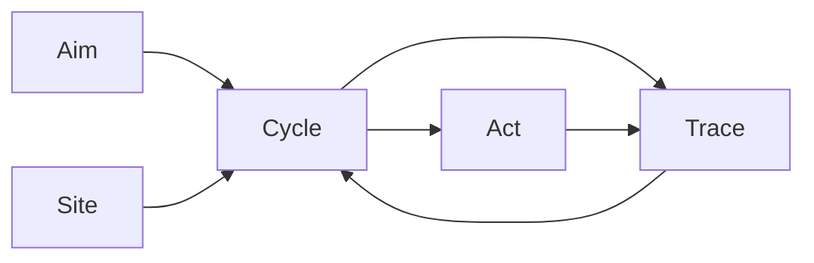

# Narada Semantics and Ontology

> **Canonical vocabulary for Narada.**  
> This document is the single source of truth for user-facing and system-facing terms.  
> Other documents may elaborate or contextualize, but they must not contradict these definitions.

---

## 1. User-Facing Vocabulary

Terms that appear in CLI output, configuration, documentation, and user communication.

<a name="operation"></a>
### 1.1 Operation (Primary)

An **Operation** is the live configured thing a user sets up and runs.

- A mailbox Operation (syncing `help@company.com`)
- A workflow Operation (a timer-driven health check)
- A webhook Operation (an inbound HTTP-triggered automation)
- A helpdesk Operation (a single mailbox with a triage charter)

Users create, configure, preflight, activate, and run **Operations**.

In the primary topology reading, an **Operation** is a configured Zone topology whose external boundary is itself zone-like: enclosing topologies may interact only through declared governed crossings, never by depending on internal sub-zone structure. Internally, the Operation is a topology of authority-homogeneous Zones connected by governed crossings. Externally, it presents one coherent authority grammar to larger Operations, Sites, or supervisory control surfaces.

Each Operation maps to exactly one `scope`. An Operation is the atomic unit of user intent; a scope is its internal representation. If Narada later needs to group or coordinate multiple Operations, that will be introduced as a distinct composite concept (e.g. `suite` or `campaign`), not by redefining Operation.

Do **not** call a user's configured work setup a "Narada instance." Use **Operation** for the user-owned configured unit of work. Use **runtime**, **daemon**, or **Site** for the deployed machinery that runs Operations.

The CLI and config surfaces may continue to use lowercase `operation` as user-facing command language. In canonical ontology prose, capitalize **Operation** when referring to the defined Narada concept.

#### Operation Specification

An **Operation Specification** is the written or configured definition of an Operation.

It may include:

- sources and admission rules
- primary and secondary charters
- posture and policy
- knowledge sources
- allowed intents/effects
- review and escalation rules
- scenario fixtures or examples

Example:

```text
A mail-backed Klaviyo campaign Operation admits inbound email facts from designated colleagues, interprets them as campaign-production requests, derives governed work, and routes that work through campaign-management charters. Klaviyo effects remain governed by Narada intents and operator approval.
```

#### Operation Charter Set

An **Operation Charter Set** is the collection of charter instructions bound to an Operation Specification.

It describes how judgment is organized inside the Operation. It is not the Operation itself, and it is not the runtime that executes it.

<a name="ops-repo"></a>
### 1.2 `ops repo`

An **ops repo** (or **operations repo**) is a private repository that contains one or more operations, plus their knowledge, scenarios, and local configuration.

Created with:

```bash
narada init-repo ~/src/my-ops
```

<a name="typed-variants"></a>
### 1.3 Typed Variants

When specificity matters:

| Variant | Meaning |
|---------|---------|
| `mailbox operation` | An operation whose source is a mailbox |
| `workflow operation` | An operation whose source is a timer/cron schedule |
| `webhook operation` | An operation whose source is an inbound HTTP webhook |
| `filesystem operation` | An operation whose source is a local filesystem path |

---

## 2. System Ontology

Terms used inside the kernel, control plane, and runtime.

### 2.0 Primary Shape

Narada's primary explanatory shape is:

- a composed topology of authority-homogeneous zones,
- connected by governed crossings.

A **zone** is a region in which one authority grammar remains invariant: the same authority owner governs what counts as valid state, what transitions are admissible, what artifacts are authoritative, and what confirmations matter.

A **governed crossing** is the admissible, durable transfer from one zone to another under an explicit crossing regime.

A **crossing regime** is the law carried by a governed crossing: it states what may cross, in what form, under whose authority, and how the crossing is confirmed.

An **admission method** is a concrete check used by a crossing regime. Review, tests, deterministic validation, operator approval, and reconciliation are admission methods. They are not zones unless they own a stable authority grammar and durable request/result lifecycle of their own.

This is the deepest semantic lens. The other major Narada descriptions are derived views:

- the **deterministic state compiler** description says what the topology does;
- the **nine-layer pipeline** says one canonical traversal order through the topology;
- **Aim / Site / Cycle / Act / Trace** gives the operator/runtime reading of the same structure;
- **Intelligence-Authority Separation** states one of the topology's core anti-collapse invariants;
- **crossing regime** names the local law at each governed crossing.

#### Three-Layer Ontology

To avoid confusion between roles and implementations, Narada distinguishes three layers:

| Layer | What It Contains | What It Is NOT | Examples |
|-------|------------------|----------------|----------|
| **Principle** | Zones, crossing regimes, authority grammars, anti-collapse invariants | Not a service, process, or deployable artifact | "Source zone", "Foreman (`resolve`)", "No crossing without regime" |
| **Logical System** | The control plane, pipeline, operators, CLI commands, state machines | Not tied to a specific substrate or language | Scheduler leases, foreman decisions, intent handoff, `narada task claim` |
| **Substrate** | Zone-local durability, transport, and execution machinery | Not the authority boundary itself | SQLite coordinator, Cloudflare Durable Objects, filesystem, Windows/WSL |

A principle describes what must remain true regardless of substrate. A logical system implements the principles in code and state machines. A substrate provides the durable storage and compute that the logical system uses.

> **Do not identify Narada with its current substrate.** SQLite is a substrate, not Narada. TypeScript is the current implementation language, not the authority boundary. Cloudflare is a Site substrate, not a zone.

### 2.1 The Nine-Layer Pipeline

All verticals traverse the same canonical traversal through the zone topology:

```
Source → Fact → Context → Work → Policy → Intent → Execution → Confirmation → Observation
```

This pipeline is not deeper than the zone-and-crossing reading. It is the standard ordered path by which Narada moves artifacts across zones.

| Layer | Responsibility | Durable? | Canonical Name |
|-------|----------------|----------|----------------|
| **Source** | Pulls records from a remote or local origin using an opaque checkpoint | Checkpoint only | `source_id` |
| **Fact** | Canonical, replay-stable envelope of every observed change | **Yes** | `fact_id` |
| **Context** | Groups facts into policy-relevant scopes | Metadata: **Yes**; grouping: No | `context_id`, `scope_id` |
| **Work** | Terminal schedulable unit opened for a context revision | **Yes** | `work_item_id` |
| **Policy** | Admits, supersedes, or rejects work; governs proposed effects | Decision: **Yes** | `decision_id` |
| **Intent** | Universal durable effect boundary | **Yes** | `intent_id` |
| **Execution** | Claims intent and performs the effect | **Yes** | `execution_id` |
| **Confirmation** | Binds execution outcome back to durable state | **Yes** | — |
| **Observation** | Read-only derived views over durable state | No | — |

### 2.2 Core Abstractions

#### `scope`

The internal runtime/config representation of an operation.

- `scope_id` identifies it in config files and the database
- `scope` is the correct word inside the kernel, CLI code, and config schema
- Users should not need to know the word "scope" to use Narada successfully

Narada compiles one **operation** into one **scope** and then into lower-level runtime/control-plane objects.

#### `fact`

The **first canonical durable boundary**. All external change enters as a Fact.

```typescript
interface Fact {
  fact_id: string;           // deterministic, replay-stable
  fact_type: FactType;       // e.g. "mail.message.discovered", "timer.tick"
  provenance: FactProvenance;
  payload_json: string;      // opaque, vertical-specific
  created_at: string;
}
```

Properties:
- All replay determinism derives from fact identity
- Fact store ingestion is idempotent (`fact_id` primary key)
- Re-pulling may return overlapping records; deduplication is the kernel's responsibility

#### `context`

A policy-relevant grouping of facts.

- `context_id` is domain-neutral. For mailbox it may be a conversation; for timer it may be `timer:{schedule_id}`; for webhook it may be `webhook:{endpoint_id}`.
- `context_records` is the durable table that tracks context metadata (primary charter, status, last activity times).
- `context_revisions` tracks deterministic snapshots of a context over time.
- Work items are keyed by `context_id`, but the abstract *grouping* itself is not durable; only its control-plane metadata and revision history are.
- No kernel section may assume `conversation_id`, `thread_id`, or message semantics.

#### `work_item`

The **terminal schedulable unit**.

```typescript
interface WorkItem {
  work_item_id: string;
  context_id: string;
  scope_id: string;
  status: "opened" | "leased" | "executing" | "resolved" | "failed_retryable" | "failed_terminal" | "superseded" | "cancelled";
  opened_for_revision_id: string;
}
```

Properties:
- At most one non-terminal work item per context may be `leased` or `executing`
- Supersession replaces stale work with new work when a higher revision arrives
- Work items are durable and survive crashes

`work_item` is a runtime control-plane object. It is not the same thing as a repo-local construction task. Task governance may use tasks to organize Narada buildout work, but scheduler leases, runtime execution, and policy admission operate on `work_item`.

#### Task Governance Task

A **Task Governance Task** is a repo-local construction governance artifact used to coordinate Narada's own buildout.

Task governance tasks may have task numbers, assignment records, reports, reviews, evidence checks, and lifecycle states such as `opened`, `claimed`, `in_review`, `closed`, and `confirmed`.

They are not kernel `work_item`s:

- `task claim` is task-governance assignment, not scheduler lease acquisition.
- `task roster` is buildout coordination, not runtime Site scheduling.
- `task evidence` is construction evidence, not automatically a control-plane Evidence Trace.
- A task may describe work on Narada itself; a `work_item` is work opened by a running Operation's control cycle.

#### `policy` / `foreman`

The foreman performs three authorities:

1. **Admission** — `onFactsAdmitted()` opens/supersedes work items from `PolicyContext[]`
2. **Governance** — `resolveWorkItem()` validates charter output, applies policy, and decides accept / reject / escalate / no-op
3. **Handoff** — On acceptance, atomically persists the decision and emits an `Intent`

Policy is the **sole gate to effects**. No effect may materialize without passing through foreman governance.

**Explicit replay derivation**: `deriveWorkFromStoredFacts()` re-derives work from already-stored facts without requiring a fresh source delta. It uses the same context formation + work-opening path as live admission but does not mark facts as admitted. This is the canonical path for replay, policy testing, and recovery from control-plane loss.

#### `intent`

The **universal durable effect boundary**.

```typescript
interface Intent {
  intent_id: string;
  intent_type: string;        // e.g. "mail.send_reply", "process.run"
  executor_family: string;    // e.g. "mail", "process"
  payload_json: string;
  idempotency_key: string;    // deterministic per (context, action, payload)
  status: IntentStatus;
  context_id: string;
}
```

Properties:
- All side effects (mail sends, process spawns, future automations) must be represented as an Intent before execution
- Idempotency is enforced at `idempotency_key`
- No `Intent` may be created outside the foreman's atomic handoff transaction

#### `execution`

Executors claim admitted Intents and perform effects:

- **Mail family** → `OutboundHandoff` creates `OutboundCommand`, workers mutate Graph state
- **Process family** → `ProcessExecutor` spawns a subprocess, records exit code
- Future families follow the same lifecycle algebra (`admitted → started → completed / failed`)

#### `confirmation`

Binds the external effect back to durable state:

- `submitted` — executor received external acceptance
- `confirmed` — inbound observation or reconciliation proves the effect took hold
- `failed` — external rejection or timeout

Confirmation status is **derived from durable store state**, not in-memory or log state.

#### `observation`

Read-only, reconstructible views over durable state.

- Non-authoritative: may be deleted and rebuilt without affecting correctness
- No scheduler, lease, executor, or sync path may depend on observation artifacts
- Operator visibility must not require terminal attachment

Observation is not evidence by default. A CLI table, JSON response, dashboard card, Mermaid graph, or terminal transcript is an observation surface unless it is admitted through a governed Evidence Admission path.

#### Evidence

**Evidence** is an admitted, durable, authority-bearing record used to justify a decision, lifecycle transition, confirmation, or audit conclusion.

Evidence differs from observation:

| Aspect | Evidence | Observation |
| --- | --- | --- |
| Authority | Admitted under a regime | Read-only view |
| Durability | Must survive audit/replay needs | Rebuildable or discardable |
| Effect | Can justify transition or confirmation | Cannot mutate or justify by itself |
| Examples | `Fact`, `decision`, `Intent`, `execution_attempt`, `VerificationRun`, accepted task evidence | CLI output, dashboard view, graph render, bounded excerpt |

A bounded output excerpt is still observation until some regime admits it as evidence. A `CommandRunResult` can become verification evidence only after TIZ admits it as a `VerificationRun`.

Review is an evidence admission method, not evidence by itself. A `ReviewRecord` becomes authority-bearing when it is linked to an admissible evidence bundle and accepted by the relevant lifecycle regime.

### 2.3 First-Class Runtime Terms

Terms already treated as first-class in code and docs.

#### `charter`

A named policy configuration that defines how a context should be analyzed and what actions may be proposed.

- **Layer**: Control plane / charters domain
- **User-facing**: Yes — users declare `primary_charter` and `secondary_charters` in scope config
- **Durable boundary**: Config-scoped; charter outputs persisted in `evaluations`
- **Authority owner**: Charter runtime (`@narada2/charters`)

Replaces the generic term `agent`. Each scope binds one primary charter and optional secondary charters for arbitration.

#### `posture`

A named safety preset that maps to a concrete set of allowed actions for a vertical.

- **Layer**: ops-kit / CLI
- **User-facing**: Yes — set via `want-posture` or `--posture` flags
- **Durable boundary**: Scope config (`allowed_actions` derived from posture)
- **Authority owner**: Operator

Canonical progression: `observe-only` → `draft-only` → `review-required` → `autonomous`. Postures do not invent actions; they select from the existing `AllowedAction` universe.

#### `evaluation`

The structured output envelope produced by charter execution.

- **Layer**: Control plane / foreman
- **User-facing**: No
- **Durable boundary**: `evaluations` table
- **Authority owner**: Charter runtime (produces); Foreman (governs)

Contains proposed actions, tool requests, confidence scores, and outcome classification. Evaluations are governed by the foreman before any effect is authorized.

#### `decision`

The authoritative record of the foreman's governance outcome for a work item.

- **Layer**: Control plane / foreman
- **User-facing**: No (surfaced read-only via observation)
- **Durable boundary**: `foreman_decisions` table (coordinator store)
- **Authority owner**: Foreman

Binds an approved action, its payload, and rationale. Decisions are the sole gate to intent creation; no intent may exist without a preceding decision.

#### `outbound handoff`

The durable bridge between a foreman decision and its executable command envelope.

- **Layer**: Control plane / outbound
- **User-facing**: No
- **Durable boundary**: `outbound_handoffs` table
- **Authority owner**: Foreman handoff logic

Preserves the decision-to-command lineage and tracks submission status through the outbound worker registry.

#### `outbound command`

The executable command envelope derived from a decision.

- **Layer**: Control plane / outbound
- **User-facing**: No
- **Durable boundary**: `outbound_commands` view/table (outbound store)
- **Creation authority**: `OutboundHandoff.createCommandFromDecision()` (called within the foreman's atomic decision transaction)
- **Mutation/execution authority**: outbound workers registered in `WorkerRegistry` (`send_reply`, `non_send_actions`)
- **Reconciliation authority**: `OutboundReconciler`

Contains the concrete action payload (e.g., draft content, move target) and tracks execution state from creation through confirmation.

#### `tool call`

A governed, durable record of a charter's request to invoke an external tool.

- **Layer**: Control plane / coordinator
- **User-facing**: No (operators may inspect summaries)
- **Durable boundary**: `tool_call_records` table
- **Authority owner**: Charter runtime (requests); Foreman (governs); Executor (performs)

Validated by the foreman before execution. Exit status is recorded for observability and operator categorization.

#### `tool catalog`

A declared set of external capabilities that may be bound into an operation.

- **Layer**: System repo / operation repo / Narada runtime boundary
- **User-facing**: Yes when configuring operations
- **Durable boundary**: Operation config and tool-call records
- **Authority owner**: System repo defines capability; operation repo grants permission; Narada runtime mediates execution

Tool catalogs obey the **Tool Locality Doctrine**:

```text
System repo owns tool implementation.
Operation repo owns tool binding and permission.
Narada runtime owns mediation, audit, timeout, and authority enforcement.
```

A system repo is the repository for the system being diagnosed or acted upon (for example, `sonar.cloud`). It owns local diagnostic scripts, safe query wrappers, Sentry wrappers, schema assumptions, and `.env` naming because those are system-local facts.

An operation repo (for example, `narada.sonar`) must not copy those tools into itself. It references system-owned tool catalogs and grants a bounded subset to charters through runtime policy.

Narada runtime never treats a tool catalog as permission by itself. Permission is the operation's binding of a tool to a charter under an authority class. Execution is mediated by Narada so calls can be validated, timed out, audited, and classified.

Example:

```text
~/src/sonar.cloud/.narada/tool-catalog.json   # declares sonar.git.read, sonar.db.query_readonly, sonar.sentry.search, sonar.git.write
~/src/narada.sonar/config/config.json         # allows support_steward to request selected tools
Narada runtime                               # validates, executes, records tool_call
```

This prevents operation/tool collapse, knowledge/authority collapse, and repo/env collapse.

#### `trace`

A durable record of charter execution metadata.

- **Layer**: Control plane / agent observability
- **User-facing**: No (operator-facing via observation API)
- **Durable boundary**: `agent_traces` table
- **Authority owner**: Charter runtime (produces); Observation layer (reads)

Contains token usage, latency, model references, and session linkage. Non-authoritative for control but essential for debugging and audit.

#### `knowledge source`

A declared reference to external knowledge consumed by a charter during context analysis.

- **Layer**: Charters domain
- **User-facing**: Yes (declared in charter config)
- **Durable boundary**: Config-scoped; normalized items may be cached
- **Authority owner**: Charter runtime

May be a URL, local filesystem path, or SQLite database. Knowledge sources are vertical-specific and bound to charter scope.

#### `operator action`

A durable request for a human operator to perform a safe, UI-mediated mutation.

- **Layer**: Control plane / coordinator
- **User-facing**: Yes (operator initiates via UI/CLI)
- **Durable boundary**: `operator_action_requests` table
- **Authority owner**: Operator

The explicit bridge between human judgment and system state. Safelisted actions include operational repair, draft disposition, confirmation replay, and controlled redispatch. New actions must be added explicitly to the safelist before they become available.

#### `email-originated operator request`

A proposal for an operator action whose initial carrier is an email message.

- **Layer**: Mail vertical / control plane boundary
- **User-facing**: Yes when a configured operator contact sends an instruction by email
- **Durable boundary**: `operator_action_requests` table plus `confirmation_challenges` table
- **Authority owner**: Operator identity provider confirmation, then canonical `executeOperatorAction()`

Email is admissible as input, not as authority. A recognized `operator_contact.address` may open a pending audited request, but the request remains inert until a short-lived confirmation challenge is completed through the configured identity provider.

For Microsoft/Entra confirmation, authority is carried by verified token claims: tenant, audience, nonce, expiry, and the configured Entra object id for the operator contact. The `From:` header never approves send, git push, config mutation, task closure, or any other effect.

The valid authority chain is:

```text
email fact -> pending operator_action_request -> confirmation_challenge
  -> Microsoft/Entra verified identity -> executeOperatorAction()
```

Any direct `email -> mutation` path is authority collapse.

---

### 2.4 Identity Lattice

| Identity | Format | Scope | Derivation |
|----------|--------|-------|------------|
| `context_id` | Domain-neutral string | Policy-relevant grouping | `conversation_id` for mailbox; `timer:{id}` for timer; etc. |
| `revision_id` | `{context_id}:rev:{ordinal}` | Snapshot of a context at a point in time | Ordinal incremented by foreman on material change |
| `work_item_id` | `wi_<uuid>` | Terminal schedulable unit | Random UUID |
| `execution_id` | `ex_<uuid>` | Bounded charter invocation | Random UUID |
| `evaluation_id` | `eval_<execution_id>` | Structured output summary | Derived from `execution_id` |
| `decision_id` | `fd_<work_item_id>_<action_type>` | Foreman proposal | Deterministic from work item + action |
| `outbound_id` | `ob_<decision_id>` | Executable command envelope | Derived from `decision_id` |
| `event_id` | `evt_<sha256>` | Compiler-normalized source record | Content-addressed hash of normalized payload |

#### Legacy Aliases

- `thread_id === conversation_id` — legacy alias. All new code uses `context_id`.
- `mailbox_id === scope_id` — legacy alias in some Graph adapter contexts.

### 2.5 Worker Registry

First-class worker identities with explicit concurrency policies:

| Worker | Executor Family | Policy | Responsibility |
|--------|----------------|--------|----------------|
| `process_executor` | `process` | `singleton` | Executes `process.run` intents via subprocess |
| `send_reply` | `outbound` | `singleton` | Creates drafts and sends reply messages |
| `non_send_actions` | `outbound` | `singleton` | Executes mark_read, move_message, set_categories |
| `outbound_reconciler` | `outbound` | `singleton` | Reconciles submitted commands with remote state |

### 2.6 Verticals

Verticals (mailbox, timer, webhook, filesystem, process) are **interchangeable projections, not organizing primitives**. Domain-specific semantics must be explicit and local, never implicit or generic.

---

### 2.7 Authority Classes

Authority classes classify what a component, tool, or command is allowed to do. They are a policy-enforced boundary, not a suggestion.

<a name="authority-derive"></a>
#### `derive`

Computes declared outputs from declared inputs. No side effects, no lifecycle state changes, no claiming, no leases.

- **Examples**: `refine`, `plan`, `validate`, `init` (artifact generation)
- **Safe to re-run**: Yes, idempotent or explicitly `--force`
- **Who may use**: Any component with access to the inputs

<a name="authority-propose"></a>
#### `propose`

Produces a structured proposal that requires governance approval before it becomes an intent.

- **Examples**: charter evaluation, task graph proposals, domain-pack refinements
- **Safe to re-run**: Yes
- **Who may use**: Charters, domain packs, compiler tools

<a name="authority-claim"></a>
#### `claim`

Acquires exclusive rights to a schedulable unit or resource.

- **Examples**: claiming a work item, acquiring a lease
- **Safe to re-run**: No — requires concurrency control
- **Who may use**: Narada runtime-authorized components only

<a name="authority-execute"></a>
#### `execute`

Performs an effect that mutates external world state or consumes resources.

- **Examples**: invoking a tool, running a subprocess, sending a message
- **Safe to re-run**: Only if idempotent; generally requires crash/retry handling
- **Who may use**: Narada runtime-authorized executors only

<a name="authority-resolve"></a>
#### `resolve`

Advances lifecycle state (complete, reject, block, escalate, supersede).

- **Examples**: marking work completed, rejecting a task, blocking a dependency
- **Safe to re-run**: No — changes durable lifecycle state
- **Who may use**: Narada runtime-authorized governance components only

<a name="authority-confirm"></a>
#### `confirm`

Acknowledges that an external effect has been observed and binds it to durable state.

- **Examples**: confirming a sent message, reconciling remote state
- **Safe to re-run**: Idempotent by design
- **Who may use**: Narada runtime-authorized confirmation workers only

<a name="authority-admin"></a>
#### `admin`

Overrides policy or changes structural configuration.

- **Examples**: posture escalation, charter binding changes, operator override
- **Safe to re-run**: No — changes governance structure
- **Who may use**: Explicit operator/admin posture only

#### Policy Enforcement

- Domain packs may define only `derive` and `propose` capabilities.
- Only Narada runtime-authorized components may perform `claim`, `execute`, `resolve`, or `confirm`.
- `admin` requires explicit operator/admin posture.
- Charter runtime envelopes must expose the capability authority class.
- Preflight must reject operation configs that bind a charter or tool to an authority class it is not allowed to use.

---

### 2.8 Re-Derivation and Recovery Operator Family

Narada defines a family of explicit operators that recompute downstream state from durable boundaries. These are not a single vague "replay" — each member has distinct semantics, authority requirements, and safety properties.

#### 2.8.1 Operator Algebra

Every member is described by:

```text
Boundary A → Boundary B
mode: live | replay | preview | recovery | rebuild | confirm
effect: read-only | control-plane-mutating | external-confirmation-only
authority: <class from §2.7>
```

| Dimension | Meaning |
|-----------|---------|
| **Boundary A** | The durable upstream boundary used as input (e.g. `Fact`, `Execution`, `Durable state`) |
| **Boundary B** | The downstream boundary being recomputed (e.g. `Work`, `Context`, `Observation`, `Confirmation`) |
| **mode** | Whether the operator runs as part of live flow, replays a past path, previews a hypothetical, recovers from loss, rebuilds a projection, or replays confirmation |
| **effect** | Whether the operator is read-only, mutates control-plane state, or only updates confirmation bindings |
| **authority** | The authority class governing who may invoke the operator |

#### 2.8.2 Family Members

| Operator | A → B | Mode | Effect | Authority | Description |
|----------|-------|------|--------|-----------|-------------|
| **Live Fact Admission** | `Fact` (unadmitted) → `Fact` (admitted) + `Work` | `live` | `control-plane-mutating` + **fact-lifecycle-mutating** | `resolve` (foreman) | Normal daemon dispatch: selects unadmitted facts, routes through context formation + foreman work opening, then marks facts admitted. Compound operation: admission + work opening. |
| **Replay Derivation** | `Fact` (stored) → `Work` | `replay` | `control-plane-mutating` | `derive` + `resolve` | Explicit operator-triggered re-derivation of work from already-stored facts using the same context-formation + foreman work-opening path as live dispatch. **Does not mark facts admitted** and does not require fresh source delta. |
| **Preview Derivation** | `Fact` → `PolicyContext`/`Evaluation` | `preview` | `read-only` | `derive` | Read-only inspection of what a charter would propose for a stored fact set. Runs context formation and charter evaluation but stops before work opening, lease claiming, or intent creation. |
| **Recovery Derivation** | `Fact` → `Context`/`Work` | `recovery` | `control-plane-mutating` | `derive` + `resolve` + `admin` | Rebuilds recoverable control-plane state after control-plane loss while facts remain intact. Shares the same derivation core as replay (`deriveWorkFromStoredFacts`), but surfaced as a distinct operator (`recoverFromStoredFacts`). Conservative: does not restore active leases or in-flight execution attempts. |
| **Projection Rebuild** | `Durable state` → `Observation` | `rebuild` | `read-only`* | `derive` | Recomputes non-authoritative derived views (filesystem views, search indexes, observation read models) from canonical durable stores via `ProjectionRebuildRegistry`. May write to derived stores, but must not mutate canonical truth, create work, or produce external effects. |
| **Confirmation Replay** | `Execution`/`Outbound` → `Confirmation` | `confirm` | `external-confirmation-only` | `confirm` | Recomputes confirmation state from durable execution/outbound records plus current observation, without re-performing the effect. Mail reconciliation (`OutboundReconciler`) is one vertical instance of this family; `ProcessConfirmationResolver` is another. |

\* Projection rebuild writes to derived stores but not to canonical durable boundaries; its effect on system correctness is read-only.

#### 2.8.3 Semantic Distinctions

These six modes must never be treated as a single vague "replay" bucket:

| Distinction | Rule |
|-------------|------|
| **Live vs Replay** | Live admission is coupled to source sync and marks facts `admitted`; replay reads stored facts independently of `admitted_at` and never mutates fact lifecycle state |
| **Admission vs Work Opening** | Live admission is a *compound* operation (fact lifecycle transition + work opening). Replay is *pure work opening* with no fact lifecycle side effect. Both use the same `ContextFormationStrategy` → `onContextsAdmitted()` path. |
| **Replay vs Preview** | Replay advances control-plane state (opens work); preview is read-only |
| **Replay vs Recovery** | Replay is bounded, operator-triggered, and scoped; recovery is loss-shaped and may re-derive broader control-plane state. They share the same derivation core (`onContextsAdmitted`) but are distinct surfaces (`deriveWorkFromStoredFacts` vs `recoverFromStoredFacts`) with different intended authority (`derive`+`resolve` vs `derive`+`resolve`+`admin`) |
| **Recovery vs Rebuild** | Recovery rebuilds authoritative control-plane state; rebuild only reconstructs non-authoritative projections |
| **Replay/Rebuild vs Confirm** | Replay and rebuild derive from upstream durable boundaries; confirm derives from execution/outbound state outward |
| **All vs Live** | No family member may run automatically on normal daemon startup unless it is live admission |

#### 2.8.4 Safety Properties

1. **Boundedness**: Every operator accepts explicit selection bounds (scope, context, time range, fact set). No background component continuously re-derives.
2. **Authority Preservation**: Replay and recovery preserve foreman authority over work opening, scheduler authority over leases, and outbound handoff authority over command creation.
3. **No Fabrication**: Replay, preview, and recovery must not fabricate source events or fresh inbound deltas.
4. **No Admission Side Effect in Replay**: Replay derivation must not mark facts as `admitted`. Fact lifecycle transitions are the exclusive concern of live dispatch.
5. **Conservative Recovery**: Recovery does not restore active leases, in-flight execution attempts, or already-submitted outbound effects blindly.
6. **Projection Non-Authority**: Rebuild may discard and recompute derived stores without affecting correctness.

#### 2.8.5 Relationship to Authority Classes

- `derive`: Required by preview, rebuild, and the computation phase of replay/recovery
- `resolve`: Required when the operator advances work-item lifecycle state (live, replay, recovery)
- `confirm`: Required for confirmation replay
- `admin`: Required for recovery because it reconstructs control-plane state after loss
- `claim` / `execute`: Not directly invoked by the operator family; these remain the authority of scheduler and worker layers during normal execution of replay-derived work

#### 2.8.6 Evolution Note

**Implemented status**: Replay derivation and recovery derivation share a common core (`deriveWorkFromStoredFacts` / `recoverFromStoredFacts` both route through `onContextsAdmitted`). The distinction is preserved in naming and intended authority (`admin` for recovery) rather than divergent runtime behavior. Preview derivation and projection rebuild are implemented. Confirmation replay is partially implemented.

---

### 2.9 Selection Operator Family

Selection is the lens through which every other operator family operates. It is the authority-agnostic grammar for bounding any operator's input set.

#### 2.9.1 Selector Algebra

A **Selector** is a read-only, composable bound composed of zero or more dimensions:

| Dimension | Type | Description |
|-----------|------|-------------|
| `scopeId` | `string \| string[]` | Scope or scopes to include |
| `since` | `ISO 8601 string` | Temporal lower bound (inclusive) |
| `until` | `ISO 8601 string` | Temporal upper bound (inclusive) |
| `factIds` | `string[]` | Exact fact identities |
| `contextIds` | `string[]` | Exact context identities |
| `workItemIds` | `string[]` | Exact work-item identities |
| `status` | `string` | Family-specific status filter |
| `vertical` | `string` | Vertical filter for multi-vertical scopes |
| `limit` | `number` | Maximum result-set size |
| `offset` | `number` | Pagination offset |

A Selector with zero dimensions is the **universal selector** for its target entity type. Selectors compose by AND: all specified dimensions must match.

#### 2.9.2 Selection Invariants

1. **Read-Only**: A selector never mutates durable state. It is pure inspection until combined with an effectful operator.
2. **Authority-Neutral**: Selection requires no authority class (`derive`, `resolve`, `admin`, etc.).
3. **Closed Grammar**: The selector dimensions listed above are the complete grammar. No operator may introduce ad-hoc bounding vocabulary outside these dimensions.
4. **Composable**: Multiple selectors may be merged into a single canonical selector. If dimensions conflict, the intersection (most restrictive) wins.

#### 2.9.3 Relationship to Other Families

- **Re-derivation** uses selectors to bound replay, preview, recovery, and confirmation replay.
- **Inspection** uses selectors to bound observation queries.
- **Promotion** uses selectors to bound bulk promotion targets.
- **Authority execution** does not use selectors directly; execution is triggered by scheduler claims and worker leases, not by operator-bounded sets.

#### 2.9.4 Evolution Note

The first concrete implementation is `Fact` selection via `getFactsByScope(scopeId, selector)`. It consumes the following selector dimensions: `since`, `until`, `factIds`, `contextIds`, `limit`, and `offset`. Dimensions that target other entity families (`status`, `vertical`, `workItemIds`) are rejected with a clear error rather than silently ignored. As the family matures, selector consumption will spread to work-item queries, execution queries, and observation routes.

---

### 2.10 Promotion Operator Family

Promotion is the bridge between inspection/preview and actual system mutation. It advances artifacts through explicit lifecycle transitions.

#### 2.10.1 Promotable Objects and Transitions

| Promotable Object | Valid Source State | Valid Target State | Trigger | Authority |
|-------------------|-------------------|--------------------|---------|-----------|
| `operation` | `inactive` | `active` | manual operator | `admin` |
| `operation` | posture A | posture B | manual operator | `admin` |
| `work_item` | `failed_retryable` | `failed_retryable` (retry readiness promoted) | manual operator | `resolve` |
| `work_item` | `failed_retryable` | `failed_terminal` | manual operator | `admin` |
| `evaluation` (preview artifact) | `preview` | `governed_work` | manual operator | `derive` + `resolve` |
| `outbound_command` | `draft_ready` | `approved_for_send` | manual operator | `execute` |
| `outbound_command` | `pending` | `cancelled` | manual operator | `execute` |

#### 2.10.2 Promotion Rules

1. **Explicit Only**: Every promotion transition requires an explicit operator trigger. No automatic promotion.
2. **No Fabrication**: Promotion never creates synthetic durable boundaries. A preview evaluation promoted to governed work must route through the same foreman admission path (`onContextsAdmitted` or equivalent) that live facts use.
3. **Authority Respect**: Each transition declares its required authority class. The operator action layer enforces this.
4. **Append-Only Audit**: Every promotion transition is logged to `operator_action_requests`.
5. **Bulk is Cardinality**: Bulk promotion (e.g., retry all failed-retryable items) is a cardinality variation, not a new transition type.

#### 2.10.3 Existing Actions Mapped to Promotion Algebra

- `activate` → `operation: inactive → active`, manual, `admin`
- `want-posture` → `operation: posture A → posture B`, manual, `admin`
- `retry_work_item` → `work_item: failed_retryable` with `next_retry_at` cleared, manual, `resolve`. The item remains `failed_retryable`; the scheduler discovers it as runnable on its next scan.
- `acknowledge_alert` → `work_item: failed_retryable → failed_terminal`, manual, `admin`
- `trigger_sync` → `operation: idle → syncing`, manual, `resolve`
- `approve_draft_for_send` → `outbound_command: draft_ready → approved_for_send`, manual, `execute`. The actual send and `approved_for_send → sending → submitted` transition are performed by the outbound worker, not the operator.
- `request_redispatch` → automatic pipeline promotion, not manual operator promotion

#### 2.10.4 Evolution Note

The first concrete implementation is `retry_failed_work_items` (bulk promotion of retry readiness for `work_item: failed_retryable`). It clears `next_retry_at` without changing status; the scheduler later discovers and claims the item. As the family matures, surfaces for `evaluation → governed_work` and `outbound_command: draft_ready → approved_for_send` will be added. The `approved_for_send → sending → submitted` path is worker-owned effect execution, not manual promotion.

---

### 2.11 Inspection Operator Family

Inspection is the read-only operator family. It observes durable and derived state without mutation.

#### 2.11.1 Definition

**Inspection** reads already-derived state without mutation.
**Preview derivation** (§2.8) re-computes downstream state from a durable boundary without mutation; it is a *re-derivation* member because it starts from a boundary and recomputes, but its effect class is read-only.

The distinction:
- **Inspection** starts from **already-derived** state (observation views, stored evaluations, control-plane snapshots).
- **Preview derivation** starts from a **durable boundary** (`Fact`) and re-derives downstream state (`PolicyContext`, `Evaluation`).

#### 2.11.2 Members

| Member | What It Reads | Surfaces |
|--------|---------------|----------|
| `status` | Sync health, control-plane snapshot, leases, quiescence | CLI `narada status` |
| `integrity` | Cursor validity, apply-log counts, view existence | CLI `narada integrity` |
| `explain` | Operational readiness, blockers, posture | CLI `ops-kit explain` |
| `inspect` | Operation configuration scope | CLI `ops-kit inspect` |
| `observation` | Full read-only derived views over durable state | Daemon `GET /scopes/...` routes (23 endpoints) |
| `backup-verify` | Backup manifest and checksums | CLI `narada backup-verify` |
| `backup-ls` | Backup contents and stats | CLI `narada backup-ls` |
| `demo` | Zero-setup read-only preview | CLI `narada demo` |

Mode modifiers such as `--dry-run` on `sync` or `cleanup` are not inspection operators. They suppress the final commit of an effectful command but may still perform network I/O or source pulls. Inspection never performs I/O beyond reading local durable stores.

#### 2.11.3 Inspection Invariants

1. **Read-Only**: Inspection never mutates durable state. No `.run()`, `.exec()`, or direct mutation calls.
2. **Authority-Agnostic**: Inspection requires no authority class (`derive`, `resolve`, `admin`, etc.). Observation routes are gated by scope access only.
3. **Projection Non-Authority**: Derived views read by inspection may be discarded and recomputed by rebuild operators (§2.8) without affecting correctness. Inspection reads already-derived state; it does not recompute.
4. **Source-Trust Transparent**: Every observation type declares its trust level: `authoritative` (mirrors one durable row), `derived` (computed from multiple sources), or `decorative` (presentational only).

#### 2.11.4 Relationship to Preview Derivation

Preview derivation (§2.8, `Fact` → `Evaluation`) is read-only, so it resembles inspection. However, it belongs to the re-derivation family because:
- It starts from a **durable boundary** (`Fact`), not derived state.
- It re-computes charter output using the same `ContextFormationStrategy` as live admission.
- It is bounded by the same selector grammar as replay and recovery.

Inspection, by contrast, never re-computes from boundaries. It only reads what is already stored or derived.

---

<a name="advisory-signals-clan"></a>
## 2.12 Advisory Signals Clan

Narada maintains a sharp distinction between **authoritative structures** (what is true, durable, allowed, committed) and **advisory signals** (what is probable, preferable, or worth attention). This section defines the clan and its sibling families.

### 2.12.1 Authoritative Structures

Authoritative structures determine:

- what is **true** — `fact`, `context_record`
- what is **durable** — `work_item`, `intent`, `decision`, `execution`
- what is **allowed** — `authority class`, `policy`, `governance`
- what is **committed** — `cursor`, `apply_log`, `confirmation`
- what has **happened** — `execution_attempt`, `outbound_transition`, `operator_action_request`

These are the substrate of correctness. They are enforced by code structure, primary-key constraints, and invariant checks. No advisory signal may override them.

### 2.12.2 Advisory Signals

Advisory signals influence operational choices without determining truth, permission, or commitment. They are **non-authoritative** by design: removing every advisory signal from the system must leave all durable boundaries intact and all authority invariants satisfiable.

Advisory signals answer questions like:

- who *should probably* do the work?
- when is it *probably best* to act?
- who *should probably* review?
- what *likely* deserves attention?
- which lane / provider / tool is *preferable*?

They do **not** answer:

- who *must* do the work? (authority: scheduler lease)
- when *must* we act? (authority: policy deadline or retry timer)
- who *is allowed* to review? (authority: policy binding)
- what *is* true? (authority: fact store)

**Hard rule**: An advisory signal may be ignored, overridden, or absent without violating any kernel invariant. If a signal were treated as authoritative, it would be a bug in the consuming component.

### 2.12.3 Sibling Families

The advisory-signals clan contains multiple families. Each family is a coherent grouping of signals that influence a particular operational dimension.

> **Implementation status**: Only `continuation_affinity` is concretely implemented in the runtime today. All other signals listed below are **prospective family members** — valid semantic concepts that the architecture accommodates but does not yet emit or consume. Their descriptions use present tense to express the intended meaning when implemented, not to claim they are active now.

#### Routing Signals

Influence where work is directed or which capability is selected.

| Signal | Meaning |
|--------|---------|
| `continuation_affinity` | **Implemented (v1)** — Soft ordering hint for the scheduler. Active (non-expired) affinity boosts a work item's position in `scanForRunnableWork()` ordering. Does **not** enforce session-targeted lease acquisition or runner selection; that remains deferred to a future v2. Stored on `WorkItem` (`preferred_session_id`, `affinity_strength`, `affinity_expires_at`). Distinguished from `resume_hint`: affinity is the scheduler/runtime ordering signal; `resume_hint` is the operator-visible trace of continuity. |
| `capability_affinity` | *(Prospective)* Prefer a worker or tool that has already demonstrated competence for this action class |
| `tool_state_affinity` | *(Prospective)* Prefer a tool instance that holds relevant ephemeral state (e.g., cached auth, open connection) |
| `cost_preference` | *(Prospective)* Prefer a cheaper lane when multiple lanes can satisfy the intent |
| `trust_preference` | *(Prospective)* Prefer a lane with higher observed reliability; de-preference one with recent failures |

#### Timing Signals

Influence when work is scheduled or when a action is taken.

| Signal | Meaning |
|--------|---------|
| `freshness_preference` | *(Prospective)* Prefer acting while context state is fresh; avoid stale re-evaluation |
| `quiescence_preference` | *(Prospective)* Prefer waiting until context appears stable (no rapid fact arrivals) |
| `coalescing_preference` | *(Prospective)* Prefer batching multiple changes into a single evaluation rather than reacting to each |
| `urgency_preference` | *(Prospective)* Prefer immediate action for time-sensitive contexts; prefer delay for low-priority ones |

#### Review Signals

Influence who should review a proposal or outcome.

| Signal | Meaning |
|--------|---------|
| `same_lane_review` | *(Prospective)* Prefer review by a charter or steward in the same vertical lane |
| `cross_lane_review` | *(Prospective)* Prefer review by a charter or steward from a different lane for independence |
| `independence_preferred` | *(Prospective)* Strong signal that review should not come from the same runtime that produced the proposal |
| `heightened_scrutiny` | *(Prospective)* Signal that the proposal touches policy boundaries or unusual patterns |

#### Escalation / Attention Signals

Influence whether a human or higher-level process should be alerted.

| Signal | Meaning |
|--------|---------|
| `likely_needs_human_attention` | *(Prospective)* Charter confidence or pattern matching suggests human judgment is preferable |
| `unusually_risky` | *(Prospective)* The proposed action deviates from historical norms for this context |
| `probably_time_sensitive` | *(Prospective)* Context metadata (e.g., sender urgency markers) suggests accelerated handling |
| `likely_policy_sensitive` | *(Prospective)* The context matches patterns that have triggered policy overrides in the past |

#### Confidence / Cost Signals

Influence how certainty and resource expenditure shape handling.

| Signal | Meaning |
|--------|---------|
| `low_confidence_proposal` | *(Prospective)* Charter output confidence is below a threshold; prefer conservative action or escalation |
| `high_confidence_repetitive` | *(Prospective)* Charter is highly confident and the pattern is familiar; prefer automated handling |
| `expensive_lane_avoidable` | *(Prospective)* The default execution path is costly; a cheaper path exists with acceptable quality |
| `cheap_acceptable_preferred` | *(Prospective)* A low-cost lane satisfies the requirement; prefer it over a gold-plated path |

### 2.12.4 Relationship to Authority Classes

Advisory signals are **orthogonal** to authority classes (§2.4):

- `derive`, `propose`, `claim`, `execute`, `resolve`, `confirm`, `admin` — these govern **who may mutate what**.
- Advisory signals govern **what is preferable** within the constraints set by authority.

A scheduler with `claim` authority may consult a `continuation_affinity` signal when assigning a lease, but the lease itself is the authoritative commitment. The signal may be ignored if the preferred session is unavailable.

A foreman with `resolve` authority might in future consult a `low_confidence_proposal` signal when deciding between `accept` and `escalate`, but the decision record would remain the authoritative outcome. The signal would not override governance rules. *(Illustrative — not yet implemented.)*

### 2.12.5 Storage and Durability

Advisory signals may be:

- **Ephemeral** — computed at runtime and discarded (e.g., scheduler scoring)
- **Cached** — stored in derived views for performance, rebuildable without loss (e.g., preference indexes)
- **Logged** — written to trace or audit tables for post-hoc analysis, but not referenced by control logic

They must **never** be stored in canonical durable boundaries (fact, work_item, intent, decision, execution) in a way that makes the boundary depend on the signal for correctness.

### 2.12.6 Advisory-Signal Invariants

1. **Non-Authority**: Removing all advisory signals must not violate any kernel invariant or authority boundary.
2. **Overrideable**: Any component that consumes an advisory signal must have a sensible fallback when the signal is absent, contradictory, or stale.
3. **No Lifecycle Side Effect**: Emitting or consuming an advisory signal must not transition the lifecycle state of a durable object (fact, work item, intent, execution).
4. **No Truth Claim**: An advisory signal must never be presented as evidence that something is true; it only expresses preference, probability, or attention-worthiness.

---

<a name="intelligence-authority-separation"></a>
## 2.13 Intelligence-Authority Separation

Narada instantiates **Intelligence-Authority Separation**: the architectural boundary that allows fallible, non-deterministic intelligence to participate in consequential operations without owning truth, permission, lifecycle, or consequence.

### 2.13.1 Core Invariant

> **Intelligence may contribute judgment. Authority must remain in governed structure.**

The opposite of separation is **collapse**: judgment, permission, intent, execution, and confirmation are compressed until model output becomes unmediated consequence.

In Narada terms:

- **`evaluation`** is intelligence output. It is evidence, not authority.
- **`decision`** is authority output. It is governed admission, rejection, or review requirement.
- No evaluation may directly mutate durable state, grant permission, execute effects, or confirm its own success.

### 2.13.2 Boundary Ownership

| Boundary | Owner | What it prevents |
|----------|-------|------------------|
| observation → fact | Source adapter + normalizer | world state becoming prompt memory |
| fact → context | Context formation strategy | unbounded reality becoming arbitrary model context |
| context → work | Foreman (`onFactsAdmitted`) | attention becoming informal task selection |
| work → evaluation | Charter runtime (read-only envelope) | inference becoming mutation |
| evaluation → decision | Foreman (`resolveWorkItem`) | model judgment becoming permission |
| decision → intent | Intent handoff (`OutboundHandoff`) | approval becoming direct effect |
| intent → execution | Worker (scheduler-claimed) | execution inventing reasons |
| execution → reconciliation | Reconciler / inbound observation | API success becoming assumed truth |
| reconciliation → observation | Observation API (read-only) | hidden state becoming uninspectable consequence |

The anti-collapse chain is:

```text
evaluation -> decision -> intent -> execution -> reconciliation -> observation
```

Each transition preserves a different authority boundary. Direct `evaluation -> execution`, `decision -> execution`, or `execution -> confirmation` shortcuts are authority collapse.

### 2.13.3 Authority Classes and Separation

The existing authority class taxonomy enforces separation:

- `derive` / `propose` — intelligence may form context and propose evaluation
- `claim` / `execute` — scheduler and workers perform mechanical execution
- `resolve` / `confirm` — foreman and reconciler own admission and confirmation
- `admin` — operator owns recovery, replay, and structural changes

No single component holds all authority classes. The charter runtime is explicitly restricted to `derive`/`propose`.

### 2.13.4 Evaluation Authority

Evaluation authority is the bounded right to produce judgment under a frozen context:

- The charter runtime receives an immutable `CharterInvocationEnvelope`
- It produces a `CharterOutputEnvelope` containing proposals, reasoning, and evidence
- The foreman decides whether to accept, reject, or escalate that output
- The evaluation is persisted as inspectable evidence, not applied as hidden state

Removing the intelligent evaluator degrades capability (no new evaluations), but does not destroy truth, permission, lifecycle, or audit structure.

### 2.13.5 Failure Modes

Separation fails when judgment and authority collapse:

| Failure mode | Description | Narada defense |
|--------------|-------------|----------------|
| Prompt sovereignty | Model output directly mutates durable state | Foreman decision gate; evaluation is read-only evidence |
| Sovereign inference | Model judgment is treated as sufficient authority | Evaluation must pass through policy/foreman decision |
| Hidden authority | Evaluator silently determines permission or lifecycle | Policy is external to evaluation; foreman owns resolution |
| Direct effect | Model or runner performs side effects without durable intent | `Intent` is the universal durable effect boundary |
| Self-confirmation | Same component proposes and declares success | Reconciler observes external state independently |
| Evidence loss | Judgment is used but not persisted | Evaluations are durably stored with execution attempts |

---

<a name="semantic-crystallization"></a>
## 2.14 Semantic Crystallization: Aim / Site / Cycle / Act / Trace

To prevent the word `operation` from accumulating contradictory meanings, Narada introduces a higher-order semantic lens:

> **Narada advances Aims at Sites through bounded Cycles that produce governed Acts and durable Traces.**

These five terms are **architectural**, not immediate replacements for every implementation label. They provide a consistent vocabulary for describing what Narada does across deployment contexts, verticals, and abstraction levels without overloading `operation`.

### 2.14.1 Definitions

These five terms are **compact prose shorthand** for Narada's higher-order semantics. Each term has a sharper **canonical expansion** for precision contexts (specifications, interfaces, authority boundaries). See [§2.14.6](#canonical-expansion-table) for the expansion table.

#### `Aim`

The **inspectable, versionable specification of desired outcome** for an operation.

- An Aim is realized as an [`operation specification`](#operation) (§1.1): sources, charters, posture, knowledge, allowed actions, and review rules.
- "Reduce support response time" is an Aim realized by a mailbox-triage operation specification.
- "Build an ERP system" is an Aim realized by a USC constructor operation specification.
- An Aim is independent of any particular runtime, substrate, or deployment target.

> **Old reading deprecated**: `Aim` was previously defined as "pursued telos." That reading is too human-centric for an AI-facing, inspectable grammar. The canonical reading is specification-bearing.

#### `Site`

The **anchored place** where state, substrate bindings, and runtime context live. Also called the **Runtime Locus** when substrate-neutrality matters.

- A local filesystem root with a SQLite coordinator is a Site.
- A Cloudflare-backed runtime with Durable Objects and R2 is a Site.
- A Windows process with a local coordinator is a Site.
- A Site materializes an Aim into a concrete execution context.

#### `Cycle`

One **bounded Control Cycle** to advance an Aim at a Site. Distinguished from generic loops by its governance phases.

- A single sync-and-dispatch pass is a Control Cycle.
- A daemon heartbeat that scans, leases, executes, and confirms is a Control Cycle.
- A `run once` invocation is a Control Cycle.
- Cycles are bounded: they start, they advance, they end, and they leave Traces.
- A Cycle is not merely "any loop." It is the nine-phase governance engine defined in [§2.14.7](#control-cycle-phase-vocabulary).

#### `Act`

A **governed effect** produced within a Cycle. An Act is realized through three canonical phases:

1. **`Effect Intent`** — the durable proposal (`intent`, `outbound_command`)
2. **`Effect Attempt`** — the bounded execution (`execution_attempt`)
3. **`Confirmation`** — the reconciliation that proves the effect landed

- A `draft_reply` proposed by a charter is an Effect Intent.
- An `outbound_command` confirmed after worker execution is a Confirmed Act.
- Acts may not bypass governance. Every Act originates from a decision and is recorded as an intent.

> **Precision rule**: When describing a specific phase, use the phase name (`Effect Intent`, `Effect Attempt`, `Confirmation`). Do not use `Act` to mean a single phase. `Act` is a family name, not a phase name.

#### `Trace`

**Durable explanation and history** of what happened and why. Also called **Evidence Trace** when audit precision matters.

- `evaluation` records are Evidence Traces of charter judgment.
- `foreman_decision` records are Evidence Traces of authority.
- `execution_attempt` records are Evidence Traces of mechanical effort.
- Logs, transitions, and operator actions are all Evidence Traces.
- Trace is a projection and lens over durable records. A traced record may also be an authoritative structure (e.g., a `foreman_decision` is both a control-authority record and a Trace of how that authority was exercised). Trace does not strip authority from the records it explains.

### 2.14.2 Current-Term Mapping

These five crystallized terms do not immediately replace existing code labels. Use this table when translating between implementation vocabulary and higher-order description.

| Existing Term | Crystallized Reading |
| --- | --- |
| `operation` | Aim-at-Site binding / current user-facing convenience word |
| `scope` | Internal partition for an Aim-at-Site binding |
| `daemon` | One possible Cycle scheduler |
| `run once` / sync cycle / dispatch cycle | Cycle |
| `work_item` | Schedulable unit inside Cycle advancement |
| `intent` / `outbound_command` | Act candidate |
| `execution_attempt` | Bounded attempt to perform charter work or execute an Act |
| `evaluation` / `foreman_decision` / logs | Trace |
| deployment target | Site materialization |
| Cloudflare Worker / Cron / Sandbox | Site substrate and Cycle machinery |
| Durable Object / R2 / SQLite | Site state and Trace storage |

### 2.14.3 Forbidden Smears

Agents and documentation should avoid these overloaded phrases and use the preferred replacements.

| Avoid | Prefer | Why |
|-------|--------|-----|
| `Cloudflare operation` | `Cloudflare Site substrate` or `Cloudflare-backed Site` | `operation` smear |
| `operation deploys operation` | `an Aim creates or materializes another Aim-at-Site binding` | `operation` smear |
| `daemon operation` | `Cycle scheduler` or `continuous Cycle runner` | `operation` smear |
| `deployment operation` | `Site materialization` | `operation` smear |
| `running an operation` (when you mean the process) | `running a Cycle` or `advancing an Aim at a Site` | `operation` smear |
| "Aim is the pursued telos" | "Aim is the inspectable operation specification" | Old human-centric definition |
| "the Act was executed" | "the Effect Intent was attempted" or "the Effect Attempt completed" | Collapses intent and attempt |
| "the Act was confirmed" | "the Effect Attempt was Confirmed after reconciliation" | Collapses all three phases |
| "Trace" meaning only logs | "Evidence Trace" or "observational logs" | Trace includes authoritative records |
| "Cycle" meaning any loop | "Control Cycle" or "iteration" | Must distinguish governance cycle |
| "Site" meaning only web deployment | "Runtime Locus" | Must be substrate-neutral |

### 2.14.4 Relationship Diagram



- **Aim** and **Site** together define why and where work happens.
- **Cycle** is the bounded engine that advances the Aim using Site resources.
- **Act** is the governed effect produced by a Cycle.
- **Trace** records what happened, feeding back into future Cycles.

### 2.14.5 Portable Invariant Spine

Narada travels across Sites, verticals, and principals by preserving authority boundaries and durable object transitions, not by preserving implementation shape.

This is the portable invariant spine:

| What Changes | What Must Remain Invariant |
|--------------|----------------------------|
| Site substrate: local daemon, Windows, WSL, Cloudflare | Aim advances only through bounded Cycles with durable Traces |
| Vertical: mailbox, email marketing, process, webhook | External change enters as Fact before downstream governance |
| Principal: human operator, charter runner, coding agent, Site worker | Principal state does not grant authority by itself |
| Runtime mechanism: SQLite, Durable Object, R2, filesystem | Durable boundaries remain explicit and replayable |
| Effect adapter: Graph, Klaviyo, process runner, future APIs | Effects originate as governed Act/Intent records before execution |
| Observation surface: CLI, console, health file, trace view | Observation remains read-only unless routed through explicit control operators |

Do not identify Narada with the substrate currently carrying it. Cloudflare is a Site substrate, not Narada. Mailbox is a vertical, not Narada. An agent is a principal or charter runner, not Narada. Narada is the invariant control form that remains recognizable as it travels through these carriers.

### 2.14.6 Canonical Expansion Table

When precision matters — specifications, interfaces, authority boundaries, agent instructions — use the canonical expansion, not the compact term alone.

| Compact Term | Canonical Expansion | Use the Expansion When... |
|--------------|---------------------|---------------------------|
| **Aim** | **Operation Specification** | Describing the inspectable, versionable configured definition (sources, charters, posture, knowledge, allowed actions). |
| **Site** | **Runtime Locus** | Emphasizing substrate neutrality (local daemon, Cloudflare, Windows, future container). |
| **Cycle** | **Control Cycle** | Distinguishing from generic loops, and when enumerating governance phases. |
| **Act** | **Effect Intent** → **Effect Attempt** → **Confirmation** | Describing the effect lifecycle with phase precision. Never use `Act` alone to mean a specific phase. |
| **Trace** | **Evidence Trace** | Emphasizing that the record includes authoritative decisions and evaluations, not merely decorative logs. |

The compact tuple remains valid for prose, architectural summaries, and high-level design. The expansions are required for precision contexts.

### 2.14.7 Control Cycle Phase Vocabulary

A `Control Cycle` is not a black box. It has nine canonical phases. Agents must use these phase names when describing Cycle internals.

```text
Source Read → Fact Admission → Context Formation → Evaluation → Governance → Intent/Handoff → Execution Attempt → Confirmation/Reconciliation → Evidence Trace
```

| # | Phase | Compact Name | Canonical Object / Output | Durable Boundary | Authority |
|---|-------|-------------|---------------------------|------------------|-----------|
| 1 | Source read | `read` | `Source` pull | Checkpoint (`cursor`) | `derive` (adapter) |
| 2 | Fact admission | `admit` | `Fact` ingestion | `fact_id` | `derive` + `resolve` (live); `derive` (replay) |
| 3 | Context formation | `form` | `PolicyContext` | `context_id`, `revision_id` | `derive` |
| 4 | Evaluation | `evaluate` | `CharterOutputEnvelope` / `evaluation` | `evaluation_id` | `propose` (charter) |
| 5 | Governance | `govern` | `foreman_decision` | `decision_id` | `resolve` (foreman) |
| 6 | Intent / Handoff | `handoff` | `Intent` + `outbound_handoff` | `intent_id`, `outbound_id` | `resolve` → `execute` |
| 7 | Execution attempt | `execute` | `execution_attempt` | `execution_id` | `execute` (worker) |
| 8 | Confirmation / Reconciliation | `confirm` | `Confirmation` status | — | `confirm` (reconciler) |
| 9 | Evidence trace | `trace` | `agent_traces`, `operator_action_requests` | `trace_id` | Advisory / read-only |

Do not invent new phase names. Do not collapse adjacent phases (e.g., "evaluate-and-govern" is not a phase).

### 2.14.8 Operation Refinement Path

An operation becomes better by changing its **Operation Specification** along one or more dimensions. Refinement is a process, not a new top-level object.

| Refinement Dimension | What Changes | Canonical Object | Authority |
|---------------------|--------------|------------------|-----------|
| **Specification** | Sources, admission rules, scope boundaries | `operation specification` | `admin` |
| **Charters** | Policy instructions, judgment organization | `operation charter set` | `admin` |
| **Knowledge** | External references consumed by charters | `knowledge source` | `admin` |
| **Tools** | Allowed external capabilities; implementations remain local to the supported system repo per Tool Locality Doctrine | `tool catalog` | `admin` |
| **Selectors** | Bounding grammar for operator input sets | `selector` | `derive` (read) / `admin` (mutate) |
| **Posture** | Safety preset, allowed actions | `posture` | `admin` |
| **Site constraints** | Runtime locus limits (budget, latency, substrate) | `Site` config | `admin` |

A refined Aim is still an Aim; its `operation specification` has changed. Refinement does not introduce a new ontological layer.

---

<a name="crossing-regime"></a>
## 2.15 Crossing Regime

Narada repeatedly relies on the same deep invariant:

> **No meaningful boundary crossing without an explicit admissibility regime.**

This section crystallizes the cross-cutting concept of **zone**, **boundary**, **crossing regime**, and **crossing artifact**, and establishes it as a first-class semantic object.

This section should be read together with §2.0. Narada is not merely a pipeline that happens to have boundaries; it is a composed topology of zones, and crossing regime is the local law that makes that topology governable.

In graph language:

- zones are the nodes;
- governed crossings are the edges;
- a regime is not parallel to an edge, but the governing law carried by that edge;
- crossing artifact and confirmation rule are edge properties too.

What flows through this graph is not one conserved substance. Different edges carry different durable artifacts. More precisely:

- artifacts flow across edges;
- authority does not flow — it is rebound at boundaries;
- truth/commitment is re-established zone by zone, not merely forwarded unchanged.

Narada therefore moves **durable artifacts under governed transformation**. Each governed crossing admits an artifact, applies a regime, and emits or binds a downstream artifact under a new authority owner.

### 2.15.1 Definitions

#### Zone

A **zone** is a region of authority homogeneity — a conceptual region within which a single authority owner governs state and transitions.

Zones are **not** implementation modules. A single codebase file may touch multiple zones. Zones are semantic/authority regions.

| Zone | Authority Owner | Canonical Objects |
|------|----------------|-------------------|
| Source | Source adapter (`derive`) | Remote records, checkpoints, cursors |
| Fact | Source adapter + normalizer (`derive`) | `fact_id`, `event_id`, normalized payload |
| Context | Context formation strategy (`derive`) | `context_id`, `revision_id`, `PolicyContext` |
| Work | Foreman (`resolve`) | `work_item_id`, `work_item` status |
| Evaluation | Charter runtime (`propose`) | `evaluation_id`, `CharterOutputEnvelope` |
| Decision | Foreman (`resolve`) | `decision_id`, `foreman_decision` |
| Intent | Foreman handoff (`resolve` → `execute`) | `intent_id`, `outbound_handoff` |
| Execution | Worker (`execute`) | `execution_id`, `execution_attempt` |
| Confirmation | Reconciler (`confirm`) | Confirmation status, `apply_log` |
| Observation | Observation layer (read-only) | Derived views, projections, traces |
| Operator | Operator (`admin`) | `operator_action_request` |
| Task | Task governance system (`claim`/`resolve`) | `TaskAssignment`, `TaskContinuation` |

The Task zone is a construction-governance zone for Narada buildout. It is not the Work zone and its `TaskAssignment` records are not scheduler leases.

#### Boundary

A **boundary** is the interface between two adjacent zones. A boundary crossing is meaningful when it moves a durable artifact from one authority owner to another.

Not every function call is a boundary crossing. A boundary crossing requires:
1. A change in authority owner, **and**
2. Production of a durable artifact, **and**
3. An explicit admissibility regime governing the transition.

#### Crossing Regime

A **crossing regime** is the explicit set of rules that determine what may cross a boundary, in what form, under what authority, and with what confirmation obligation.

Crossing regimes are edge laws, not zones. A regime may use many admission methods.

#### Admission Method

An **admission method** is a specific way a crossing regime checks whether an artifact may cross. Examples: review, tests, deterministic schema validation, operator approval, challenge-confirmation, and reconciliation.

Admission methods do not become zones merely because they are important. They become zones only if they own a stable authority grammar with durable request/result artifacts and confirmations.

#### Crossing Artifact

A **crossing artifact** is the durable record produced by a boundary crossing. It is the token that proves the crossing occurred and carries state from the source zone into the destination zone.

### 2.15.2 Isomorphism with Existing Structures

The crossing-regime concept does not introduce new runtime machinery. It reveals structure that is already present:

| Existing Structure | Crossing-Regime Reading |
|-------------------|------------------------|
| Nine-layer pipeline (§2.1) | Sequence of zone-to-zone boundary crossings |
| Operator algebra `Boundary A → Boundary B` (§2.8) | Crossing regime parameterized by mode, effect, authority |
| Boundary ownership table (§2.13.2) | Authority owner per boundary crossing |
| Control cycle phases (§2.14.7) | Canonical ordering of crossing regimes |
| Authority classes (§2.7) | The permission grammar of who may initiate which crossing |
| Assignment intent enum (Decision 490) | Task-zone crossing regime classification |

### 2.15.3 Irreducible Fields

Every crossing regime in Narada contains at least these six irreducible fields:

| Field | Meaning | Narada Example |
|-------|---------|----------------|
| **source_zone** | The zone providing the artifact | `Source`, `Evaluation`, `Operator`, `Agent` |
| **destination_zone** | The zone receiving the artifact | `Fact`, `Decision`, `Control`, `Task` |
| **authority_owner** | The component/role with permission to govern this crossing | `Foreman`, `Source adapter`, `Operator`, `Reviewer` |
| **admissibility_regime** | The explicit rules for what may cross, in what form | Content hash, policy validation, identity challenge, intent enum |
| **crossing_artifact** | The durable record produced by the crossing | `Fact`, `Intent`, `operator_action_request`, `TaskAssignment` |
| **confirmation_rule** | How the crossing is verified or reconciled | Self-certifying hash, downstream execution, challenge token, roster exclusivity, inbound observation |

No crossing regime in Narada omits any of these six fields. A transition that lacks one is either not a meaningful boundary crossing, or an authority collapse.

### 2.15.4 Canonical Cases

The seven canonical crossings below are the structurally load-bearing boundaries in Narada. They are backfilled as `DocumentedCrossingRegime` instances in the machine-readable inventory at `packages/layers/control-plane/src/types/crossing-regime-inventory.ts`.

| # | Crossing | Source Zone → Destination Zone | Authority Owner | Admissibility Regime | Crossing Artifact | Confirmation Rule |
|---|----------|-------------------------------|-----------------|---------------------|-------------------|-------------------|
| 1 | Fact admission | Source → Fact | Source adapter (`derive`) | Deterministic normalization + content-addressed `event_id` | `Fact` | Self-certifying (`event_id` hash) |
| 2 | Intent admission | Decision → Intent | Foreman handoff (`resolve`) | Decision `accept` + atomic handoff transaction | `Intent` | Downstream execution + reconciliation |
| 3 | Operator action request | Operator → Control | Operator (`admin`) + identity provider | Recognized contact + confirmation challenge + safelist | `operator_action_request` | Challenge token verification |
| 4 | Task completion | Work → Review/Closure | Agent (`claim`) + reviewer (`resolve`) | Report + evidence artifact + review acceptance | Task report / review artifact | Review artifact passes acceptance criteria |
| 5 | Task attachment/carriage | Agent → Task | Agent (`claim`) / Operator (`admin`) | Intent enum + reason + dependency check + exclusivity | `TaskAssignment` | Roster state reflects attachment; single-primary-carriage invariant |
| 6 | Evaluation → decision | Evaluation → Decision | Foreman (`resolve`) | Policy validation + governance rules | `foreman_decision` | Append-only; reversal requires new decision |
| 7 | Execution → confirmation | Execution → Confirmation | Reconciler (`confirm`) | External observation or inbound reconciliation | Confirmation status | Inbound observation matches expected outcome |

The inventory also contains **advisory** crossings (real boundaries that are less structurally central, e.g. `Fact → Context`, `Context → Work`, `Work → Evaluation`) and **deferred** crossings (suspected but not yet crystallized, e.g. `Intent → Execution`). See the inventory file for full declarations and classification rationale.

### 2.15.5 Crossing-Regime Invariants

1. **No crossing without regime**: Every zone-to-zone boundary crossing that produces a durable artifact must have an explicit crossing regime.
2. **Authority changes at boundaries**: If a transition does not change authority owner, it is not a boundary crossing (it is an internal state transition within a zone).
3. **Artifacts are durable**: A crossing artifact must be durable enough to survive a crash in either zone. Ephemeral signals do not qualify.
4. **Confirmation is downstream or self-certifying**: Every crossing either carries its own proof (content hash) or defines how it will be confirmed later (reconciliation, review, challenge).
5. **Regimes are not transitive shortcuts**: Crossing regimes compose sequentially, not by skipping zones. `Source → Fact → Context → Work` is valid; `Source → Work` is an authority collapse.

### 2.15.6 Relationship to Operator Families

The operator families defined in §2.8–§2.11 are **crossing-regime operators** parameterized by mode:

| Operator Family | What It Does to Crossing Regimes |
|----------------|----------------------------------|
| Re-derivation (§2.8) | Replays or previews a crossing regime using stored artifacts from an earlier zone |
| Selection (§2.9) | Bounds which artifacts may enter a crossing regime |
| Promotion (§2.10) | Advances an artifact to the next zone under explicit operator trigger |
| Inspection (§2.11) | Observes artifacts within a zone without initiating a crossing |

### 2.15.7 Non-Goals

- This section does not introduce a generic `CrossingRegime` class or runtime abstraction.
- It does not rename existing concrete types (`Fact`, `Work`, `Intent`, `TaskAssignment`).
- It does not force every subsystem into a fake linear pipeline.
- It is a semantic lens, not a refactoring mandate.

### 2.15.8 Declaration Contract

The six irreducible fields (§2.15.3) are not merely documentation. They form a **canonical declaration contract** that lint, inspection, and construction surfaces consume mechanically.

#### Canonical Shape

A valid crossing regime declaration is an object containing exactly these fields:

| Field | Type | Cardinality | Description |
|-------|------|-------------|-------------|
| `source_zone` | string | 1 | The zone providing the artifact |
| `destination_zone` | string | 1 | The zone receiving the artifact |
| `authority_owner` | string | 1 | The component/role with permission to govern this crossing |
| `admissibility_regime` | string | 1 | The explicit rules for what may cross, in what form |
| `crossing_artifact` | string | 1 | The durable record produced by the crossing |
| `confirmation_rule` | string | 1 | How the crossing is verified or reconciled |

#### Admissible Representations

The contract may be expressed in multiple forms. All forms must preserve the same six fields.

| Representation | Status | Canonical Location | Purpose |
|----------------|--------|-------------------|---------|
| Prose + tables | **Active** | SEMANTICS.md §2.15 | Human authority, semantic source of truth |
| TypeScript interface | **Active** | `packages/layers/control-plane/src/types/crossing-regime.ts` | Machine-readable contract for lint, inspection, and construction surfaces |
| JSON Schema | **Deferred** | TBD | Will be generated from the TypeScript interface when a concrete consumer requires it |

#### Canonical Home

- **Semantic authority**: SEMANTICS.md §2.15 is the single source of truth for what a crossing regime means.
- **Machine-readable contract**: `packages/layers/control-plane/src/types/crossing-regime.ts` is the canonical import for code that validates, inspects, or constructs crossing regime declarations.
- **Inventory backfill**: `packages/layers/control-plane/src/types/crossing-regime-inventory.ts` contains the canonical initial inventory of `CrossingRegimeInventoryEntry` values against this contract.
- **Lint gate**: `scripts/task-graph-lint.ts` warns when a task file appears to introduce a durable authority-changing boundary without referencing the crossing regime declaration contract. The `validateCrossingRegimeDeclaration()` function in `packages/layers/control-plane/src/types/crossing-regime.ts` provides mechanical validation of individual declarations.
- **Construction surface**: `narada chapter init` task templates include an optional commented `## Crossing Regime` section. The construction loop plan warns when open tasks lack crossing regime references. The chapter planning contract requires crossing regime awareness for boundary-shaping chapters..

#### What the Declaration Contract Does NOT Own

The declaration contract is **static grammar only**. It explicitly does NOT own:

| Concern | Owner | Why |
|---------|-------|-----|
| Runtime orchestration | The scheduler, workers, and adapters that execute crossings | Declaration describes shape; execution performs effect |
| State-machine transitions | Individual subsystems (`foreman_decision`, `work_item`, `outbound_handoff`) | Declaration is not a lifecycle engine |
| Side-effect execution | Outbound workers, charter runtime, source adapters | Declaration governs admissibility, not performance |
| Generic inheritance requirements | None — Narada explicitly avoids a `CrossingRegime` base class | Concrete types (`Fact`, `Intent`, `TaskAssignment`) remain independent |
| Enforcement timing | Lint and review surfaces (Task 497) | The contract defines what to check; enforcement is a separate concern |

#### Enforcement

The declaration contract is enforced through two complementary surfaces:

| Surface | Type | Location | Behavior |
|---------|------|----------|----------|
| **Task lint heuristic** | Automated warning | `scripts/task-graph-lint.ts` + `narada task lint` | Warns when a task file appears to introduce a durable authority-changing boundary without referencing the crossing regime declaration contract. Emits `crossing-regime-missing-declaration` as a **warning** (not error) to avoid theater on unrelated tasks. |
| **Review checklist** | Human gate | `.ai/task-contracts/agent-task-execution.md` §Crossing Regime Review Checklist | Reviewers must explicitly verify that tasks introducing new durable boundaries declare the six irreducible fields and reference the canonical contract. |
| **Machine validation** | Programmatic API | `packages/layers/control-plane/src/types/crossing-regime.ts` | `validateCrossingRegimeDeclaration(candidate)` checks a candidate object against the six-field contract and returns structured violations. |

**Residual**: Fully automatic detection of "new durable authority-changing crossings" is not yet admissible. Static text heuristics cannot reliably distinguish a task that introduces a new boundary from one that merely discusses existing boundaries. The lint warning is an advisory signal (§2.12) — it draws attention without blocking. Human review remains the authoritative gate.

#### Stability Guarantee

The six irreducible fields are **stable**. New fields may be added only if:

1. They are genuinely irreducible (no crossing regime can be complete without them), AND
2. They are added to ALL canonical representations (docs, TypeScript, and eventually JSON Schema), AND
3. The change is approved through the same decision process that accepted the crossing regime concept (Task 491).

Optional metadata (name, description, anti-collapse invariant, documented-at anchor) may be added to documented crossings without destabilizing the core contract.

### 2.15.9 Crossing Regime Kind Taxonomy

The eleven crossings in the canonical inventory do not each invent a unique edge law. They cluster into a smaller family of **regime kinds** — reusable patterns defined by admissibility law and confirmation shape, not by the specific zones involved.

A regime kind answers: *What sort of law governs this edge?* A concrete crossing declaration answers: *Which zones does this edge connect, and who owns the authority?* The kind is the reusable pattern; the declaration is the local instance.

#### Kind Definitions

Each kind is defined by its edge law, typical confirmation shape, and what it excludes.

| Kind | Edge Law (Admissibility) | Typical Confirmation | What It Excludes |
|------|-------------------------|---------------------|------------------|
| **`self_certifying`** | The artifact is valid because it was produced by a deterministic, replay-stable transformation of the source. | Content-addressed hash or replay determinism. | Any crossing where validity depends on external state, governance decision, or post-hoc observation. |
| **`policy_governed`** | A governance component validates the artifact against explicit policy rules before admitting it. | Append-only durable record of the admission decision. | Crossings that create effect boundaries, require external challenge, or depend on post-hoc observation. |
| **`intent_handoff`** | A governed decision crosses into the universal durable effect boundary through an atomic transaction. | Downstream execution and reconciliation. | Non-effect admissions, non-atomic handoffs, admissions without an effect boundary. |
| **`challenge_confirmed`** | An external verifier must complete a challenge-response before the crossing is confirmed. | Verified challenge completion token or roster-state invariant. | Self-certifying crossings, policy-governed admissions without external challenge, post-hoc observation. |
| **`review_gated`** | A human or peer reviewer validates artifact quality against explicit acceptance criteria. | Review artifact with sign-off. | Automated validation, identity verification, self-certification. |
| **`observation_reconciled`** | The crossing is confirmed by observing external state after the effect has been attempted. | Inbound observation matches expected outcome. | Pre-observation confirmations, self-certifying crossings, governance-only admissions. |

#### Inventory Mapping

| Crossing | Primary Kind | Classification | Notes |
|----------|-------------|----------------|-------|
| Fact admission | `self_certifying` | Canonical | Content hash is the proof. |
| Fact → Context | `self_certifying` | Advisory | Replay determinism ensures same facts produce same grouping. |
| Evaluation → Decision | `policy_governed` | Canonical | Foreman applies governance rules. |
| Context → Work | `policy_governed` | Advisory | Foreman opens work under at-most-one-non-terminal invariant. |
| Work → Evaluation | `policy_governed` | Advisory | Charter runtime evaluates under read-only sandbox policy. |
| Intent admission | `intent_handoff` | Canonical | Atomic creation of the universal effect boundary. |
| Operator action request | `challenge_confirmed` | Canonical | Identity provider challenge completion. |
| Task attachment / carriage | `challenge_confirmed` | Canonical | Exclusivity check against roster state functions as a challenge. |
| Task completion | `review_gated` | Canonical | Reviewer validates report against acceptance criteria. |
| Execution → Confirmation | `observation_reconciled` | Canonical | Inbound observation proves effect took hold. |
| Intent → Execution | `observation_reconciled` | Deferred | Downstream reconciliation confirms the effect. |

#### Ambiguous and Overlapping Cases

**Task attachment** is a hybrid. Its admissibility regime includes policy governance (intent enum, reason, dependency check) AND exclusivity enforcement (single-primary-carriage invariant). The exclusivity check against roster state functions like a challenge, which is why it maps to `challenge_confirmed`, but this fit is imperfect. A stricter taxonomy might treat it as `policy_governed` with an exclusivity modifier.

**Intent admission** could be treated as `policy_governed` because the foreman validates the decision before admitting it. It is classified as `intent_handoff` because the structural significance of creating the universal effect boundary outweighs the policy-governance similarity. This is a deliberate taxonomic promotion, not a natural cluster.

**Review-gated vs. challenge-confirmed**: Both involve an external verifier, but the verifier evaluates quality (`review_gated`) rather than identity (`challenge_confirmed`). This boundary is clean in current crossings but may blur if future crossings involve hybrid verification.

#### What Should Remain Local Declaration

Not every crossing deserves taxonomic promotion:

- **Advisory crossings** (`Fact → Context`, `Context → Work`, `Work → Evaluation`) do not represent distinct regime kinds. They are pipeline stages that instantiate the same kinds as their canonical counterparts.
- **Exclusivity enforcement** is a crossing modifier, not a kind. It can combine with `policy_governed` or `challenge_confirmed` but does not define a fundamental edge law by itself.
- **Lease acquisition** (e.g., scheduler claiming a work item) is an internal mechanism, not a crossing regime.

#### Kind Invariants

1. **Kinds are doctrine, not runtime switches**. The taxonomy classifies; it does not dispatch.
2. **A concrete declaration may have at most one primary kind**. Hybrids must be mapped honestly to the best fit, with ambiguity recorded.
3. **Kinds are stable**. Adding a new kind requires the same decision process as adding a new irreducible field to the declaration contract.
4. **Kinds do not replace the six-field contract**. They are an additional clustering layer. A valid crossing declaration must still declare all six irreducible fields regardless of kind.

---

<a name="named-operational-modes"></a>
## 2.16 Named Operational Modes

Narada operates in distinguishable modes. Naming the mode explicitly prevents confusion about what is active, what guarantees hold, and what authority is required.

### Live Mode

The normal operating condition: sources are connected, the scheduler is claiming and running work, effects are being executed and confirmed, and operators may interact through the CLI and observation surfaces.

- All authority transitions are live and durable.
- New facts enter through source adapters.
- The foreman opens work, resolves evaluations, and creates intents.
- Workers perform effects and the reconciler confirms them.
- Operators may approve, reject, retry, or inspect.

### Replay Derivation Mode

An explicit operator-triggered mode that re-derives work, decisions, or confirmations from stored artifacts without requiring fresh inbound events. Replay is bounded by scope, context, time range, or fact set.

- No new facts are admitted.
- Existing facts are replayed through the same pipeline to reconstruct downstream state.
- Used for recovery after coordinator loss, or for testing policy changes against historical facts.
- Requires `derive`, `resolve`, or `admin` authority depending on the operator.

### Preview Derivation Mode

A read-only variant of replay that computes what would happen without mutating durable state. Preview produces evaluations or context formations but does not create work items, decisions, or intents.

- No leases are created.
- No work items are opened.
- No intents are created.
- Used for policy testing, charter debugging, and operator review.

### Recovery Mode

A special-case replay triggered after partial durable state loss (e.g., coordinator database corruption or accidental deletion). Recovery reconstructs control-plane state from the fact boundary upward.

- Facts are the authoritative starting point.
- Context formation, work opening, and foreman decisions are re-derived.
- No in-flight executions are resurrected.
- No submitted outbound effects are re-submitted.
- Requires `admin` authority.

### Inspection Mode

A permanently read-only mode. All inspection operators (`narada status`, `narada show`, `narada crossing list`, `narada select`, etc.) operate in this mode.

- No durable state is mutated.
- No leases are acquired.
- No effects are performed.
- Observation API routes are inspection-only by construction.

### Mode Invariants

1. **Modes are explicit, not inferred**: A command or surface must declare which mode it operates in. Do not assume "live" as the default.
2. **Replay does not admit**: Replay and preview modes must not mark facts as admitted or transition fact lifecycle states. Fact admission is the exclusive concern of live dispatch.
3. **Recovery is bounded**: Recovery mode must not create active leases, resurrect in-flight execution attempts, or fabricate outbound confirmations.
4. **Inspection never mutates**: Inspection mode must not contain `.run()`, `.exec()`, or direct mutation calls.
5. **Mode transitions require operator trigger**: No mode switches automatically. An operator must explicitly request replay, preview, recovery, or inspection.

---

<a name="zone-template-taxonomy"></a>
## 2.17 Zone Template Taxonomy

Narada's zones (§2.15.1) are authority-homogeneous regions. Not every zone instantiates a reusable template, but many do. A **zone template** is a reusable pattern defined by invariant authority grammar, typical artifacts, and explicit negative boundaries.

### 2.17.1 Purpose

The taxonomy reduces ambiguity by answering:

- Which zones share the same structural role?
- What authority grammar is invariant within that role?
- What is a zone instance, what is a template, and what is a local stage that should not be promoted?

Templates are **descriptive**, not prescriptive. They provide a vocabulary for reasoning about zones but do not mandate runtime refactoring.

### 2.17.2 Templates

| Template | Name | Invariant Authority Grammar | Typical Artifacts | What It Is NOT | Instances | Fit |
|----------|------|----------------------------|-------------------|----------------|-----------|-----|
| `ingress` | Ingress | Receives data from outside the governed topology; produces first internal representation. Does not govern, decide, or execute. Authority varies by type (`derive` for automated, `admin` for human). | Remote records, checkpoints, cursors, `operator_action_request` | Governance, computation, or effect zone | Source, Operator | strong |
| `canonicalization` | Canonicalization | `derive` only. Computes outputs from inputs. No side effects. Content-addressed and idempotent. Safe to re-run. | `fact_id`, `event_id`, `NormalizedPayload` | Governance or effect zone | Fact | single-instance pattern |
| `compilation` | Compilation | `derive` or `propose`. Requires upstream artifacts; produces downstream artifacts. No direct authority change at boundary. Safe to re-run or produces structured proposals. | `context_id`, `revision_id`, `PolicyContext`, `evaluation_id`, `CharterOutputEnvelope` | Governance zone | Context, Evaluation | moderate |
| `governance` | Governance | `resolve` or `claim`. Decides what proceeds. Advances or blocks lifecycle state. Not safe to re-run without concurrency control. | `work_item_id`, `foreman_decision`, `TaskAssignment` | Computation or direct effect zone | Work, Decision, Task | strong |
| `effect_boundary` | Effect Boundary | `resolve` → `execute` handoff. Governance produces effect representation; execution claims it. Atomic creation. Idempotency key ensures safe re-execution. | `intent_id`, `outbound_handoff`, `idempotency_key` | Governance or performance zone | Intent | single-instance pattern |
| `performance` | Performance | `execute` only. Mutates external state. Records attempt artifacts. Idempotent where possible; requires crash/retry handling. | `execution_id`, `execution_attempt`, `outbound_command` | Governance or verification zone | Execution | single-instance pattern |
| `verification` | Verification | `confirm` only. Binds external observation to durable state. Idempotent. Requires inbound observation. API success alone is insufficient. | Confirmation status, `apply_log`, reconciliation record | Performance zone | Confirmation | single-instance pattern |
| `observation` | Observation | No mutating authority. Read-only. Non-authoritative: may be deleted and rebuilt without affecting correctness. | Derived views, projections, traces, search indexes | Any zone with mutating authority | Observation | single-instance pattern |

### 2.17.3 Template vs Instance vs Local Stage

**Zone instance** — a concrete zone in Narada's topology (e.g., `Source`, `Fact`, `Work`). Defined in §2.15.1.

**Zone template** — a reusable pattern that multiple instances may share (e.g., `ingress`, `governance`). Defined by invariant authority grammar, not by implementation module.

**Local stage** — a mechanical step within a zone that should not be promoted to zone or template status. Examples:

| Local Stage | Containing Zone | Why It Stays Local |
|-------------|-----------------|-------------------|
| `revision_tracking` | Context | Snapshotting is a mechanism, not an authority region |
| `lease_management` | Work | Lease acquisition/release is scheduling mechanics, not governance |
| `handoff_transaction` | Intent | Atomic creation moment is an implementation detail, not a zone |
| `normalization` | Fact | Payload transformation is canonicalization mechanics |
| `checkpoint_persistence` | Source | Cursor durability is substrate concern, not authority region |

### 2.17.4 Ambiguous and Weakly Fitting Cases

1. **Compilation template (Context + Evaluation)**  
   Context groups facts (organization); Evaluation produces intelligence proposals (analysis). They share "computation" but differ in nature. Evaluation is governance-adjacent, which makes the boundary fuzzy. The template is kept because both transform upstream artifacts into downstream ones without direct authority change.

2. **Work within Governance**  
   Work includes scheduling mechanics (leases, execution attempts) that are mechanical rather than purely governance. However, the core authority grammar is governance: the foreman decides whether work opens, resolves, or fails. Leases are a scheduling substrate concern within the governance zone.

3. **Task within Governance**  
   Task includes human review, which introduces a different authority grammar than automated foreman governance. However, at the structural level, Task is still governance: it decides lifecycle transitions (assignment, completion, closure).

4. **Fact not fitting Ingress**  
   Fact is canonicalization, not ingress. Source and Operator are ingress because they receive from outside. Fact receives from Source (already inside the topology) and transforms into canonical form. This distinction matters: ingress is "external → internal"; canonicalization is "raw → canonical."

5. **Single-instance templates**  
   Five templates (`canonicalization`, `effect_boundary`, `performance`, `verification`, `observation`) currently have one instance each. They are kept as templates because the pattern is clear and reusable for future verticals or extensions. Removing them would make the taxonomy incomplete.

### 2.17.5 Non-Goals

- This section does not introduce a `ZoneTemplate` runtime enum or generic class.
- It does not force every zone into a template.
- It does not mandate refactoring of existing code.
- It is a semantic lens, not an implementation mandate.

### 2.17.6 Machine-Readable Contract

The canonical TypeScript declaration lives at `packages/layers/control-plane/src/types/zone-template.ts`.

| Concern | Location |
|---------|----------|
| Semantic authority | SEMANTICS.md §2.17 (this section) |
| Machine-readable contract | `packages/layers/control-plane/src/types/zone-template.ts` |
| Inventory | `ZONE_TEMPLATE_INVENTORY` constant in the TypeScript file |
| Lookup helpers | `getZoneTemplateForZone()`, `getZonesForTemplate()`, `getTemplatesByFitStrength()` |

---

<a name="prohibited-terms"></a>
## 3. Prohibited Terms

Words that should not be used in user-facing or generic system contexts:

| Word | Why | Use Instead |
|------|-----|-------------|
| `agent` | Too generic; implies autonomy without governance | `charter` for the policy role, `operation` for the live arrangement |
| `instance` | Implies a running process, not the configured intent | `operation` for user work setup; `runtime`, `daemon`, or `Site` for deployed machinery |
| `deployment` | Implies infrastructure/Ops overhead | `operation` or `ops repo` |
| `workspace` | Too vague; conflicts with editor workspaces | `ops repo` |
| `setup` | A verb, not a noun for the live thing | `operation` |

---

## 4. Invariants (Derived from Ontology)

1. **All external change enters as Fact**
2. **All effects originate as Intent**
3. **Only Policy (Foreman) may create intents**
4. **System must be replay deterministic**
5. **Observation must not affect control**
6. **Kernel must remain vertical-neutral**

---

## 5. Relationship to Other Documents

| Document | Role | Relationship to Semantics |
|----------|------|--------------------------|
| [`TERMINOLOGY.md`](TERMINOLOGY.md) | User-facing term guide | **Subordinate**: `TERMINOLOGY.md` presents the user-facing subset. If there is ever a contradiction, `SEMANTICS.md` wins. |
| [`docs/00-kernel.md`](packages/layers/control-plane/docs/00-kernel.md) | Normative lawbook | **Elaborates**: formal interfaces, invariants, and failure model. Definitions here must match `SEMANTICS.md`. |
| [`docs/00-dharma-stewart.md`](packages/layers/control-plane/docs/00-dharma-stewart.md) | Steward handoff | **Contextualizes**: high-level ontology for human stewards. Concrete definitions are in `SEMANTICS.md`. |
| [`docs/01-spec.md`](packages/layers/control-plane/docs/01-spec.md) | Dearbitrized specification | **Formalizes**: algebraic properties and minimal completeness. Uses terms defined here. |
| [`docs/02-architecture.md`](packages/layers/control-plane/docs/02-architecture.md) | Component layers and data flow | **Illustrates**: how the ontology is implemented. Vocabulary notes must not redefine terms. |
| [§2.8](SEMANTICS.md#re-derivation-and-recovery-operator-family) | Re-derivation / recovery operator family | **Defines**: the algebra, members, and authority mapping for bounded recomputation between durable boundaries |
| [§2.9](SEMANTICS.md#selection-operator-family) | Selection operator family | **Defines**: the canonical selector algebra, dimensions, and invariants for bounding operator input sets |
| [§2.10](SEMANTICS.md#promotion-operator-family) | Promotion operator family | **Defines**: the promotable objects, transition algebra, authority mapping, and audit rules for lifecycle advancement |
| [§2.11](SEMANTICS.md#inspection-operator-family) | Inspection operator family | **Defines**: the read-only operator family, its members, and its distinction from preview derivation |
| [§2.12](SEMANTICS.md#advisory-signals-clan) | Advisory signals clan | **Defines**: the split between authoritative structures and advisory signals, the sibling families, and their invariants |
| [§2.15](SEMANTICS.md#crossing-regime) | Crossing regime | **Defines**: the unifying abstraction of zone, boundary, crossing regime, and crossing artifact |
| [§2.17](SEMANTICS.md#zone-template-taxonomy) | Zone template taxonomy | **Defines**: reusable zone templates, instance/template/stage distinction, and ambiguous fits |

| [`docs/04-identity.md`](packages/layers/control-plane/docs/04-identity.md) | Identity and determinism | **Specializes**: identity schemes, serialization, and hashing. Assumes the ontology here. |
| [`AGENTS.md`](AGENTS.md) | Agent navigation hub | **Indexes**: concept-to-file lookup table. Definitions point here. |

---

## 6. How to Extend

1. Propose the new term in an issue or task file
2. Add it to this document with a clear definition and layer assignment
3. Update `AGENTS.md` concept table with the primary location
4. If the term is a new re-derivation/recovery operator, add it to §2.8 and ensure it is distinguished from existing family members
5. If the term is a new promotion operator, add it to §2.10 and ensure it declares its authority class
6. If the term is a new inspection operator, add it to §2.11 and ensure it is read-only and authority-agnostic
7. If the term is a new advisory-signal family, add it to §2.12 and ensure it is non-authoritative and overrideable
8. If the term is a new crossing-regime concept, add it to §2.15 and ensure it identifies the six irreducible fields
9. If user-facing, also update `TERMINOLOGY.md`
9. Never redefine an existing term; deprecate and alias instead
