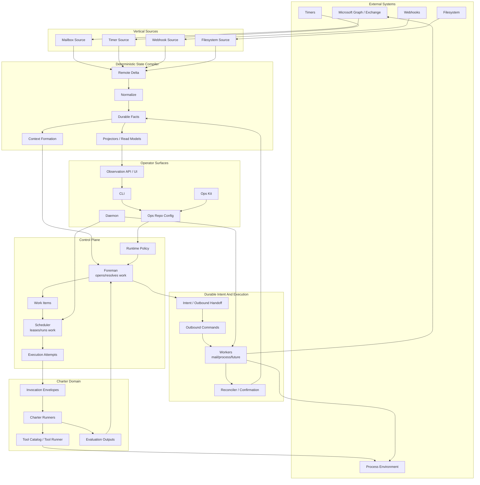
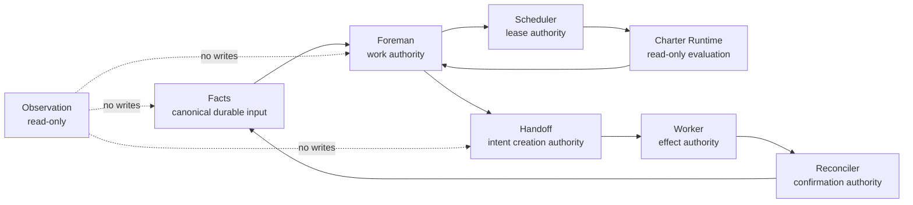
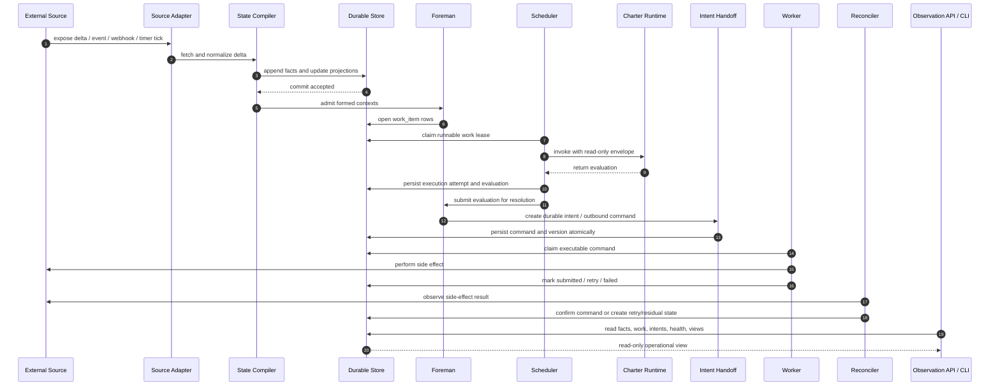
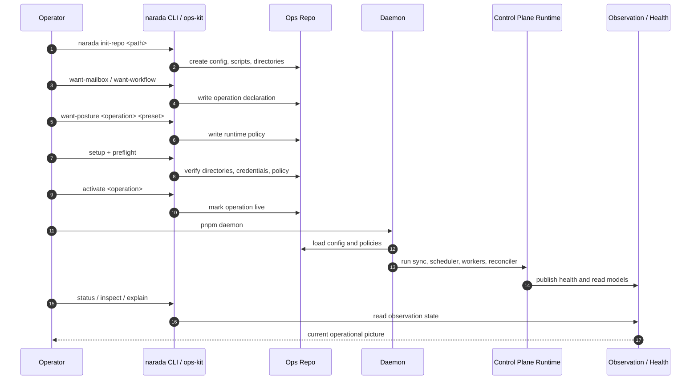
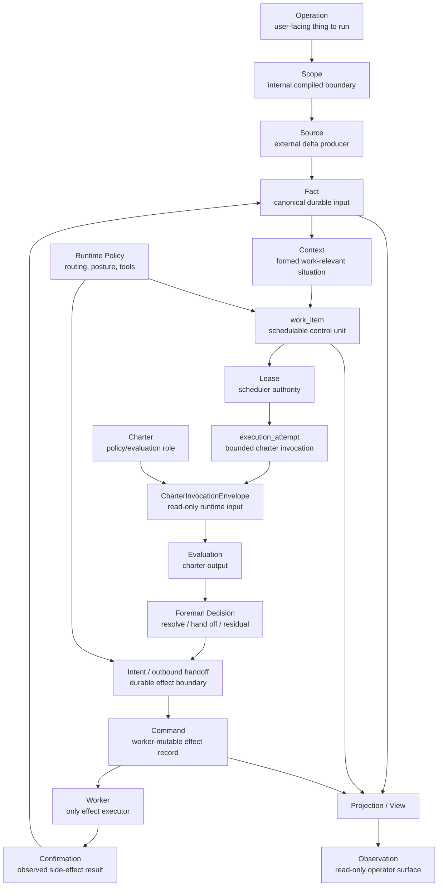
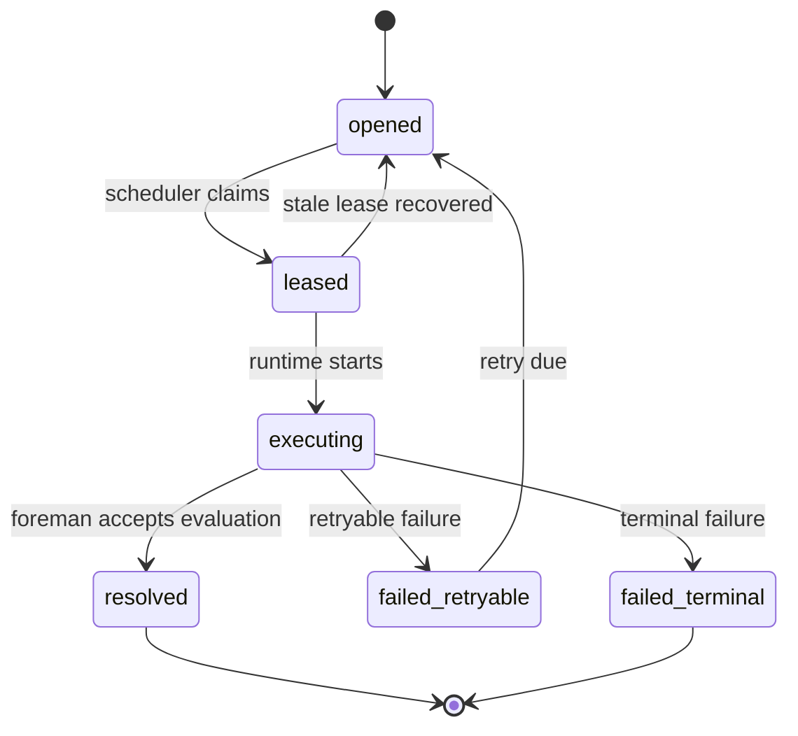
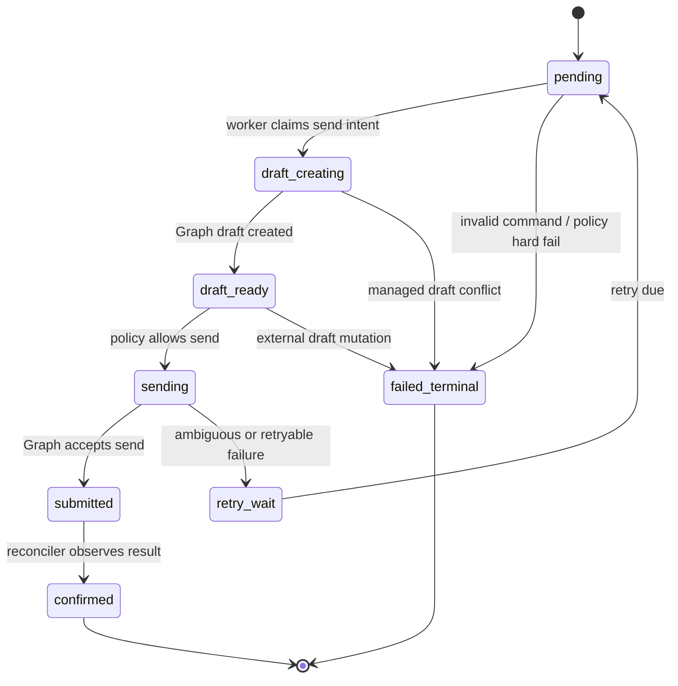
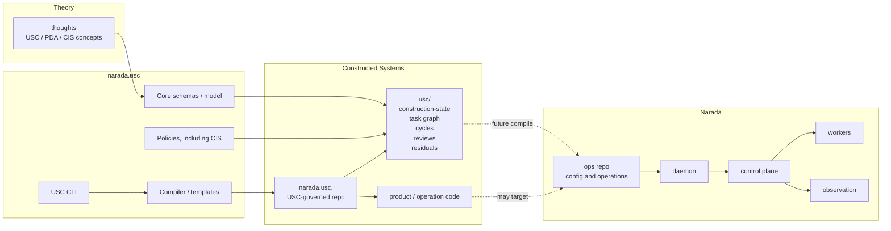
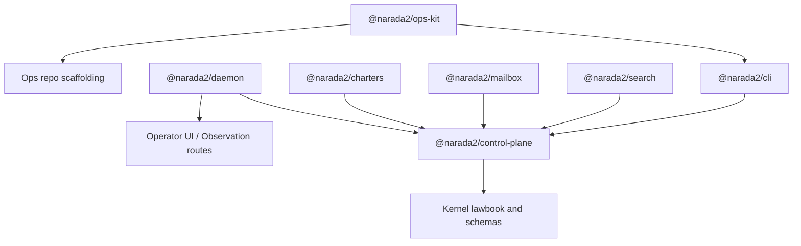

# Narada As A System

Narada is a deterministic state compiler and governed execution runtime.

It turns external deltas into durable facts, forms contexts and work, invokes policy/charter evaluation, creates durable intents, executes side effects through workers, confirms effects through observation, and exposes read-only operational views.

## Authority Boundaries

## Runtime Interaction

## Operator Interaction

## Concept Map

## Work And Outbound Lifecycles

## Narada And narada.usc Boundary

## Package View

